# LangBuilder Database Schema - Entity Relationship Diagram

```mermaid
erDiagram
    %% User Management
    User {
        UUID id PK
        string username UK
        string password
        string email
        boolean is_active
        boolean is_superuser
        string profile_image
        datetime created_at
        datetime updated_at
        datetime last_login_at
        string store_api_key
        json optins
    }

    ApiKey {
        UUID id PK
        string name
        string api_key UK
        datetime created_at
        datetime last_used_at
        int total_uses
        boolean is_active
        UUID user_id FK
    }

    %% Flow Management
    Flow {
        UUID id PK
        string name
        string description
        json data
        string icon
        string icon_bg_color
        string gradient
        boolean is_component
        datetime updated_at
        boolean webhook
        string endpoint_name UK
        string[] tags
        boolean locked
        boolean mcp_enabled
        string action_name
        string action_description
        enum access_type
        string fs_path
        UUID user_id FK
        UUID folder_id FK
    }

    Folder {
        UUID id PK
        string name
        string description
        json auth_settings
        UUID parent_id FK
        UUID user_id FK
    }

    %% Variables and Configuration
    Variable {
        UUID id PK
        string name
        string value
        string type
        string[] default_fields
        datetime created_at
        datetime updated_at
        UUID user_id FK
    }

    GlobalVariable {
        UUID id PK
        string name UK
        string value
        enum type
        string description
        boolean is_secret
        datetime created_at
        datetime updated_at
        UUID user_id FK
    }

    %% Messaging and Communication
    Message {
        UUID id PK
        datetime timestamp
        string sender
        string sender_name
        string session_id
        string text
        string[] files
        boolean error
        boolean edit
        json properties
        string category
        json[] content_blocks
        UUID flow_id FK
    }

    %% Execution and Monitoring
    Transaction {
        UUID id PK
        datetime timestamp
        string vertex_id
        string target_id
        json inputs
        json outputs
        string status
        string error
        UUID flow_id FK
    }

    VertexBuild {
        UUID build_id PK
        string id
        datetime timestamp
        json data
        json artifacts
        string params
        boolean valid
        UUID flow_id FK
    }

    %% File Management
    File {
        UUID id PK
        string name UK
        string path
        int size
        string provider
        datetime created_at
        datetime updated_at
        UUID user_id FK
    }

    %% Component System
    Component {
        string display_name PK
        string description
        string icon
        enum category
        json inputs
        json outputs
        string code
        json template
        string documentation
        boolean beta
        boolean experimental
    }

    %% Graph Runtime
    Vertex {
        string id PK
        string display_name
        string description
        enum base_type
        json inputs
        json outputs
        json params
        boolean frozen
        boolean is_input
        boolean is_output
        boolean is_state
    }

    Edge {
        string id PK
        string source_handle
        string target_handle
        json data
    }

    %% Security and Credentials
    Credential {
        UUID id PK
        string name UK
        enum credential_type
        string encrypted_value
        json metadata
        datetime created_at
        datetime updated_at
        datetime expires_at
        boolean is_active
        UUID user_id FK
    }

    %% Store and Marketplace
    Store {
        UUID id PK
        string name
        string description
        json flow_data
        string[] tags
        boolean is_public
        int downloads
        int likes
        string version
        string author
        datetime created_at
        datetime updated_at
        UUID user_id FK
    }

    StoreRating {
        UUID id PK
        int rating
        string review
        datetime created_at
        UUID store_id FK
        UUID user_id FK
    }

    %% Core Relationships - User to Owned Entities
    User ||--o{ ApiKey : "owns"
    User ||--o{ Flow : "creates"
    User ||--o{ Folder : "organizes"
    User ||--o{ Variable : "manages"
    User ||--o{ File : "uploads"
    User ||--o{ Credential : "manages"
    User ||--o{ Store : "contributes"
    
    %% Folder Hierarchy
    Folder ||--o{ Folder : "parent_child"
    Folder ||--o{ Flow : "contains"
    
    %% Flow Execution and Monitoring
    Flow ||--o{ Transaction : "generates"
    Flow ||--o{ VertexBuild : "builds"
    Flow ||--o{ Message : "processes"
    Flow ||--o{ Component : "contains"
    
    %% Graph Relationships
    Vertex }|--|| Edge : "connects"
    Transaction }o--|| Vertex : "tracks"
    VertexBuild }o--|| Component : "references"
    
    %% Message Relationships
    Message }o--|| User : "belongs_to"
    
    %% File and Flow Relationships
    File }|--|| Flow : "used_by"
    
    %% API and Transaction Relationships
    ApiKey ||--o{ Transaction : "authorizes"
    
    %% Variable and Flow Relationships
    Variable }|--|| Flow : "used_in"
    
    %% Credential Relationships
    Credential ||--o{ ApiKey : "manages"
    Credential ||--o{ Variable : "relates"
    
    %% Store Relationships
    Store ||--o{ Component : "contains"
    Store ||--o{ Flow : "shares"
    Store ||--o{ StoreRating : "rated_by"
    
    %% Global Variable Relationships
    GlobalVariable }o--|| User : "scoped_to"
```

## Schema Summary

### Core Entity Groups

1. **User Management**: User, ApiKey
   - Users own and manage API keys for authentication

2. **Flow Management**: Flow, Folder
   - Hierarchical folder organization
   - Flows contain workflow definitions with MCP support

3. **Variables & Config**: Variable, GlobalVariable
   - Encrypted storage for sensitive data
   - Global system configuration

4. **Execution**: Transaction, VertexBuild
   - Runtime execution tracking
   - Component build artifacts

5. **Communication**: Message
   - Chat and voice mode integration

6. **File System**: File
   - Storage provider abstraction

7. **Components**: Component, Vertex, Edge
   - Runtime graph representation
   - Component library system

8. **Security**: Credential
   - Secure credential management

9. **Marketplace**: Store, StoreRating
   - Component and flow sharing

### Key Relationships

- **1:N Relationships**: User owns multiple entities (flows, folders, files, etc.)
- **N:N Relationships**: Files used by multiple flows, Variables used in multiple flows
- **Self-Reference**: Folders can contain other folders (hierarchy)
- **Execution Chain**: Flow → Transaction → Vertex tracking
- **Component System**: Flow contains Components, VertexBuild references Components

### Security Model

- User-based ownership and access control
- Encrypted variable storage
- Credential management system
- API key authentication with usage tracking