# LangBuilder User Flows and Navigation Diagram

This diagram shows the user flows and navigation paths between all interface components in the LangBuilder application.

```mermaid
flowchart TD
    %% Main Pages
    LoginPage["🔐 LoginPage<br/>User authentication interface"]
    FlowDashboard["📊 FlowDashboard<br/>Main dashboard with flow management"]
    FlowEditor["✏️ FlowEditor<br/>Visual flow building interface"]
    PlaygroundInterface["🎮 PlaygroundInterface<br/>Flow testing and interaction"]
    SettingsPage["⚙️ SettingsPage<br/>User settings management"]
    StorePage["🏪 StorePage<br/>Component marketplace"]
    FileManagementPage["📁 FileManagementPage<br/>File upload and management"]
    AdminPage["👑 AdminPage<br/>System administration"]
    TemplateGallery["📋 TemplateGallery<br/>Pre-built flow templates"]

    %% Components and Modals
    IOModal["💬 IOModal<br/>Playground testing modal"]
    AddMCPServerModal["🔌 AddMCPServerModal<br/>MCP server configuration"]
    HeaderComponent["📱 HeaderComponent<br/>Application header"]
    FolderSidebar["📂 FolderSidebar<br/>Folder navigation"]
    ComponentSidebar["🧩 ComponentSidebar<br/>Component library"]
    FlowGrid["📊 FlowGrid<br/>Flow cards display"]
    ComponentGrid["🧩 ComponentGrid<br/>Component marketplace display"]
    ReactFlowCanvas["🎨 ReactFlowCanvas<br/>Visual flow canvas"]
    FlowToolbar["🛠️ FlowToolbar<br/>Editor toolbar"]
    MessageList["💬 MessageList<br/>Chat messages display"]
    ChatInput["⌨️ ChatInput<br/>Multi-modal input interface"]
    VoiceAssistant["🎤 VoiceAssistant<br/>Voice interaction"]
    MCPServerTab["🔌 MCPServerTab<br/>MCP server management"]

    %% Settings Sub-components
    ApiKeysSettings["🔑 ApiKeysSettings<br/>API key management"]
    GlobalVariablesSettings["📝 GlobalVariablesSettings<br/>Variable management"]

    %% System Components
    NotificationSystem["🔔 NotificationSystem<br/>Real-time notifications"]
    ErrorBoundary["⚠️ ErrorBoundary<br/>Error handling wrapper"]
    LoadingStates["⏳ LoadingStates<br/>Loading indicators"]
    ThemeProvider["🎨 ThemeProvider<br/>Theme management"]
    AuthGuard["🛡️ AuthGuard<br/>Route protection"]
    WebSocketManager["🌐 WebSocketManager<br/>Real-time communication"]

    %% Main Navigation Flow
    LoginPage -->|"✅ successful login"| FlowDashboard
    AuthGuard -->|"🔒 authentication required"| LoginPage
    
    %% Dashboard Navigation
    FlowDashboard -->|"✏️ edit flow"| FlowEditor
    FlowDashboard -->|"🎮 test flow"| PlaygroundInterface
    FlowDashboard -->|"⚙️ settings"| SettingsPage
    FlowDashboard -->|"🏪 browse store"| StorePage
    FlowDashboard -->|"📋 templates"| TemplateGallery
    
    %% Editor Navigation
    FlowEditor -->|"🎮 test flow"| PlaygroundInterface
    FlowEditor -->|"🏪 import components"| StorePage
    FlowEditor -->|"💬 playground modal"| IOModal
    
    %% Cross-Page Navigation
    PlaygroundInterface -->|"✏️ back to editor"| FlowEditor
    SettingsPage -->|"📁 file management"| FileManagementPage
    SettingsPage -->|"👑 admin panel"| AdminPage
    StorePage -->|"✏️ import to editor"| FlowEditor
    FileManagementPage -->|"✏️ use in editor"| FlowEditor
    TemplateGallery -->|"✏️ create from template"| FlowEditor

    %% Component Relationships within Dashboard
    FlowDashboard -.->|contains| HeaderComponent
    FlowDashboard -.->|contains| FolderSidebar
    FlowDashboard -.->|contains| FlowGrid
    FlowDashboard -.->|contains| ComponentGrid

    %% Component Relationships within Editor
    FlowEditor -.->|contains| FlowToolbar
    FlowEditor -.->|contains| ComponentSidebar
    FlowEditor -.->|contains| ReactFlowCanvas
    
    %% Component Relationships within Playground
    PlaygroundInterface -.->|contains| MessageList
    PlaygroundInterface -.->|contains| ChatInput
    PlaygroundInterface -.->|contains| VoiceAssistant

    %% Settings Sub-navigation
    SettingsPage -.->|contains| ApiKeysSettings
    SettingsPage -.->|contains| GlobalVariablesSettings
    SettingsPage -.->|contains| MCPServerTab
    SettingsPage -->|"🔌 add MCP server"| AddMCPServerModal

    %% System-wide Components (present throughout app)
    HeaderComponent -.->|provides| NotificationSystem
    ThemeProvider -.->|styles| HeaderComponent
    ErrorBoundary -.->|wraps| FlowDashboard
    ErrorBoundary -.->|wraps| FlowEditor
    ErrorBoundary -.->|wraps| PlaygroundInterface
    LoadingStates -.->|used in| FlowDashboard
    LoadingStates -.->|used in| FlowEditor
    WebSocketManager -.->|powers| PlaygroundInterface
    WebSocketManager -.->|powers| VoiceAssistant

    %% Styling
    classDef mainPage fill:#e1f5fe,stroke:#01579b,stroke-width:2px
    classDef component fill:#f3e5f5,stroke:#4a148c,stroke-width:2px
    classDef modal fill:#fff3e0,stroke:#e65100,stroke-width:2px
    classDef system fill:#e8f5e8,stroke:#1b5e20,stroke-width:2px

    class LoginPage,FlowDashboard,FlowEditor,PlaygroundInterface,SettingsPage,StorePage,FileManagementPage,AdminPage,TemplateGallery mainPage
    class HeaderComponent,FolderSidebar,ComponentSidebar,FlowGrid,ComponentGrid,ReactFlowCanvas,FlowToolbar,MessageList,ChatInput,VoiceAssistant,MCPServerTab,ApiKeysSettings,GlobalVariablesSettings component
    class IOModal,AddMCPServerModal modal
    class NotificationSystem,ErrorBoundary,LoadingStates,ThemeProvider,AuthGuard,WebSocketManager system
```

## User Flow Summary

### Primary User Journeys

1. **Authentication Flow**
   - LoginPage → FlowDashboard (after successful authentication)
   - AuthGuard redirects unauthenticated users back to LoginPage

2. **Flow Creation & Editing**
   - FlowDashboard → FlowEditor (create/edit flows)
   - FlowEditor → PlaygroundInterface (test flows)
   - TemplateGallery → FlowEditor (use templates)

3. **Component Discovery & Integration**
   - FlowDashboard → StorePage (browse marketplace)
   - StorePage → FlowEditor (import components)
   - ComponentSidebar (within editor for component library)

4. **Testing & Interaction**
   - FlowEditor → IOModal (quick testing)
   - FlowEditor → PlaygroundInterface (full testing environment)
   - PlaygroundInterface includes ChatInput, MessageList, VoiceAssistant

5. **Administration & Settings**
   - FlowDashboard → SettingsPage (user settings)
   - SettingsPage → FileManagementPage (file management)
   - SettingsPage → AdminPage (admin functions)
   - SettingsPage contains ApiKeysSettings, GlobalVariablesSettings, MCPServerTab

### Key Interface Patterns

- **Modal Overlays**: IOModal, AddMCPServerModal provide focused workflows
- **Sidebar Navigation**: FolderSidebar, ComponentSidebar for contextual navigation
- **Grid Displays**: FlowGrid, ComponentGrid for browsing content
- **System Components**: ErrorBoundary, LoadingStates, NotificationSystem provide app-wide functionality
- **Real-time Features**: WebSocketManager powers live features in PlaygroundInterface and VoiceAssistant