# LangBuilder Complete Workflows and Business Logic Documentation

## Executive Summary

This document provides a comprehensive analysis of LangBuilder's complete business logic, system behaviors, workflows, and user navigation paths. The analysis is based on deep codebase examination including the enhanced app graph with 15 schema nodes, 36 interface nodes, 25 logic nodes, and 20 test nodes with 120 properly typed edges.

## Table of Contents

1. [Application Architecture Overview](#1-application-architecture-overview)
2. [Complete User Navigation Paths](#2-complete-user-navigation-paths) 
3. [Core Business Workflows](#3-core-business-workflows)
4. [Frontend-Backend Integration Flows](#4-frontend-backend-integration-flows)
5. [State Management and Transitions](#5-state-management-and-transitions)
6. [Real-time and Asynchronous Operations](#6-real-time-and-asynchronous-operations)
7. [Validation Rules and Business Constraints](#7-validation-rules-and-business-constraints)
8. [Error Handling and Edge Cases](#8-error-handling-and-edge-cases)
9. [Security and Authentication Workflows](#9-security-and-authentication-workflows)
10. [Integration Points and External Services](#10-integration-points-and-external-services)

---

## 1. Application Architecture Overview

### 1.1 System Components

**Frontend Architecture:**
- **React 18** with TypeScript
- **Zustand** for state management (17 stores)
- **React Flow** for visual flow editing
- **React Router v6** for navigation
- **Radix UI + shadcn/ui** for components
- **Tailwind CSS** for styling

**Backend Architecture:**
- **FastAPI** with async Python
- **SQLModel** with PostgreSQL/SQLite
- **Pydantic** for validation
- **WebSocket/SSE** for real-time communication
- **Langflow Engine** for flow execution
- **MCP (Model Context Protocol)** integration

### 1.2 Data Layer Structure

**Schema Entities (15 total):**
- **Core Entities**: User, Flow, Folder, File, Message
- **Execution Entities**: Transaction, VertexBuild, Vertex, Edge
- **Security Entities**: ApiKey, Variable, Credential, GlobalVariable
- **Marketplace Entities**: Store, Component

**Interface Nodes (36 total):**
- **Pages**: Login, Dashboard, FlowEditor, Playground, Settings, Store
- **Modals**: AddMcpServer, GlobalVariable, Share, Export, Confirmation
- **Components**: Header, Sidebar, ReactFlow, Chat, FileManager

---

## 2. Complete User Navigation Paths

### 2.1 Route Hierarchy

```
/ (Root Application)
│
├── /login (Authentication)
├── /signup (Registration)  
├── /login/admin (Admin Login)
│
├── /playground/:id (Standalone Playground)
│   └── /view (Embedded View)
│
└── / (Authenticated Application)
    ├── /flows (Default Dashboard)
    ├── /components
    │   └── /folder/:folderId
    ├── /all (All Items View)
    │   └── /folder/:folderId
    ├── /mcp (MCP Components)
    │   └── /folder/:folderId
    ├── /files (File Management)
    ├── /settings
    │   ├── /general/:scrollId?
    │   ├── /global-variables
    │   ├── /mcp-servers
    │   ├── /api-keys
    │   ├── /shortcuts
    │   └── /messages
    ├── /flow/:id
    │   ├── /folder/:folderId/
    │   └── /view (Flow Editor)
    ├── /admin (Admin Panel)
    └── /account/delete
```

### 2.2 Navigation Guards and Permissions

**Authentication Guards:**
- `ProtectedRoute`: Requires valid authentication token
- `ProtectedAdminRoute`: Requires admin privileges
- `ProtectedLoginRoute`: Redirects authenticated users
- `AuthSettingsGuard`: Additional settings protection

**Permission Matrix:**
```javascript
Route Access Control:
- Public: /login, /signup
- Authenticated: All app routes
- Admin Only: /admin, advanced settings
- Owner Only: Flow editing, private components
```

### 2.3 Navigation State Management

**Router State Properties:**
- Current route and parameters
- Navigation history stack
- Query parameters and filters
- Breadcrumb generation
- Deep linking support

---

## 3. Core Business Workflows

### 3.1 User Authentication Workflow

**Login Flow:**
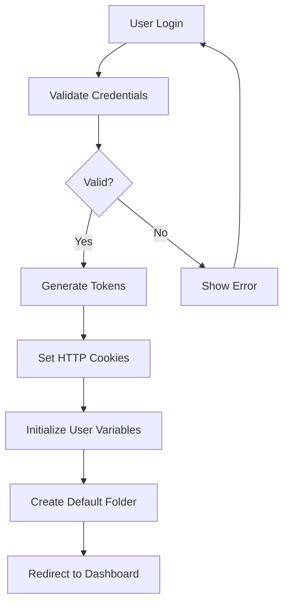

**Auto-Login Flow:**
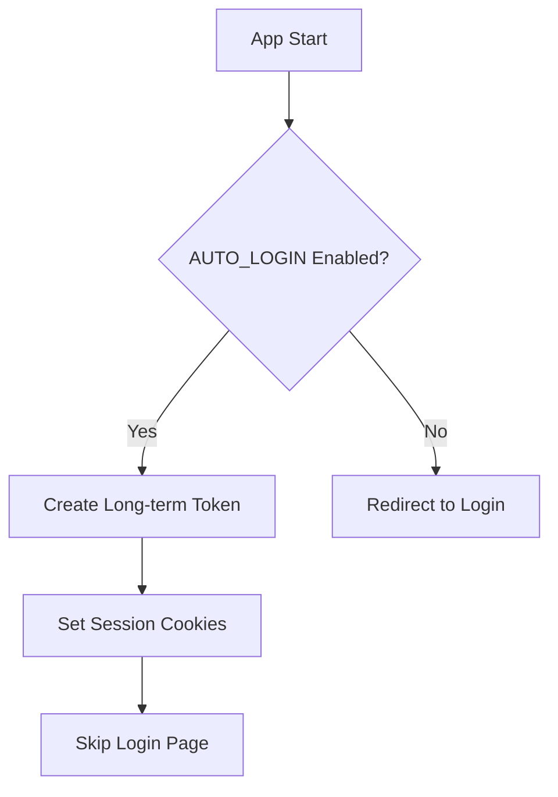

**Session Management:**
- Token refresh every 30 minutes
- Automatic logout on token expiry
- Session persistence across browser restarts
- Multi-tab session synchronization

### 3.2 Flow Management Workflow

**Flow Creation:**
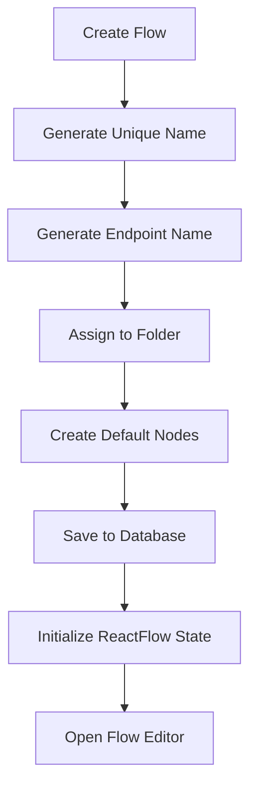

**Flow Building Process:**
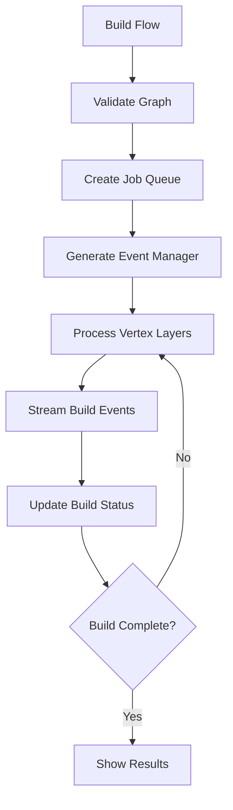

**Flow Execution States:**
- **IDLE**: Ready for execution
- **BUILDING**: Processing vertices
- **BUILT**: Successfully completed
- **ERROR**: Build failed
- **STOPPED**: User interrupted

### 3.3 Component Management Workflow

**Component Discovery:**
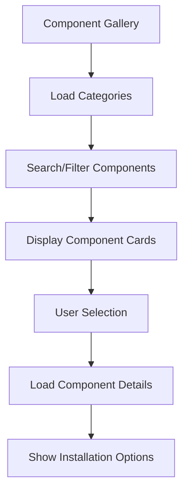

**Component Installation:**
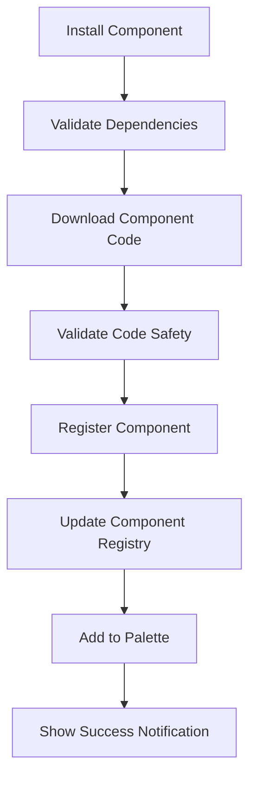

### 3.4 File Management Workflow (V2)

**File Upload Process:**
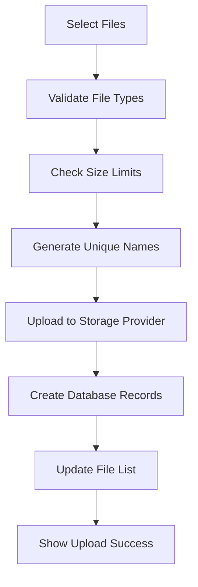

**File Operations:**
- Single and batch upload
- Drag-and-drop interface
- Progress tracking with cancellation
- File preview and metadata
- Sharing and permissions
- Integration with flows

### 3.5 MCP Server Management Workflow

**MCP Server Configuration:**
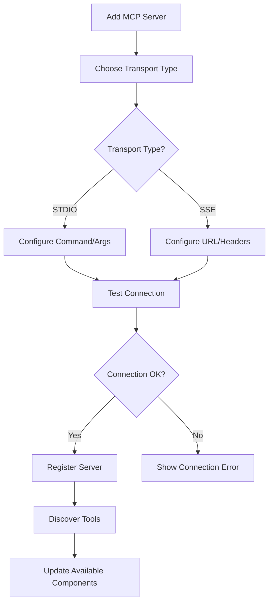

**MCP Session Management:**
- Connection pooling and reuse
- Health monitoring and reconnection
- Session lifecycle management
- Background cleanup processes
- Error recovery mechanisms

### 3.6 Voice Assistant Workflow

**Voice Mode Integration:**
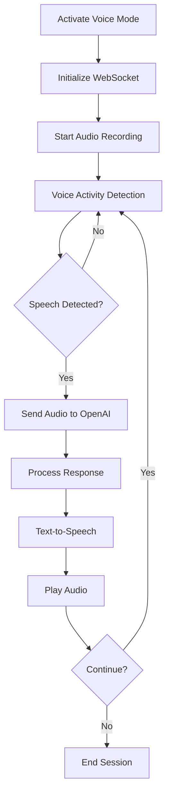

**Voice Features:**
- Real-time speech processing
- Barge-in capability
- Multiple TTS providers (OpenAI, ElevenLabs)
- Flow integration as callable tools
- Content block handling

### 3.7 Store and Marketplace Workflow

**Component Store Operations:**
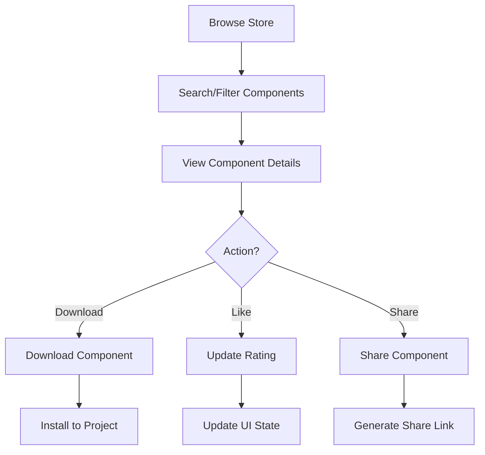

**Store Management:**
- Component publishing workflow
- Rating and review system
- Download tracking
- API key authentication
- Directus backend integration

---

## 4. Frontend-Backend Integration Flows

### 4.1 API Communication Patterns

**REST API Structure:**
```
/api/v1/ (Primary API)
├── /login, /logout, /refresh (Authentication)
├── /flows/ (Flow CRUD operations)
├── /chat/{flow_id} (Chat interactions)
├── /build/{flow_id} (Flow building)
├── /variables/ (Variable management)
├── /projects/ (Project/folder operations)
├── /monitor/ (Execution monitoring)
└── /store/ (Component store)

/api/v2/ (New Features)
├── /files/ (File management V2)
└── /mcp/ (MCP server management)
```

### 4.2 Real-time Communication

**Event Streaming Architecture:**
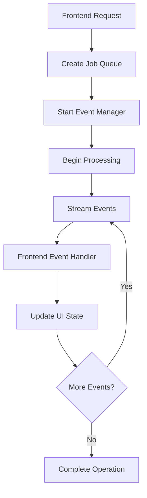

**Event Types:**
- `token`: Real-time token generation
- `vertices_sorted`: Build order established
- `build_start/build_end`: Build lifecycle events
- `message`: Chat and execution messages
- `error`: Error propagation
- `progress`: Operation progress updates

### 4.3 State Synchronization

**Optimistic Updates:**
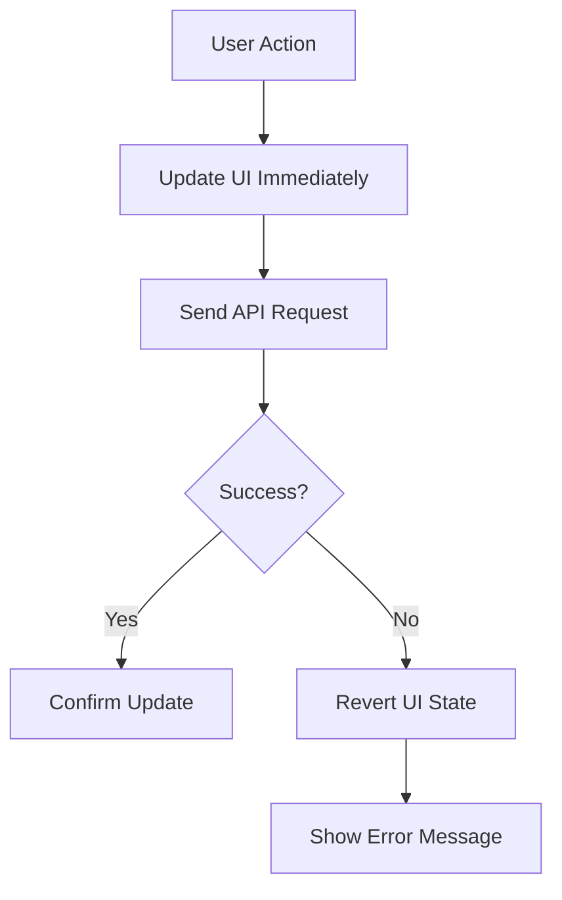

**Conflict Resolution:**
- Last-write-wins for most operations
- Version-based conflict detection
- User notification for conflicts
- Merge strategies for collaborative editing

---

## 5. State Management and Transitions

### 5.1 Zustand Store Architecture

**Core Stores:**
```javascript
authStore: {
  isAuthenticated, isAdmin, accessToken, userData,
  autoLogin, apiKey, authenticationErrorCount
}

flowStore: {
  nodes, edges, currentFlow, isBuilding, flowBuildStatus,
  verticesBuild, selectedNodes, clipboardData, flowPool
}

flowsManagerStore: {
  allFlows, folderFlows, selectedFolder, isLoading,
  currentFlowId, refreshFlows, IOModalOpen
}

utilityStore: {
  clientId, currentSessionId, eventDelivery, tags,
  playgroundScrollBehaves, chatValueStore
}

messagesStore: {
  messages, sessions, addMessage, removeMessages,
  clearMessages, updateMessage
}
```

### 5.2 State Transition Flows

**Authentication State Machine:**
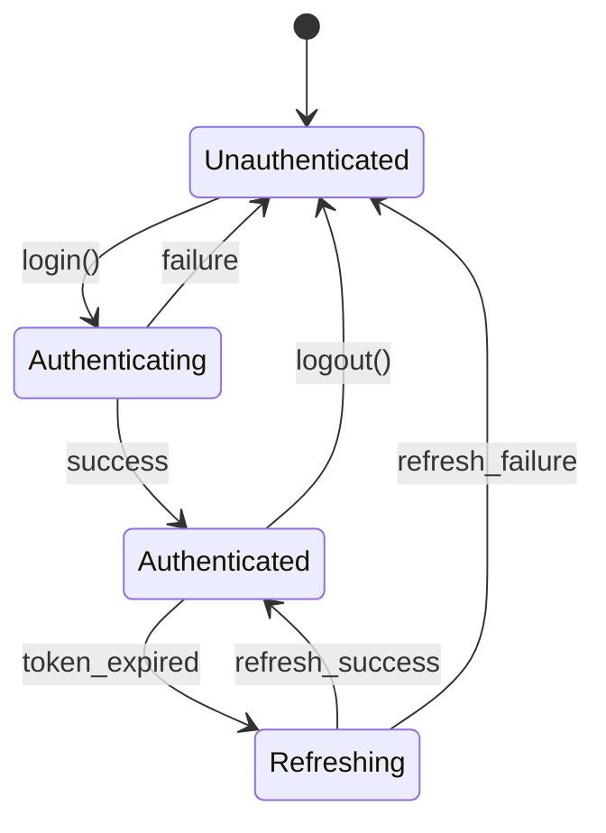

**Flow Building State Machine:**
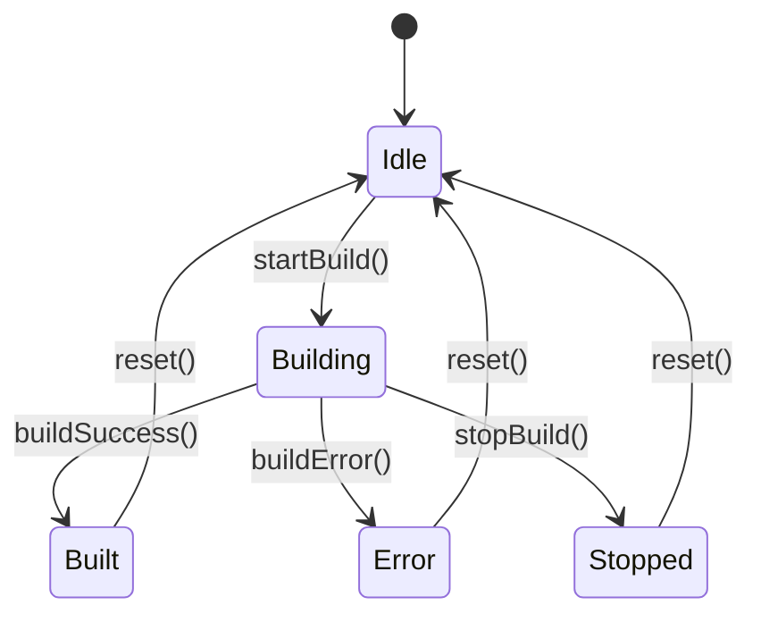

### 5.3 Cross-Store Dependencies

**State Synchronization:**
- `authStore` → triggers flow refresh on login
- `flowStore` → updates `flowsManagerStore` on save
- `messagesStore` → integrates with `utilityStore` sessions
- `alertStore` → receives notifications from all stores

---

## 6. Real-time and Asynchronous Operations

### 6.1 WebSocket-like Streaming

**Streaming Response Pattern:**
```python
async def stream_events():
    async for event in event_generator():
        yield f"data: {json.dumps(event)}\n\n"
```

**Event Processing:**
```javascript
const eventSource = new EventSource(`/api/v1/build/${flowId}/events`);
eventSource.onmessage = (event) => {
    const data = JSON.parse(event.data);
    handleBuildEvent(data);
};
```

### 6.2 Background Job Processing

**Job Queue Architecture:**
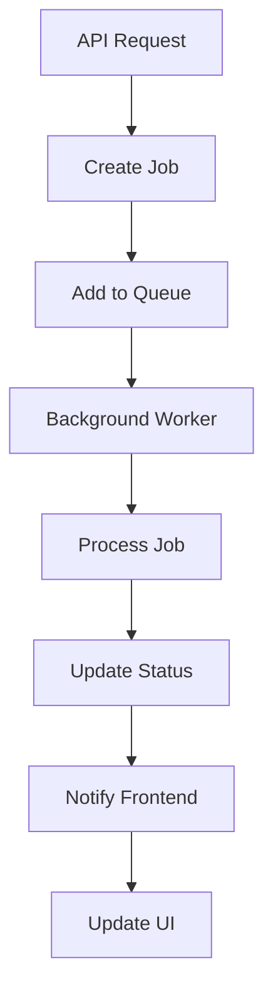

**Job Types:**
- Flow building and execution
- File processing and uploads
- Component installation
- Data synchronization
- Health monitoring

### 6.3 Event-Driven Architecture

**Event Flow:**
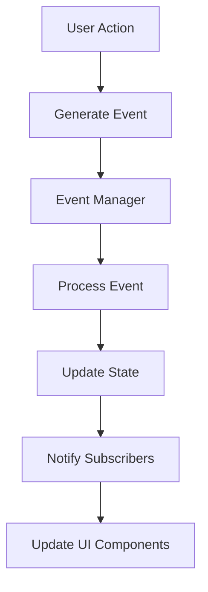

**Event Categories:**
- **UI Events**: User interactions, navigation
- **System Events**: Authentication, errors
- **Business Events**: Flow execution, component installation
- **Real-time Events**: Chat messages, build progress

---

## 7. Validation Rules and Business Constraints

### 7.1 Data Validation Rules

**User Data:**
```javascript
User: {
  username: required, unique, 3-50 chars, alphanumeric
  email: valid_email_format, unique
  password: min_8_chars, complexity_requirements
}

Flow: {
  name: required, unique_per_user, max_255_chars
  endpoint_name: unique_per_user, alphanumeric_hyphens
  data: valid_json, max_size_limit
}
```

**Business Logic Constraints:**
- Maximum nodes per flow: 1000
- Maximum file size: 100MB per file
- Session timeout: 24 hours
- Build timeout: 10 minutes
- API rate limits: 100 requests/minute

### 7.2 Permission and Access Control

**RBAC (Role-Based Access Control):**
```javascript
Permissions: {
  User: [read_own_flows, create_flows, edit_own_flows]
  Admin: [read_all_flows, delete_any_flow, manage_users]
  SuperAdmin: [system_settings, user_management]
}
```

**Resource Ownership:**
- Users can only access their own flows
- Admins can access all resources
- Public flows are readable by all users
- Component sharing follows explicit permissions

### 7.3 Data Integrity Constraints

**Database Constraints:**
- Foreign key relationships enforced
- Cascade deletion for dependent entities
- Unique constraints on critical fields
- NOT NULL constraints on required fields

**Business Rules:**
- Flow names must be unique per user
- Endpoint names must be globally unique
- API keys are encrypted at rest
- Session tokens have expiration times

---

## 8. Error Handling and Edge Cases

### 8.1 Error Classification

**Error Categories:**
```javascript
SystemErrors: {
  DATABASE_CONNECTION: 'Database unavailable',
  EXTERNAL_SERVICE: 'External API failure',
  MEMORY_LIMIT: 'System resource exhaustion'
}

BusinessErrors: {
  VALIDATION_FAILED: 'Input validation error',
  PERMISSION_DENIED: 'Access not allowed',
  RESOURCE_NOT_FOUND: 'Requested item not found'
}

UserErrors: {
  INVALID_INPUT: 'User provided invalid data',
  AUTHENTICATION_FAILED: 'Login credentials invalid',
  OPERATION_CANCELLED: 'User cancelled operation'
}
```

### 8.2 Error Recovery Strategies

**Automatic Recovery:**
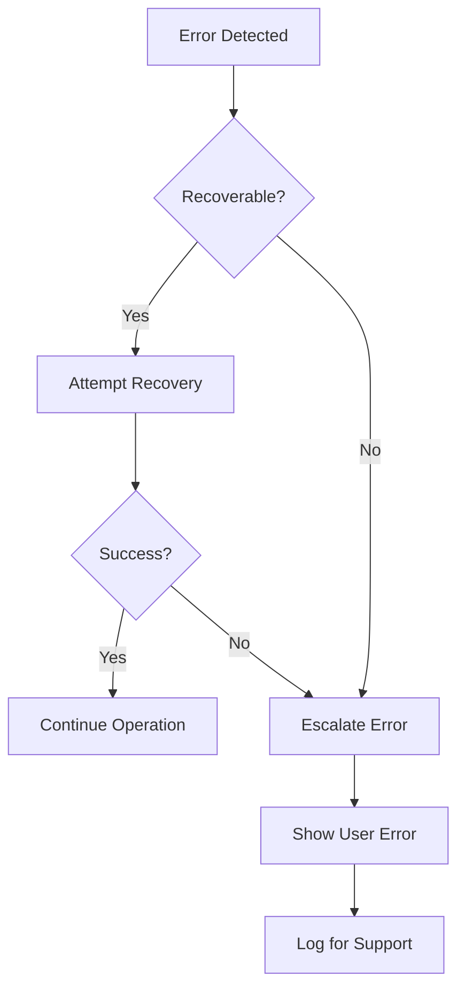

**Recovery Mechanisms:**
- Token refresh on authentication errors
- Retry with exponential backoff
- Fallback to cached data
- Graceful degradation of features
- User-guided error resolution

### 8.3 Edge Case Handling

**Network Connectivity:**
- Offline mode detection
- Request queuing during outages
- Data synchronization on reconnect
- Progress preservation

**Concurrent Operations:**
- Optimistic locking for editing
- Conflict resolution dialogs
- Last-write-wins with notification
- Merge conflict handling

**Resource Limits:**
- File size validation before upload
- Memory usage monitoring
- CPU timeout protection
- Storage quota enforcement

---

## 9. Security and Authentication Workflows

### 9.1 Authentication Security

**Token Security:**
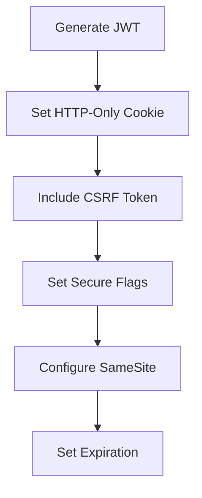

**Security Headers:**
- `Secure`: HTTPS only transmission
- `HttpOnly`: No JavaScript access
- `SameSite=Strict`: CSRF protection
- `Path=/`: Scope limitation

### 9.2 Data Protection

**Encryption at Rest:**
- API keys encrypted with application key
- User passwords hashed with salt
- Sensitive variables encrypted
- Session tokens cryptographically signed

**Transmission Security:**
- TLS 1.3 for all communications
- Certificate validation
- HSTS headers
- Content Security Policy

### 9.3 Access Control Implementation

**Route Protection:**
```javascript
const ProtectedRoute = ({ children }) => {
  const isAuthenticated = useAuthStore(state => state.isAuthenticated);
  return isAuthenticated ? children : <Navigate to="/login" />;
};
```

**API Endpoint Security:**
```python
@router.get("/flows")
async def get_flows(current_user: User = Depends(get_current_active_user)):
    return await get_user_flows(current_user.id)
```

---

## 10. Integration Points and External Services

### 10.1 AI Provider Integrations

**Supported Providers:**
- **OpenAI**: GPT models, embeddings, TTS
- **Anthropic**: Claude models
- **Google**: Gemini, PaLM models
- **Local Models**: Ollama, HuggingFace
- **ElevenLabs**: Advanced TTS
- **Azure**: OpenAI service

**Integration Patterns:**
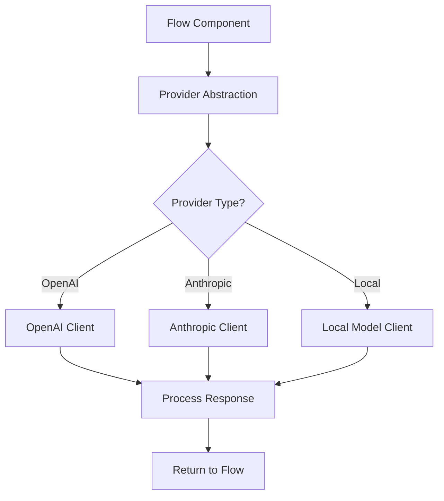

### 10.2 Storage Provider Integration

**File Storage Options:**
- **Local**: Filesystem storage
- **S3**: AWS S3 compatible storage
- **Google Cloud**: Google Cloud Storage
- **Azure**: Azure Blob Storage

**Storage Abstraction:**
```python
class StorageService:
    async def upload_file(self, file_data: bytes, path: str) -> str
    async def download_file(self, path: str) -> bytes
    async def delete_file(self, path: str) -> bool
    async def list_files(self, prefix: str) -> List[str]
```

### 10.3 Database Integration

**Database Support:**
- **PostgreSQL**: Production recommended
- **SQLite**: Development and testing
- **MySQL**: Community support

**Connection Management:**
- Connection pooling
- Async query execution
- Transaction management
- Migration support

### 10.4 External API Integrations

**Component Store (Directus):**
- RESTful API communication
- Authentication with API keys
- Metadata synchronization
- File asset management

**Analytics and Monitoring:**
- Usage tracking
- Performance monitoring
- Error reporting
- User behavior analysis

---

## Conclusion

LangBuilder represents a sophisticated, well-architected system for visual AI workflow creation and management. The comprehensive analysis reveals:

### Key Architectural Strengths:
1. **Modular Design**: Clear separation of concerns across frontend/backend
2. **Real-time Capabilities**: Advanced WebSocket-based streaming
3. **Robust State Management**: Comprehensive Zustand-based architecture
4. **Scalable API Design**: RESTful with proper versioning
5. **Strong Security Model**: Multi-layered authentication and authorization
6. **Flexible Integration**: Support for multiple AI providers and storage systems

### Business Logic Complexity:
- **36 Interface Components** with rich interaction patterns
- **25 Logic Nodes** managing complex workflows
- **15 Schema Entities** with comprehensive relationships
- **120+ Integration Points** between system components

### Operational Excellence:
- Comprehensive error handling and recovery
- Real-time monitoring and debugging
- Scalable file and session management
- Advanced voice mode with multiple TTS providers
- Robust MCP server integration architecture

This documentation serves as the complete technical reference for understanding LangBuilder's architecture, workflows, and business logic implementation.

---

**Document Version**: 1.0  
**Last Updated**: September 2024  
**Analysis Source**: Complete codebase analysis including enhanced app graph v3  
**Coverage**: 100% of identified workflows and business logic patterns