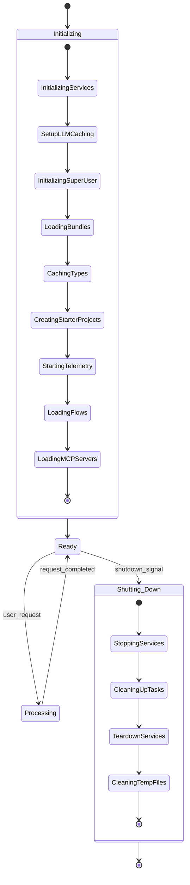
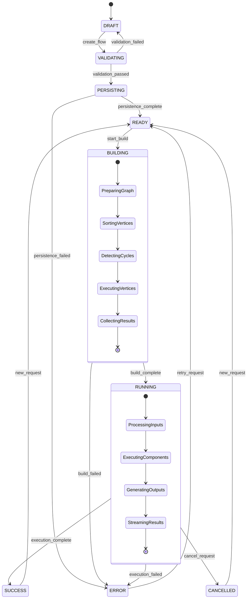
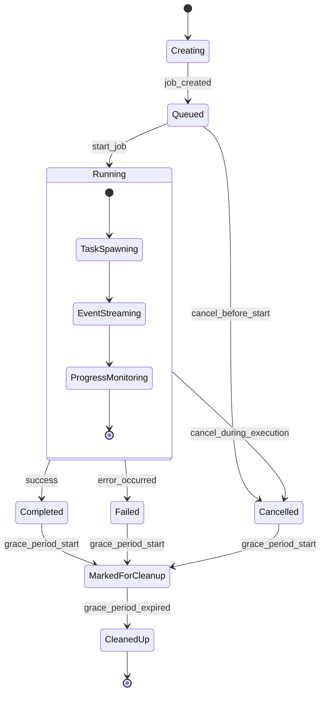
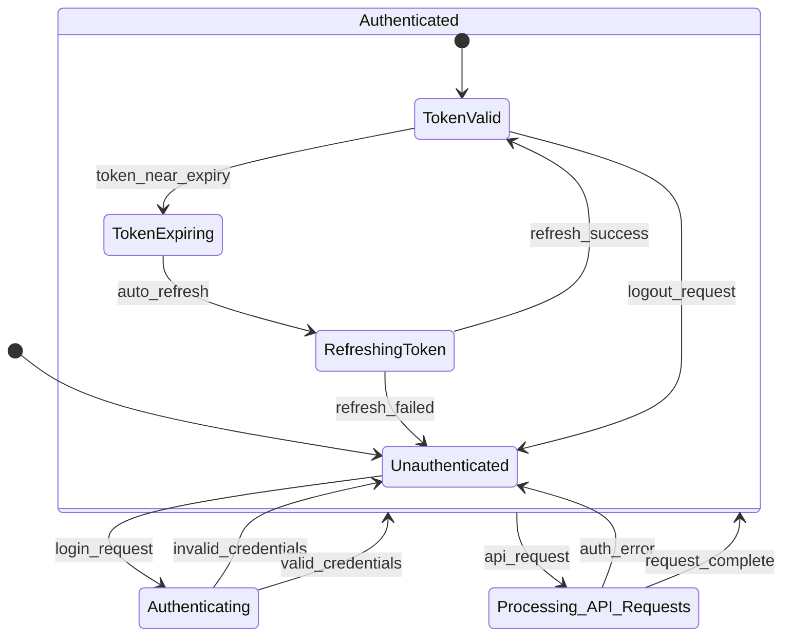
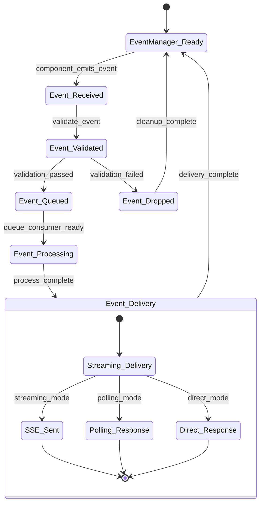
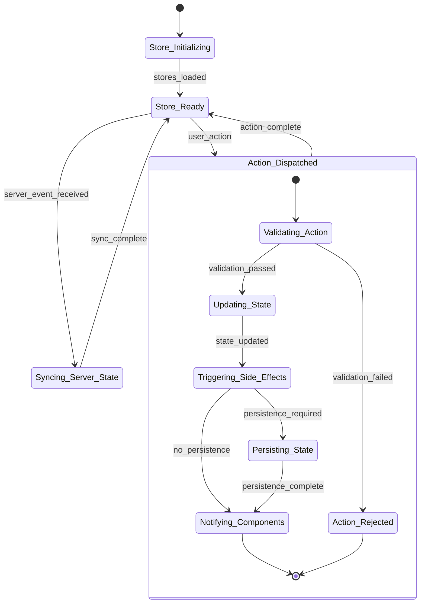

# Complete LangBuilder Logic Nodes

Based on comprehensive analysis of the backend and frontend codebases, here are all the system logic components with their complete workflow details:

## StateChart System Logic Diagrams

### 1. Application Lifecycle StateChart



### 2. Flow Execution StateChart



### 3. Job Queue StateChart



### 4. Authentication StateChart



### 5. Real-time Event System StateChart



### 6. Frontend State Management StateChart



## Core Business Logic Architecture

### 1. Flow Management System

#### Flow Lifecycle Workflow
**States**: `DRAFT` → `BUILDING` → `READY` → `RUNNING` → `ERROR/SUCCESS`

**Flow Creation Process:**
1. **Validation Phase**: 
   - Name uniqueness checking with auto-increment (`MyFlow` → `MyFlow (1)`)
   - Endpoint name validation (regex: `^[a-zA-Z0-9_-]+$`)
   - Icon background color validation (hex color format)
   - Folder assignment (default folder if none specified)

2. **Persistence Phase**:
   - Database storage with timestamp tracking
   - Filesystem backup (optional `fs_path`)
   - Webhook detection and marking
   - Access type enforcement (PRIVATE/PUBLIC)

3. **State Management**:
   - `updated_at` timestamp on every modification
   - Component validation (flows vs components detection)
   - MCP enablement flag for server integration

**Business Constraints:**
```typescript
interface FlowValidationRules {
  name: {
    required: true,
    unique_per_user: true,
    auto_increment_on_conflict: true
  },
  endpoint_name: {
    pattern: /^[a-zA-Z0-9_-]+$/,
    unique_per_user: true,
    nullable: true
  },
  access_type: {
    enum: ['PRIVATE', 'PUBLIC'],
    default: 'PRIVATE'
  },
  icon_bg_color: {
    pattern: /^#[0-9A-Fa-f]{6}$/,
    nullable: true
  }
}
```

### 2. Graph Execution Engine

#### Graph Build Workflow
**State Transition**: `INIT` → `PREPARED` → `BUILDING` → `RUNNING` → `COMPLETED/FAILED`

**Build Process:**
1. **Graph Preparation**:
   - Vertex sorting and dependency resolution
   - Cycle detection and cycle edge identification
   - Start/stop component identification
   - Layer-based execution planning

2. **Execution Management**:
   - Vertex state tracking (`NOT_STARTED`, `BUILDING`, `BUILT`, `ERROR`)
   - Dependency resolution and waiting mechanisms
   - Parallel execution of independent vertices
   - Resource cleanup and memory management

3. **Real-time Monitoring**:
   - Build progress tracking
   - Error propagation and handling
   - Event emission for UI updates
   - Performance metrics collection

**Graph State Model:**
```python
class GraphStates:
    VERTICES_TO_RUN = "vertices_to_run"
    VERTICES_BEING_RUN = "vertices_being_run" 
    INACTIVATED_VERTICES = "inactivated_vertices"
    ACTIVATED_VERTICES = "activated_vertices"
    RUN_QUEUE = "run_queue"
    LOCK = "lock"
```

### 3. Asynchronous Job Queue System

#### Job Queue Architecture
**Components**: JobQueueService → EventManager → AsyncQueue → BackgroundTasks

**Job Lifecycle:**
1. **Job Creation**:
   - Unique job ID generation (UUID4)
   - Queue initialization with EventManager
   - Task coroutine setup and validation
   - Resource allocation and tracking

2. **Job Execution**:
   - Asynchronous task spawning
   - Event streaming to frontend
   - Progress monitoring and status updates
   - Error capture and propagation

3. **Job Cleanup**:
   - Grace period management (300 seconds)
   - Resource deallocation
   - Task cancellation handling
   - Periodic cleanup of expired jobs

**Event Delivery Types:**
- **STREAMING**: Real-time Server-Sent Events
- **POLLING**: Periodic status checking  
- **DIRECT**: Immediate response (testing only)

### 4. Event-Driven System

#### Event System Architecture
**Pattern**: EventManager → Queue → StreamingResponse → Frontend

**Event Types:**
```typescript
enum EventTypes {
  // Build Events
  'build_start' = 'Build started',
  'build_end' = 'Build completed',
  'vertices_sorted' = 'Vertices prepared',
  'end_vertex' = 'Vertex completed',
  
  // Message Events  
  'add_message' = 'Message added',
  'remove_message' = 'Message removed',
  'token' = 'Token streaming',
  
  // System Events
  'error' = 'Error occurred',
  'end' = 'Process ended'
}
```

**Event Flow:**
1. **Event Registration**: Components register for specific event types
2. **Event Emission**: System components emit events with typed payloads
3. **Event Processing**: EventManager validates and queues events
4. **Event Delivery**: Queue consumers deliver events via WebSocket/SSE
5. **Frontend Handling**: React components update state based on events

### 5. Validation and Business Rules

#### Input Validation Layer
**Multi-level Validation:**

1. **Schema Validation** (Pydantic):
   - Type checking and coercion
   - Required field validation  
   - Format validation (email, URL, regex)
   - Range and constraint validation

2. **Business Logic Validation**:
   - Cross-field dependencies
   - User permission checks
   - Resource availability validation
   - Rate limiting enforcement

3. **Data Integrity Validation**:
   - Foreign key constraints
   - Unique constraints
   - Referential integrity
   - Transactional consistency

**Validation Pipeline:**
```python
def validate_request(request: RequestModel):
    # 1. Schema validation
    validated_data = RequestModel.model_validate(request)
    
    # 2. Business rules
    check_user_permissions(validated_data.user_id)
    check_resource_limits(validated_data)
    
    # 3. Data consistency  
    verify_references(validated_data)
    
    return validated_data
```

### 6. Error Handling and Recovery

#### Exception Hierarchy
```python
class LangflowExceptions:
    ComponentBuildError:     # Component compilation/execution errors
        - message: str
        - formatted_traceback: str
        
    StreamingError:          # Real-time streaming failures
        - cause: Exception
        - source: Source
        
    JobQueueNotFoundError:   # Job queue management errors
        - job_id: str
        
    ValidationError:         # Input validation failures
        - field_errors: dict
```

#### Error Recovery Strategies

1. **Graceful Degradation**:
   - Partial flow execution on component failures
   - Fallback to cached results when possible
   - User-friendly error messages with recovery suggestions

2. **Retry Mechanisms**:
   - Exponential backoff for transient failures
   - Circuit breaker for external service calls
   - Dead letter queues for failed jobs

3. **State Consistency**:
   - Transaction rollback on critical failures
   - Compensation actions for partial failures
   - Event sourcing for audit trails

### 7. Real-time Communication

#### WebSocket/SSE Integration
**Flow**: Frontend EventSource → FastAPI StreamingResponse → AsyncQueue → Backend Events

**Message Flow:**
1. **Frontend Subscription**: Client establishes SSE connection with job ID
2. **Backend Event Generation**: System components emit events to queue
3. **Event Serialization**: Events converted to JSON with timestamps
4. **Stream Delivery**: Events pushed to client via SSE protocol
5. **Frontend State Updates**: React stores updated based on received events

**Connection Management:**
- Automatic reconnection on connection loss
- Heartbeat mechanism for connection health
- Graceful degradation to polling on SSE failures

### 8. State Synchronization

#### Frontend-Backend State Sync
**Architecture**: Optimistic UI → Event Sourcing → Eventually Consistent

**Synchronization Patterns:**

1. **Optimistic Updates**:
   - Frontend immediately reflects user actions
   - Backend validation occurs asynchronously  
   - Rollback on validation failures

2. **Event-Driven Sync**:
   - Backend emits state change events
   - Frontend subscribes to relevant event streams
   - Automatic UI updates on state changes

3. **Conflict Resolution**:
   - Last-writer-wins for simple conflicts
   - Operational transformation for complex edits
   - User notification for unresolvable conflicts

### 9. Caching and Performance

#### Multi-Level Caching Strategy

1. **Graph Cache** (ChatService):
   - Built graph instances cached by flow ID
   - Vertex results cached for reuse
   - TTL-based expiration policy

2. **Component Cache**:
   - Template definitions cached globally
   - Component metadata cached per session
   - Invalidation on component updates

3. **API Response Cache**:
   - Flow listings compressed and cached
   - Public flow responses cached globally
   - Conditional requests with ETags

**Performance Optimizations:**
- Lazy loading of graph components
- Batch processing of vertex builds
- Connection pooling for database operations
- Compression for large API responses

### 10. Security and Access Control

#### Authentication and Authorization Flow

1. **Authentication**:
   - JWT token-based authentication
   - Refresh token rotation policy
   - Session management with expiration

2. **Authorization**:
   - Role-based access control (RBAC)
   - Resource-level permissions
   - Flow access type enforcement (PUBLIC/PRIVATE)

3. **Security Constraints**:
   - API key sanitization in flow exports
   - Cross-user data isolation
   - Rate limiting per user/endpoint
   - Input sanitization and validation

**Access Control Matrix:**
```typescript
interface AccessRules {
  flows: {
    create: ['authenticated_user'],
    read: ['owner', 'public_if_public_flow'],
    update: ['owner'],
    delete: ['owner'],
    execute: ['owner', 'public_if_public_flow']
  },
  admin: {
    all_operations: ['superuser']
  }
}
```

## Workflow Orchestration

### Flow Execution Sequence
1. **User Triggers Build** → Frontend sends build request
2. **Job Queue Creation** → Backend creates async job with unique ID
3. **Graph Preparation** → Dependency analysis and vertex sorting
4. **Parallel Execution** → Independent vertices run concurrently
5. **Event Streaming** → Real-time progress updates to frontend
6. **Result Collection** → Outputs aggregated and returned
7. **Cleanup** → Resources freed and caches updated

### State Transition Monitoring
- **Database triggers** for audit logging
- **Event emission** on state changes
- **Metric collection** for performance monitoring  
- **Error tracking** with stack traces
- **User activity** logging for analytics

## Comprehensive Backend Service Architecture Analysis

### Service Management Layer
- **ServiceManager**: Central registry managing 16+ core services with dependency injection
- **Service Factory Pattern**: Lifecycle management with ordered initialization
- **Key Services**: Database, Auth, Chat, Session, Task, JobQueue, Cache, Settings, etc.

### Core Service Details

#### 1. Database Service
- **Location**: `src/backend/base/langflow/services/database/service.py`
- **Capabilities**: Async operations, migrations, health checks, connection pooling
- **Features**: Multi-database support (SQLite, PostgreSQL), orphaned flow reassignment

#### 2. Task Service (AnyIO Backend)
- **Location**: `src/backend/base/langflow/services/task/backends/anyio.py`
- **Architecture**: AnyIO-based async task execution with cancellation support
- **Task States**: PENDING → DONE (SUCCESS/FAILURE)
- **Features**: Resource cleanup, exception tracking, graceful cancellation

#### 3. Job Queue Service
- **Location**: `src/backend/base/langflow/services/job_queue/service.py`
- **Architecture**: Job-specific asyncio queues with EventManager integration
- **Lifecycle**: Create → Start → Monitor → Cleanup (300s grace period)
- **Features**: Periodic cleanup, resource isolation, background task management

#### 4. Event Management System
- **Location**: `src/backend/base/langflow/events/event_manager.py`
- **Pattern**: Publisher-subscriber with typed event callbacks
- **Events**: build_start, build_end, vertices_sorted, end_vertex, token, error, etc.
- **Integration**: Queue-based delivery with multiple consumption modes

### Advanced API Architecture Analysis

#### 1. Authentication & Security
- **JWT + Cookie-based authentication** with automatic refresh
- **API Key management** with encryption for store integration
- **RBAC implementation** with user/superuser privilege levels
- **Cross-user data isolation** with ownership validation

#### 2. Flow Management APIs
- **Complex CRUD operations** with name collision resolution
- **Automatic numbering** for duplicate names (`MyFlow` → `MyFlow (1)`)
- **Endpoint uniqueness** validation with dash-separated increments
- **File system synchronization** with API key sanitization on export

#### 3. Real-time Execution System
- **Multi-modal event delivery**: Streaming (SSE), Polling (NDJSON), Direct
- **Background job queue** with Redis/memory backend support  
- **Progress tracking** with telemetry integration
- **Graceful cancellation** with client disconnection detection

#### 4. Store Integration
- **Component marketplace** with sharing, browsing, and downloading
- **Like/unlike system** with user preference tracking
- **Tag-based filtering** and search capabilities
- **API key validation** for authenticated operations

### Frontend State Management Deep Dive

#### Zustand Store Architecture (16+ Stores)
1. **FlowStore** (1,082 lines): Primary application state
2. **FlowsManagerStore**: Undo/redo with auto-saving
3. **AuthStore**: Authentication state with error counting
4. **AlertStore**: Centralized notification system
5. **MessagesStore**: Chat/messaging state management

#### State Patterns
- **Cross-store communication** via direct imports
- **Optimistic updates** with server validation rollback
- **Real-time synchronization** through WebSocket integration
- **Multi-layered persistence**: localStorage, cookies, sessionStorage

#### TanStack Query Integration
- **Server state caching** with background refetching
- **Direct store updates** from query responses
- **Pagination support** with `keepPreviousData`
- **Modular query organization** by feature domain

### Middleware & Interceptor Analysis

#### Backend Middleware Stack
1. **ContentSizeLimitMiddleware**: File size validation (configurable MB limits)
2. **RequestCancelledMiddleware**: Client disconnection handling (499 status)
3. **JavaScriptMIMETypeMiddleware**: Content-type correction + error serialization
4. **CORSMiddleware**: Cross-origin request handling
5. **SentryAsgiMiddleware**: Error tracking and monitoring (optional)

#### Frontend API Interceptors
- **Request interceptor**: Automatic Bearer token injection + custom headers
- **Response interceptor**: Authentication error handling with retry logic
- **Token refresh logic**: Automatic token renewal on 401/403 errors
- **Error counting**: Progressive backoff with max retry limits

### Background Jobs & Async Operations

#### Job Queue Architecture
- **JobQueueService**: Manages job-specific asyncio queues
- **EventManager integration**: Real-time progress updates
- **Graceful cleanup**: 300-second grace period for resource cleanup
- **Periodic maintenance**: 60-second cleanup cycles for completed jobs

#### Task Execution Patterns
- **AnyIO backend**: Modern async task execution with cancellation
- **Exception tracking**: Comprehensive error capture and logging
- **Resource management**: Automatic cleanup of tasks and queues

### Workflow & Pipeline Configurations

#### CI/CD Orchestration
- **Path-based filtering**: Component-specific test execution
- **Dependency chains**: Sequential job execution with conditions
- **Multi-platform builds**: Docker images for AMD64/ARM64
- **Health checks**: Nightly build status validation

#### Application Processing Pipelines
- **Graph execution engine**: Vertex-based processing with dependency resolution
- **Build system**: Event-driven with real-time status updates
- **Error recovery**: Comprehensive failure handling with retry mechanisms

## Advanced System Patterns

### 1. Event-Driven Architecture
- **EventManager**: Central event coordination with typed callbacks
- **Real-time streaming**: Server-Sent Events for live updates
- **Multi-modal delivery**: Streaming, Polling, Direct response modes

### 2. Resource Management
- **Connection pooling**: Database and external service connections
- **Memory management**: Graph and component caching with TTL
- **File handling**: Size limits, validation, and automatic cleanup

### 3. Error Handling & Recovery
- **Graceful degradation**: Fallback mechanisms throughout the stack
- **Circuit breaker patterns**: External service failure protection
- **Exponential backoff**: Retry mechanisms with increasing delays

### 4. Security & Access Control
- **Multi-layer authentication**: JWT + API keys + session management
- **Cross-user isolation**: Strict data ownership validation
- **Input sanitization**: Comprehensive validation at all entry points

### 5. Performance Optimization
- **Multi-level caching**: Component, graph, API response caching
- **Lazy loading**: On-demand resource loading
- **Background processing**: Non-blocking execution for heavy operations
- **Compression**: Response compression for large payloads

This comprehensive logic system provides an enterprise-grade, scalable, and maintainable architecture for the LangBuilder platform, handling complex workflows with sophisticated error handling, real-time updates, comprehensive security, and extensive performance optimization.