# LangBuilder Database Architecture & ER Diagram Analysis

## Executive Summary

This document provides a comprehensive analysis of the LangBuilder database architecture, entity relationships, and data flow patterns. The analysis reveals a sophisticated multi-tenant RBAC system built on SQLModel/SQLAlchemy with a hierarchical permission model supporting workspace, project, environment, and flow-level access control.

## 🏗️ Overall Architecture

### Core Architecture Principles

1. **Multi-Tenant Hierarchy**: Workspace → Project → Environment → Flow → Component
2. **Role-Based Access Control (RBAC)**: Fine-grained permissions with inheritance
3. **Audit Trail**: Comprehensive logging for compliance and security
4. **SSO Integration**: Enterprise identity provider support
5. **Service Account Support**: API access for automation
6. **Temporal Versioning**: Audit trails and deployment tracking

### Database Technology Stack

- **ORM**: SQLModel (Pydantic + SQLAlchemy)
- **Type System**: UUIDstr (custom UUID handling)
- **JSON Fields**: Extensive use for metadata, configurations, and dynamic data
- **Relationships**: Comprehensive foreign key constraints with cascading

## 📊 Entity Relationship Diagram

```mermaid
erDiagram
    %% Core User Management
    User {
        UUIDstr id PK
        string username UK
        string password
        string profile_image
        bool is_active
        bool is_superuser
        datetime create_at
        datetime updated_at
        datetime last_login_at
        string store_api_key
        dict optins
    }

    %% Workspace - Top Level Multi-Tenant Container
    Workspace {
        UUIDstr id PK
        string name
        string description
        string organization
        dict settings
        dict workspace_metadata
        list tags
        bool is_active
        bool is_deleted
        datetime deletion_requested_at
        datetime created_at
        datetime updated_at
        UUIDstr owner_id FK
    }

    %% Project - Workspace-scoped organization
    Project {
        UUIDstr id PK
        string name
        string description
        string repository_url
        string documentation_url
        list tags
        dict project_metadata
        UUIDstr default_environment_id
        bool auto_deploy_enabled
        int retention_days
        bool is_active
        bool is_archived
        datetime archived_at
        datetime created_at
        datetime updated_at
        UUIDstr workspace_id FK
        UUIDstr owner_id FK
    }

    %% Environment - Deployment contexts
    Environment {
        UUIDstr id PK
        string name
        string description
        string type
        string api_endpoint
        string deployment_url
        dict config
        dict secrets
        int max_instances
        int max_memory_mb
        float max_cpu_cores
        int timeout_seconds
        bool auto_scaling_enabled
        int min_instances
        bool scale_to_zero
        bool is_active
        bool is_locked
        datetime locked_at
        UUIDstr locked_by_id FK
        datetime last_deployed_at
        UUIDstr last_deployed_by_id FK
        int deployment_count
        datetime created_at
        datetime updated_at
        UUIDstr project_id FK
        UUIDstr owner_id FK
    }

    %% Flow - Core LangBuilder entity
    Flow {
        UUID id PK
        string name
        string description
        string icon
        string icon_bg_color
        string gradient
        dict data
        bool is_component
        datetime updated_at
        bool webhook
        string endpoint_name UK
        list tags
        bool locked
        bool mcp_enabled
        string action_name
        string action_description
        string access_type
        string fs_path
        UUIDstr user_id FK
        UUID folder_id FK
        UUIDstr project_id FK
        UUIDstr environment_id FK
    }

    %% Folder - Flow organization
    Folder {
        UUID id PK
        string name
        string description
        dict auth_settings
        UUID parent_id FK
        UUIDstr user_id FK
    }

    %% RBAC - Roles
    Role {
        UUIDstr id PK
        string name
        string description
        string type
        UUIDstr parent_role_id FK
        int priority
        bool is_system
        bool is_default
        bool is_active
        string scope_type
        UUIDstr scope_id
        dict role_metadata
        list tags
        int version
        datetime created_at
        datetime updated_at
        UUIDstr workspace_id FK
        UUIDstr created_by_id FK
    }

    %% RBAC - Permissions
    Permission {
        UUIDstr id PK
        string name
        string description
        string code UK
        string resource_type
        string action
        string scope
        dict conditions
        string category
        bool is_system
        bool is_dangerous
        bool requires_mfa
        datetime created_at
        datetime updated_at
    }

    %% RBAC - Role-Permission Junction
    RolePermission {
        UUIDstr id PK
        UUIDstr role_id FK
        UUIDstr permission_id FK
        bool is_granted
        dict conditions
        datetime expires_at
        UUIDstr granted_by_id FK
        datetime granted_at
        string reason
    }

    %% RBAC - Role Assignments
    RoleAssignment {
        UUIDstr id PK
        UUIDstr role_id FK
        string assignment_type
        string scope_type
        UUIDstr user_id FK
        UUIDstr group_id FK
        UUIDstr service_account_id FK
        UUIDstr workspace_id FK
        UUIDstr project_id FK
        UUIDstr environment_id FK
        UUIDstr flow_id FK
        UUIDstr component_id
        bool is_active
        bool is_inherited
        datetime valid_from
        datetime valid_until
        dict conditions
        list ip_restrictions
        dict time_restrictions
        string reason
        UUIDstr approved_by_id FK
        datetime approval_date
        UUIDstr assigned_by_id FK
        datetime assigned_at
        datetime updated_at
    }

    %% User Groups
    UserGroup {
        UUIDstr id PK
        string name
        string description
        string type
        string external_id
        string external_provider
        dict membership_rules
        list auto_assign_roles
        bool is_active
        bool is_system
        int max_members
        dict group_metadata
        list tags
        datetime created_at
        datetime updated_at
        datetime last_synced_at
        UUIDstr workspace_id FK
        UUIDstr created_by_id FK
        UUIDstr parent_group_id FK
    }

    %% User Group Membership
    UserGroupMembership {
        UUIDstr id PK
        UUIDstr user_id FK
        UUIDstr group_id FK
        string role
        bool is_active
        datetime joined_at
        datetime expires_at
        UUIDstr added_by_id FK
        string added_via
    }

    %% Service Accounts
    ServiceAccount {
        UUIDstr id PK
        string name
        string description
        string service_type
        string integration_name
        string token_prefix
        int max_tokens
        int token_expiry_days
        list allowed_ips
        list allowed_origins
        int rate_limit_per_minute
        string default_scope_type
        UUIDstr default_scope_id
        list allowed_permissions
        bool is_active
        bool is_locked
        string locked_reason
        datetime locked_at
        datetime last_used_at
        int usage_count
        dict service_metadata
        list tags
        datetime created_at
        datetime updated_at
        datetime expires_at
        UUIDstr workspace_id FK
        UUIDstr created_by_id FK
    }

    %% SSO Configuration
    SSOConfiguration {
        UUIDstr id PK
        string name
        string provider_type
        string status
        UUIDstr workspace_id FK
        dict provider_config
        string client_id
        string client_secret
        string discovery_url
        string authorization_url
        string token_url
        string userinfo_url
        string jwks_url
        string saml_entity_id
        string saml_sso_url
        string saml_slo_url
        string saml_certificate
        string saml_private_key
        string ldap_server
        int ldap_port
        bool ldap_use_ssl
        string ldap_base_dn
        string ldap_bind_dn
        string ldap_bind_password
        string ldap_user_filter
        string ldap_group_filter
        dict user_mapping
        dict group_mapping
        dict role_mapping
        list allowed_domains
        list required_claims
        dict claim_mappings
        bool scim_enabled
        string scim_endpoint
        string scim_token
        int scim_sync_interval_hours
        datetime last_scim_sync
        bool auto_provision_users
        bool auto_create_groups
        UUIDstr default_role_id
        int session_timeout_minutes
        int force_reauth_hours
        dict metadata
        list tags
        datetime last_test_at
        string last_test_result
        string test_user_email
        UUIDstr created_by_id FK
        datetime created_at
        datetime updated_at
        datetime last_used_at
    }

    %% API Keys
    ApiKey {
        UUIDstr id PK
        string name
        string api_key UK
        datetime created_at
        datetime last_used_at
        int total_uses
        bool is_active
        UUIDstr user_id FK
        UUIDstr service_account_id FK
        list scoped_permissions
        string scope_type
        UUIDstr scope_id
        UUIDstr workspace_id FK
    }

    %% Variables
    Variable {
        UUIDstr id PK
        string name
        string value
        string type
        list default_fields
        datetime created_at
        datetime updated_at
        UUIDstr user_id FK
        UUIDstr environment_id FK
    }

    %% Audit Logging
    AuditLog {
        UUIDstr id PK
        string event_type
        string action
        string outcome
        string actor_type
        UUIDstr actor_id
        string actor_name
        string actor_email
        string resource_type
        UUIDstr resource_id
        string resource_name
        UUIDstr workspace_id FK
        UUIDstr project_id
        UUIDstr environment_id
        string ip_address
        string user_agent
        string session_id
        string request_id
        string api_endpoint
        string http_method
        string error_message
        dict event_metadata
        bool retention_required
        bool sensitive_data_accessed
        list compliance_tags
        datetime timestamp
    }

    %% Messages
    MessageTable {
        UUID id PK
        datetime timestamp
        string sender
        string sender_name
        string session_id
        string text
        list files
        bool error
        bool edit
        dict properties
        string category
        list content_blocks
        UUID flow_id FK
    }

    %% Transactions
    TransactionTable {
        UUID id PK
        datetime timestamp
        string vertex_id
        string target_id
        dict inputs
        dict outputs
        string status
        string error
        UUID flow_id FK
    }

    %% Vertex Builds
    VertexBuildTable {
        UUID build_id PK
        datetime timestamp
        string id
        dict data
        dict artifacts
        string params
        bool valid
        UUID flow_id FK
    }

    %% Workspace Invitations
    WorkspaceInvitation {
        UUIDstr id PK
        UUIDstr workspace_id FK
        string email
        UUIDstr role_id FK
        UUIDstr invited_by_id FK
        string invitation_code UK
        datetime expires_at
        bool is_accepted
        datetime accepted_at
        UUIDstr accepted_by_id FK
        datetime created_at
    }

    %% Environment Deployments
    EnvironmentDeployment {
        UUIDstr id PK
        UUIDstr environment_id FK
        string version
        string commit_hash
        string deployment_type
        string status
        datetime started_at
        datetime completed_at
        string error_message
        UUIDstr deployed_by_id FK
        dict deployment_config
        dict artifacts
    }

    %% Service Account Tokens
    ServiceAccountToken {
        UUIDstr id PK
        UUIDstr service_account_id FK
        string name
        string token_hash UK
        string token_prefix
        list scoped_permissions
        string scope_type
        UUIDstr scope_id
        list allowed_ips
        bool is_active
        datetime last_used_at
        int usage_count
        datetime created_at
        datetime expires_at
        datetime revoked_at
        UUIDstr revoked_by_id FK
        string revoke_reason
        UUIDstr created_by_id FK
    }

    %% Relationships
    User ||--o{ Workspace : "owns"
    User ||--o{ Project : "owns"
    User ||--o{ Environment : "owns"
    User ||--o{ Flow : "creates"
    User ||--o{ Folder : "creates"
    User ||--o{ Role : "creates"
    User ||--o{ RoleAssignment : "assigned_to"
    User ||--o{ UserGroupMembership : "member_of"
    User ||--o{ UserGroup : "creates"
    User ||--o{ ServiceAccount : "creates"
    User ||--o{ ApiKey : "owns"
    User ||--o{ Variable : "owns"

    Workspace ||--o{ Project : "contains"
    Workspace ||--o{ Role : "defines"
    Workspace ||--o{ RoleAssignment : "scopes"
    Workspace ||--o{ UserGroup : "contains"
    Workspace ||--o{ ServiceAccount : "contains"
    Workspace ||--o{ SSOConfiguration : "configures"
    Workspace ||--o{ AuditLog : "tracks"
    Workspace ||--o{ WorkspaceInvitation : "invites_to"

    Project ||--o{ Environment : "contains"
    Project ||--o{ Flow : "contains"
    Project ||--o{ RoleAssignment : "scopes"

    Environment ||--o{ Flow : "deploys"
    Environment ||--o{ Variable : "scopes"
    Environment ||--o{ RoleAssignment : "scopes"
    Environment ||--o{ EnvironmentDeployment : "tracks"

    Flow ||--o{ RoleAssignment : "scopes"
    Flow ||--o{ MessageTable : "generates"
    Flow ||--o{ TransactionTable : "executes"
    Flow ||--o{ VertexBuildTable : "builds"

    Folder ||--o{ Flow : "organizes"
    Folder ||--o{ Folder : "nests"

    Role ||--o{ RolePermission : "grants"
    Role ||--o{ RoleAssignment : "assigned_via"
    Role ||--o{ Role : "inherits_from"

    Permission ||--o{ RolePermission : "granted_via"

    UserGroup ||--o{ UserGroupMembership : "contains"
    UserGroup ||--o{ RoleAssignment : "assigned_to"
    UserGroup ||--o{ UserGroup : "nests"

    ServiceAccount ||--o{ ApiKey : "uses"
    ServiceAccount ||--o{ RoleAssignment : "assigned_to"
    ServiceAccount ||--o{ ServiceAccountToken : "authenticates_with"
```



## 🔗 Key Relationships Analysis

### 1. **Multi-Tenant Hierarchy**
```
Workspace (1) → (N) Project (1) → (N) Environment (1) → (N) Flow
```
- **Workspace**: Top-level tenant container
- **Project**: Organizational unit within workspace
- **Environment**: Deployment context (dev, staging, prod)
- **Flow**: Core LangBuilder processing unit

### 2. **RBAC System Relationships**
```
User → RoleAssignment ← Role ← RolePermission ← Permission
UserGroup → RoleAssignment (group-based permissions)
ServiceAccount → RoleAssignment (API access)
```

### 3. **Permission Inheritance Chain**
```
Workspace Level → Project Level → Environment Level → Flow Level → Component Level
```

### 4. **Audit Trail Relationships**
```
User/ServiceAccount/System → Action → Resource → AuditLog
```

## 🗃️ Database Schema Details

### Primary Key Strategy
- **UUIDstr**: Custom UUID type handling for consistent UUID operations
- **Auto-generated**: All entities use `uuid4()` for primary keys
- **Immutable**: Primary keys never change once assigned

### Foreign Key Patterns
1. **Owner Relationships**: Most entities have `owner_id` pointing to User
2. **Hierarchical Relationships**: Parent-child with self-referencing FKs
3. **Scoping Relationships**: RBAC entities link to scope entities
4. **Audit Relationships**: Tracking who/when/what for changes

### Unique Constraints
1. **Per-Tenant Uniqueness**: Names unique within workspace/project scope
2. **External Integration**: External IDs unique per provider
3. **Security Tokens**: API keys and tokens globally unique

### Indexes for Performance
1. **Hierarchical Queries**: Workspace → Project → Environment paths
2. **Permission Lookups**: User + resource type + action combinations
3. **Audit Queries**: Time-based and actor-based searches
4. **Multi-tenant Isolation**: Workspace-scoped data access

## 🔍 Critical Data Flows

### 1. **Permission Check Flow**
```
User Request → Permission Engine → Role Resolution → Hierarchical Check → Cache → Decision
```

### 2. **Resource Creation Flow**
```
User → Workspace Check → Project Check → Resource Creation → Role Assignment → Audit Log
```

### 3. **SSO Authentication Flow**
```
External Provider → SSO Config → User Provisioning → Role Mapping → Session Creation
```

### 4. **Deployment Flow**
```
Flow → Environment → Deployment Config → Resource Allocation → Status Tracking → Audit
```

## 🛡️ Security Architecture

### Authentication Layers
1. **User Authentication**: Username/password + optional MFA
2. **API Key Authentication**: Service accounts and user tokens
3. **SSO Integration**: OIDC, SAML, OAuth2 providers
4. **Service Account**: Machine-to-machine authentication

### Authorization Model
1. **Role-Based**: Users assigned roles with specific permissions
2. **Hierarchical**: Permissions inherited down the tenant hierarchy
3. **Scope-Based**: Permissions limited to specific resource scopes
4. **Conditional**: Dynamic conditions based on context

### Audit & Compliance
1. **Complete Audit Trail**: All actions logged with context
2. **Retention Policies**: Configurable data retention
3. **Compliance Reports**: SOC2, ISO27001, GDPR support
4. **Data Classification**: Sensitive data tracking

## 💾 Data Storage Patterns

### JSON Field Usage
- **Configuration Data**: Environment configs, SSO settings
- **Metadata**: User preferences, resource metadata
- **Dynamic Content**: Flow data, message content
- **Audit Context**: Event details and conditions

### Relationship Cascade Rules
- **ON DELETE CASCADE**: Child records deleted with parent
- **SOFT DELETE**: Logical deletion with retention
- **ORPHAN PROTECTION**: Prevent orphaned records

### Temporal Data
- **Created/Updated Timestamps**: All entities track lifecycle
- **Validity Periods**: Role assignments with time bounds
- **Audit Timeline**: Immutable event sequence
- **Deployment History**: Version tracking and rollback

## 🔧 Technical Implementation Notes

### SQLModel Integration
1. **Type Safety**: Pydantic models with SQLAlchemy tables
2. **Validation**: Field-level validation with custom validators
3. **Serialization**: JSON serialization with size limits
4. **Relationships**: SQLAlchemy relationships with proper backref

### Performance Considerations
1. **Indexing Strategy**: Multi-column indexes for common queries
2. **Query Optimization**: Eager loading for related data
3. **Caching**: Permission results cached with TTL
4. **Pagination**: All list endpoints support pagination

### Migration Strategy
1. **Alembic Integration**: Database schema versioning
2. **Data Migrations**: Scripts for data transformation
3. **Backward Compatibility**: Gradual schema evolution
4. **Testing**: Migration testing in CI/CD pipeline

## 🚀 Future Considerations

### Scalability Improvements
1. **Horizontal Partitioning**: Workspace-based sharding
2. **Read Replicas**: Separate read/write operations
3. **Caching Layers**: Redis for permission caching
4. **Event Sourcing**: Audit log as event stream

### Feature Enhancements
1. **Advanced RBAC**: Attribute-based access control (ABAC)
2. **Policy Engine**: Dynamic permission policies
3. **Data Governance**: Automated data classification
4. **Multi-Region**: Geographic data distribution

---

**Generated by**: Claude AI Assistant  
**Date**: 2024-09-17  
**Version**: 1.0  
**Status**: Production Analysis