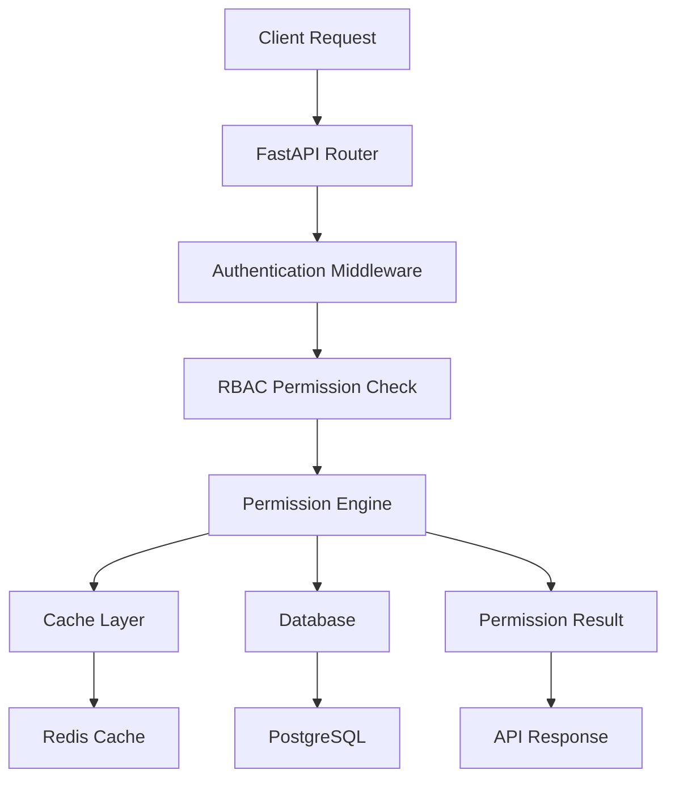
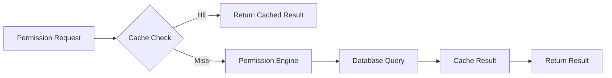

# RBAC Phase 2: FastAPI REST API Foundation - Detailed Technical Documentation

## 📚 Table of Contents

1. [Architecture Overview](#architecture-overview)
2. [API Endpoint Reference](#api-endpoint-reference)
3. [Permission Engine Deep Dive](#permission-engine-deep-dive)
4. [Database Schema & Models](#database-schema--models)
5. [Testing Framework](#testing-framework)
6. [Security Implementation](#security-implementation)
7. [Performance & Caching](#performance--caching)
8. [Configuration & Deployment](#configuration--deployment)
9. [Troubleshooting Guide](#troubleshooting-guide)
10. [Development Guidelines](#development-guidelines)

---

## 🏗️ Architecture Overview

### **System Architecture**



### **Component Responsibilities**

| Component | Responsibility | Location |
|-----------|---------------|----------|
| **API Routers** | HTTP endpoint handling, request/response validation | `langflow/api/v1/rbac/*.py` |
| **Permission Engine** | Core permission logic, caching, batch processing | `langflow/services/rbac/permission_engine.py` |
| **Data Models** | Database schema, relationships, validation | `langflow/services/database/models/rbac/*.py` |
| **Dependencies** | FastAPI dependency injection, permission checking | `langflow/api/v1/rbac/dependencies.py` |
| **Test Suite** | Unit/integration testing, validation | `tests/unit/api/v1/rbac/*.py` |

### **Request Flow**

1. **Authentication**: Validate Bearer token or API key
2. **Route Matching**: FastAPI router matches endpoint
3. **Input Validation**: Pydantic models validate request data
4. **Permission Check**: Permission engine evaluates access
5. **Cache Lookup**: Check Redis cache for cached results
6. **Database Query**: Query PostgreSQL if cache miss
7. **Response Generation**: Return structured API response
8. **Audit Logging**: Log access attempts for compliance

---

## 🌐 API Endpoint Reference

### **Workspace Management API**

#### **Base URL**: `/api/v1/rbac/workspaces`

| Method | Endpoint | Description | Permissions Required |
|--------|----------|-------------|---------------------|
| `POST` | `/` | Create new workspace | `system:create_workspace` |
| `GET` | `/` | List user's workspaces | `workspace:read` |
| `GET` | `/{workspace_id}` | Get workspace details | `workspace:read` |
| `PUT` | `/{workspace_id}` | Update workspace | `workspace:update` |
| `DELETE` | `/{workspace_id}` | Delete workspace (soft) | `workspace:delete` |
| `POST` | `/{workspace_id}/invite` | Invite user to workspace | `workspace:manage` |
| `GET` | `/{workspace_id}/users` | List workspace users | `workspace:read` |
| `GET` | `/{workspace_id}/projects` | List workspace projects | `workspace:read` |
| `GET` | `/{workspace_id}/stats` | Get workspace statistics | `workspace:read` |

#### **Example Requests**

```python
# Create Workspace
POST /api/v1/rbac/workspaces/
{
    "name": "AI Development Team",
    "description": "Workspace for AI/ML development projects",
    "organization": "Acme Corp",
    "settings": {
        "default_project_visibility": "private",
        "allow_external_collaborators": false,
        "require_approval_for_deployments": true
    }
}

# Response
{
    "id": "550e8400-e29b-41d4-a716-446655440000",
    "name": "AI Development Team",
    "description": "Workspace for AI/ML development projects",
    "organization": "Acme Corp",
    "owner_id": "123e4567-e89b-12d3-a456-426614174000",
    "is_active": true,
    "created_at": "2024-09-17T10:00:00Z",
    "updated_at": "2024-09-17T10:00:00Z"
}
```

### **Project Management API**

#### **Base URL**: `/api/v1/rbac/projects`

| Method | Endpoint | Description | Permissions Required |
|--------|----------|-------------|---------------------|
| `POST` | `/` | Create new project | `workspace:create_project` |
| `GET` | `/` | List accessible projects | `project:read` |
| `GET` | `/{project_id}` | Get project details | `project:read` |
| `PUT` | `/{project_id}` | Update project | `project:update` |
| `DELETE` | `/{project_id}` | Archive project | `project:delete` |
| `GET` | `/{project_id}/environments` | List project environments | `project:read` |
| `GET` | `/{project_id}/flows` | List project flows | `project:read` |
| `GET` | `/{project_id}/stats` | Get project statistics | `project:read` |

### **Role Management API**

#### **Base URL**: `/api/v1/rbac/roles`

| Method | Endpoint | Description | Permissions Required |
|--------|----------|-------------|---------------------|
| `POST` | `/` | Create custom role | `workspace:create_role` or `system:admin` |
| `GET` | `/` | List accessible roles | `role:read` |
| `GET` | `/{role_id}` | Get role details | `role:read` |
| `PUT` | `/{role_id}` | Update role | `role:update` |
| `DELETE` | `/{role_id}` | Delete role | `role:delete` |
| `GET` | `/{role_id}/permissions` | List role permissions | `role:read` |
| `POST` | `/{role_id}/permissions` | Grant permission to role | `role:manage` |
| `DELETE` | `/{role_id}/permissions/{permission_id}` | Revoke permission from role | `role:manage` |
| `POST` | `/initialize-system-roles` | Initialize system roles | `system:admin` |

### **Permission Management API**

#### **Base URL**: `/api/v1/rbac/permissions`

| Method | Endpoint | Description | Permissions Required |
|--------|----------|-------------|---------------------|
| `GET` | `/` | List system permissions | `system:admin` |
| `GET` | `/{permission_id}` | Get permission details | `system:admin` |
| `POST` | `/check` | Check single permission | Authenticated |
| `POST` | `/batch-check` | Check multiple permissions | Authenticated |
| `POST` | `/initialize-system-permissions` | Initialize permissions | `system:admin` |
| `GET` | `/resource-types` | List available resource types | Authenticated |
| `GET` | `/actions` | List available actions | Authenticated |

#### **Permission Check Examples**

```python
# Single Permission Check
POST /api/v1/rbac/permissions/check
{
    "resource_type": "project",
    "action": "deploy",
    "resource_id": "proj-123",
    "workspace_id": "ws-456",
    "project_id": "proj-123",
    "environment_id": "env-789"
}

# Response
{
    "allowed": true,
    "reason": "User has project-deploy permission via DevOps role",
    "source": "role_assignment",
    "cached": false,
    "evaluated_at": "2024-09-17T10:30:00Z"
}

# Batch Permission Check
POST /api/v1/rbac/permissions/batch-check
[
    {
        "resource_type": "workspace",
        "action": "read",
        "workspace_id": "ws-456"
    },
    {
        "resource_type": "project", 
        "action": "create",
        "workspace_id": "ws-456"
    },
    {
        "resource_type": "environment",
        "action": "deploy",
        "workspace_id": "ws-456",
        "project_id": "proj-123"
    }
]

# Response (Array)
[
    {
        "allowed": true,
        "reason": "User is workspace member",
        "source": "workspace_membership",
        "cached": true,
        "evaluated_at": "2024-09-17T10:29:45Z"
    },
    {
        "allowed": true,
        "reason": "User has project-create permission",
        "source": "role_assignment", 
        "cached": false,
        "evaluated_at": "2024-09-17T10:30:00Z"
    },
    {
        "allowed": false,
        "reason": "User lacks deployment permissions",
        "source": "default_deny",
        "cached": false,
        "evaluated_at": "2024-09-17T10:30:00Z"
    }
]
```

---

## ⚡ Permission Engine Deep Dive

### **Core Classes**

```python
@dataclass
class PermissionContext:
    """Context for permission evaluation."""
    resource_type: str
    action: str
    resource_id: UUID | None = None
    workspace_id: UUID | None = None
    project_id: UUID | None = None
    environment_id: UUID | None = None

class PermissionResult(BaseModel):
    """Result of permission evaluation."""
    allowed: bool
    reason: str
    source: str
    cached: bool = False
    evaluated_at: datetime | None = None
```

### **Permission Resolution Flow**

```python
class PermissionEngine:
    async def check_permission(self, session, user, **kwargs) -> PermissionResult:
        # 1. Build permission context
        context = PermissionContext(**kwargs)
        
        # 2. Check cache first
        cache_key = self._build_cache_key(user.id, context)
        cached_result = await self._check_cached_permission(cache_key)
        if cached_result:
            return cached_result
            
        # 3. Superuser bypass
        if user.is_superuser:
            return PermissionResult(allowed=True, reason="Superuser access")
            
        # 4. Check resource ownership
        ownership_result = await self._check_resource_ownership(session, user, context)
        if ownership_result.allowed:
            await self._cache_result(cache_key, ownership_result)
            return ownership_result
            
        # 5. Check role-based permissions
        role_result = await self._check_role_permissions(session, user, context)
        if role_result.allowed:
            await self._cache_result(cache_key, role_result)
            return role_result
            
        # 6. Check hierarchical permissions
        hierarchical_result = await self._resolve_hierarchical_permissions(session, user, context)
        if hierarchical_result.allowed:
            await self._cache_result(cache_key, hierarchical_result)
            return hierarchical_result
            
        # 7. Default deny
        result = PermissionResult(allowed=False, reason="No applicable permissions found")
        await self._cache_result(cache_key, result)
        return result
```

### **Caching Strategy**

```python
class CacheConfiguration:
    # Cache TTL by permission type
    CACHE_TTL = {
        "ownership": 300,      # 5 minutes
        "role_assignment": 600, # 10 minutes  
        "system_admin": 1800,  # 30 minutes
        "default_deny": 60,    # 1 minute
    }
    
    # Cache invalidation patterns
    INVALIDATION_PATTERNS = {
        "role_assignment": ["user:{user_id}:roles:*", "role:{role_id}:*"],
        "resource_ownership": ["user:{user_id}:ownership:*"],
        "workspace_membership": ["workspace:{workspace_id}:members:*"],
    }
```

### **Batch Processing Optimization**

```python
async def batch_check_permissions(self, session, user, requests) -> List[PermissionResult]:
    """Optimized batch permission checking."""
    # 1. Group requests by context similarity
    grouped_requests = self._group_similar_requests(requests)
    
    # 2. Pre-load user roles and permissions for context
    user_roles = await self._get_user_roles(session, user, workspace_ids=self._extract_workspaces(requests))
    
    # 3. Batch cache lookups
    cache_keys = [self._build_cache_key(user.id, req) for req in requests]
    cached_results = await self._batch_cache_lookup(cache_keys)
    
    # 4. Process uncached requests efficiently
    results = []
    for i, request in enumerate(requests):
        if cached_results[i]:
            results.append(cached_results[i])
        else:
            result = await self._check_permission_with_context(session, user, request, user_roles)
            results.append(result)
            
    return results
```

---

## 🗄️ Database Schema & Models

### **Core RBAC Tables**

```sql
-- Permissions table
CREATE TABLE rbac_permissions (
    id UUID PRIMARY KEY,
    code VARCHAR(100) UNIQUE NOT NULL,  -- e.g., "workspace:read"
    name VARCHAR(200) NOT NULL,
    description TEXT,
    resource_type VARCHAR(50) NOT NULL, -- workspace, project, environment, flow
    action VARCHAR(50) NOT NULL,        -- read, create, update, delete, manage
    is_system BOOLEAN DEFAULT false,
    created_at TIMESTAMP WITH TIME ZONE DEFAULT NOW(),
    updated_at TIMESTAMP WITH TIME ZONE DEFAULT NOW()
);

-- Roles table
CREATE TABLE rbac_roles (
    id UUID PRIMARY KEY,
    name VARCHAR(200) NOT NULL,
    description TEXT,
    workspace_id UUID,  -- NULL for system roles
    parent_role_id UUID,
    type VARCHAR(50) DEFAULT 'custom', -- system, custom, inherited
    is_system BOOLEAN DEFAULT false,
    is_active BOOLEAN DEFAULT true,
    created_by_id UUID NOT NULL,
    created_at TIMESTAMP WITH TIME ZONE DEFAULT NOW(),
    updated_at TIMESTAMP WITH TIME ZONE DEFAULT NOW(),
    version INTEGER DEFAULT 1,
    UNIQUE(name, workspace_id)
);

-- Role-Permission assignments
CREATE TABLE rbac_role_permissions (
    id UUID PRIMARY KEY,
    role_id UUID NOT NULL REFERENCES rbac_roles(id),
    permission_id UUID NOT NULL REFERENCES rbac_permissions(id),
    is_granted BOOLEAN DEFAULT true,
    granted_by_id UUID NOT NULL,
    granted_at TIMESTAMP WITH TIME ZONE DEFAULT NOW(),
    reason TEXT,
    UNIQUE(role_id, permission_id)
);

-- Role assignments to users/groups
CREATE TABLE rbac_role_assignments (
    id UUID PRIMARY KEY,
    role_id UUID NOT NULL REFERENCES rbac_roles(id),
    user_id UUID,           -- Either user_id OR group_id, not both
    group_id UUID,
    workspace_id UUID,      -- Scope of assignment
    project_id UUID,
    environment_id UUID,
    assigned_by_id UUID NOT NULL,
    assigned_at TIMESTAMP WITH TIME ZONE DEFAULT NOW(),
    expires_at TIMESTAMP WITH TIME ZONE,
    is_active BOOLEAN DEFAULT true,
    reason TEXT,
    CHECK ((user_id IS NOT NULL AND group_id IS NULL) OR (user_id IS NULL AND group_id IS NOT NULL))
);
```

### **Workspace Hierarchy**

```sql
-- Workspaces (top-level multi-tenant containers)
CREATE TABLE rbac_workspaces (
    id UUID PRIMARY KEY,
    name VARCHAR(200) NOT NULL,
    description TEXT,
    organization VARCHAR(200),
    owner_id UUID NOT NULL,
    settings JSONB DEFAULT '{}',
    is_active BOOLEAN DEFAULT true,
    is_deleted BOOLEAN DEFAULT false,
    deletion_requested_at TIMESTAMP WITH TIME ZONE,
    created_at TIMESTAMP WITH TIME ZONE DEFAULT NOW(),
    updated_at TIMESTAMP WITH TIME ZONE DEFAULT NOW(),
    UNIQUE(owner_id, name) WHERE NOT is_deleted
);

-- Projects (within workspaces)  
CREATE TABLE rbac_projects (
    id UUID PRIMARY KEY,
    name VARCHAR(200) NOT NULL,
    description TEXT,
    workspace_id UUID NOT NULL REFERENCES rbac_workspaces(id),
    owner_id UUID NOT NULL,
    tags JSONB DEFAULT '[]',
    settings JSONB DEFAULT '{}',
    is_active BOOLEAN DEFAULT true,
    is_archived BOOLEAN DEFAULT false,
    archived_at TIMESTAMP WITH TIME ZONE,
    created_at TIMESTAMP WITH TIME ZONE DEFAULT NOW(),
    updated_at TIMESTAMP WITH TIME ZONE DEFAULT NOW(),
    UNIQUE(workspace_id, name) WHERE is_active = true
);

-- Environments (within projects)
CREATE TABLE rbac_environments (
    id UUID PRIMARY KEY,
    name VARCHAR(200) NOT NULL,
    description TEXT,
    project_id UUID NOT NULL REFERENCES rbac_projects(id),
    owner_id UUID NOT NULL,
    type VARCHAR(50) DEFAULT 'development', -- development, staging, production
    settings JSONB DEFAULT '{}',
    is_active BOOLEAN DEFAULT true,
    is_locked BOOLEAN DEFAULT false,
    deployment_count INTEGER DEFAULT 0,
    created_at TIMESTAMP WITH TIME ZONE DEFAULT NOW(),
    updated_at TIMESTAMP WITH TIME ZONE DEFAULT NOW(),
    UNIQUE(project_id, name) WHERE is_active = true
);
```

### **SQLModel Classes**

```python
class Permission(SQLModel, table=True):
    __tablename__ = "rbac_permissions"
    
    id: UUID = Field(default_factory=uuid4, primary_key=True)
    code: str = Field(unique=True, index=True)
    name: str
    description: str | None = None
    resource_type: str = Field(index=True)
    action: str = Field(index=True)
    is_system: bool = Field(default=False)
    created_at: datetime = Field(default_factory=lambda: datetime.now(timezone.utc))
    updated_at: datetime = Field(default_factory=lambda: datetime.now(timezone.utc))

class Role(SQLModel, table=True):
    __tablename__ = "rbac_roles"
    
    id: UUID = Field(default_factory=uuid4, primary_key=True)
    name: str = Field(index=True)
    description: str | None = None
    workspace_id: UUID | None = Field(default=None, foreign_key="rbac_workspaces.id", index=True)
    parent_role_id: UUID | None = Field(default=None, foreign_key="rbac_roles.id")
    type: str = Field(default="custom")  # system, custom, inherited
    is_system: bool = Field(default=False)
    is_active: bool = Field(default=True, index=True)
    created_by_id: UUID = Field(foreign_key="users.id")
    created_at: datetime = Field(default_factory=lambda: datetime.now(timezone.utc))
    updated_at: datetime = Field(default_factory=lambda: datetime.now(timezone.utc))
    version: int = Field(default=1)

class Workspace(SQLModel, table=True):
    __tablename__ = "rbac_workspaces"
    
    id: UUID = Field(default_factory=uuid4, primary_key=True)
    name: str = Field(index=True)
    description: str | None = None
    organization: str | None = None
    owner_id: UUID = Field(foreign_key="users.id", index=True)
    settings: dict = Field(default_factory=dict, sa_type=JSON)
    is_active: bool = Field(default=True, index=True)
    is_deleted: bool = Field(default=False, index=True)
    deletion_requested_at: datetime | None = None
    created_at: datetime = Field(default_factory=lambda: datetime.now(timezone.utc))
    updated_at: datetime = Field(default_factory=lambda: datetime.now(timezone.utc))
```

---

## 🧪 Testing Framework

### **Test Structure**

```
tests/
├── unit/api/v1/rbac/
│   ├── test_workspaces.py      # 28 workspace API tests
│   ├── test_projects.py        # 28 project API tests
│   ├── test_roles.py           # 46 role API tests
│   ├── test_permissions.py     # 42 permission API tests
│   └── __init__.py
├── integration/
│   └── test_rbac_integration.py  # End-to-end workflow tests
└── fixtures/
    ├── conftest.py             # Shared test fixtures
    └── rbac_fixtures.py        # RBAC-specific test data
```

### **Test Categories**

#### **1. Unit Tests (144+ methods)**
```python
class TestWorkspaceAPI:
    def test_create_workspace_success(self):
        """Test successful workspace creation with valid data."""
        
    def test_create_workspace_duplicate_name(self):
        """Test workspace creation fails with duplicate name."""
        
    def test_list_workspaces_with_filters(self):
        """Test workspace listing with search and filter parameters."""
        
    def test_workspace_permission_denied(self):
        """Test workspace access denied for insufficient permissions."""

class TestPermissionEngine:
    def test_permission_check_superuser(self):
        """Test superuser bypass for all permissions."""
        
    def test_permission_check_cached_result(self):
        """Test permission engine returns cached results."""
        
    def test_batch_permission_check_optimization(self):
        """Test batch checking performance and correctness."""
        
    def test_hierarchical_permission_inheritance(self):
        """Test permission inheritance from workspace to project."""
```

#### **2. Integration Tests**
```python
class TestRBACWorkflowIntegration:
    async def test_complete_workspace_project_flow(self):
        """Test complete workflow: create workspace -> project -> assign roles -> check permissions."""
        
    async def test_multi_tenant_isolation(self):
        """Test users cannot access resources from other tenants."""
        
    async def test_role_based_access_patterns(self):
        """Test different role-based access scenarios."""
        
    async def test_permission_caching_integration(self):
        """Test permission caching works across multiple API calls."""
```

### **Test Fixtures & Utilities**

```python
@pytest.fixture
def mock_user():
    """Create a mock user for testing."""
    user = MagicMock(spec=User)
    user.id = uuid4()
    user.username = "testuser"
    user.is_superuser = False
    user.is_active = True
    return user

@pytest.fixture
def mock_permission_engine():
    """Create a mock permission engine with configurable responses."""
    engine = AsyncMock(spec=PermissionEngine)
    engine.check_permission.return_value = PermissionResult(
        allowed=True,
        reason="Test permission granted",
        source="test_fixture",
        cached=False
    )
    return engine

@pytest.fixture
def sample_workspace_data():
    """Generate sample workspace data for testing."""
    return {
        "name": f"Test Workspace {uuid4().hex[:8]}",
        "description": "A workspace created for testing purposes",
        "organization": "Test Organization",
        "settings": {
            "default_project_visibility": "private",
            "allow_external_collaborators": False
        }
    }
```

### **Performance Testing**

```python
class TestPerformance:
    async def test_permission_check_latency(self):
        """Verify permission checks complete under 100ms."""
        start_time = time.time()
        result = await permission_engine.check_permission(...)
        end_time = time.time()
        
        assert (end_time - start_time) < 0.1  # 100ms
        assert result is not None
        
    async def test_batch_permission_scalability(self):
        """Test batch permission checking with 50 requests."""
        requests = [generate_permission_request() for _ in range(50)]
        
        start_time = time.time()
        results = await permission_engine.batch_check_permissions(session, user, requests)
        end_time = time.time()
        
        assert len(results) == 50
        assert (end_time - start_time) < 0.2  # 200ms for 50 checks
```

---

## 🔒 Security Implementation

### **Authentication & Authorization Flow**

```python
class RBACSecurityMiddleware:
    async def __call__(self, request: Request, call_next):
        # 1. Extract and validate authentication token
        token = self.extract_token(request)
        if not token:
            raise HTTPException(status_code=401, detail="Authentication required")
            
        # 2. Validate token and get user
        user = await self.validate_token(token)
        if not user or not user.is_active:
            raise HTTPException(status_code=401, detail="Invalid or inactive user")
            
        # 3. Add user to request context
        request.state.current_user = user
        
        # 4. Continue to endpoint
        response = await call_next(request)
        
        # 5. Log access for audit trail
        await self.log_access(user, request, response)
        
        return response
```

### **Input Validation & Sanitization**

```python
class WorkspaceCreate(BaseModel):
    name: str = Field(..., min_length=1, max_length=200, pattern=r'^[\w\s\-\.]+$')
    description: str | None = Field(None, max_length=2000)
    organization: str | None = Field(None, max_length=200)
    settings: dict = Field(default_factory=dict)
    
    @validator('name')
    def validate_name(cls, v):
        # Sanitize input to prevent XSS and injection attacks
        v = v.strip()
        if not v:
            raise ValueError('Name cannot be empty')
        # Additional sanitization logic
        return v
        
    @validator('settings')
    def validate_settings(cls, v):
        # Validate settings against allowed keys and types
        allowed_keys = {'default_project_visibility', 'allow_external_collaborators'}
        if not all(key in allowed_keys for key in v.keys()):
            raise ValueError('Invalid settings keys')
        return v
```

### **Rate Limiting**

```python
class RBACRateLimiter:
    # Rate limits by endpoint type
    RATE_LIMITS = {
        "permission_check": "10000/minute",    # High frequency for permission checks
        "batch_permission": "100/minute",      # Lower for batch operations  
        "workspace_create": "10/minute",       # Conservative for creation
        "role_management": "100/minute",       # Moderate for role operations
    }
    
    async def check_rate_limit(self, user_id: UUID, endpoint_type: str):
        key = f"rate_limit:{user_id}:{endpoint_type}"
        current = await redis.incr(key)
        if current == 1:
            await redis.expire(key, 60)  # 1 minute window
            
        limit = self.get_limit_for_endpoint(endpoint_type)
        if current > limit:
            raise HTTPException(
                status_code=429, 
                detail=f"Rate limit exceeded for {endpoint_type}"
            )
```

### **Multi-Tenant Data Isolation**

```python
class TenantIsolationMixin:
    """Mixin to ensure multi-tenant data isolation."""
    
    def apply_tenant_filter(self, query, user: User, resource_type: str):
        """Apply tenant-specific filters to database queries."""
        
        if user.is_superuser:
            return query  # Superusers can see all data
            
        if resource_type == "workspace":
            # Users can only see workspaces they own or are members of
            return query.filter(
                or_(
                    Workspace.owner_id == user.id,
                    Workspace.id.in_(self.get_user_workspace_ids(user.id))
                )
            )
            
        elif resource_type == "project":
            # Users can only see projects in their accessible workspaces
            accessible_workspaces = self.get_user_workspace_ids(user.id)
            return query.filter(Project.workspace_id.in_(accessible_workspaces))
            
        return query
        
    def validate_tenant_access(self, user: User, resource_id: UUID, resource_type: str):
        """Validate user has access to resource within their tenant scope."""
        if user.is_superuser:
            return True
            
        # Check if resource belongs to user's accessible workspaces
        resource_workspace_id = self.get_resource_workspace_id(resource_id, resource_type)
        user_workspace_ids = self.get_user_workspace_ids(user.id)
        
        if resource_workspace_id not in user_workspace_ids:
            raise HTTPException(
                status_code=403, 
                detail="Access denied: Resource not in accessible workspace"
            )
```

---

## ⚡ Performance & Caching

### **Caching Architecture**



### **Cache Implementation**

```python
class PermissionCache:
    def __init__(self, redis_client):
        self.redis = redis_client
        self.local_cache = TTLCache(maxsize=1000, ttl=60)  # 1-minute local cache
        
    async def get(self, key: str) -> dict | None:
        # 1. Check local cache first (fastest)
        if key in self.local_cache:
            return self.local_cache[key]
            
        # 2. Check Redis cache
        cached_data = await self.redis.get(key)
        if cached_data:
            data = json.loads(cached_data)
            self.local_cache[key] = data  # Populate local cache
            return data
            
        return None
        
    async def set(self, key: str, value: dict, ttl: int = 300):
        # Store in both local and Redis cache
        self.local_cache[key] = value
        await self.redis.setex(key, ttl, json.dumps(value, default=str))
        
    async def invalidate_pattern(self, pattern: str):
        """Invalidate all keys matching pattern."""
        keys = await self.redis.keys(pattern)
        if keys:
            await self.redis.delete(*keys)
        # Clear local cache items matching pattern
        self.local_cache.clear()  # Simple approach - clear all local cache
```

### **Performance Optimization Techniques**

#### **1. Database Query Optimization**
```python
class OptimizedQueries:
    @staticmethod
    async def get_user_permissions_bulk(session, user_id: UUID, workspace_ids: List[UUID]):
        """Optimized bulk query for user permissions across workspaces."""
        query = select(
            Permission.code,
            Permission.resource_type,
            Permission.action,
            Role.workspace_id,
            RoleAssignment.project_id,
            RoleAssignment.environment_id
        ).select_from(
            Permission
            .join(RolePermission, Permission.id == RolePermission.permission_id)
            .join(Role, RolePermission.role_id == Role.id)  
            .join(RoleAssignment, Role.id == RoleAssignment.role_id)
        ).where(
            RoleAssignment.user_id == user_id,
            RoleAssignment.is_active == True,
            RolePermission.is_granted == True,
            Role.is_active == True,
            or_(
                Role.workspace_id.in_(workspace_ids),
                Role.workspace_id.is_(None)  # System roles
            )
        )
        
        result = await session.exec(query)
        return result.all()
```

#### **2. Connection Pooling**
```python
class DatabaseConfig:
    # Optimized connection pool settings
    CONNECTION_POOL = {
        "pool_size": 20,           # Base pool size
        "max_overflow": 30,        # Additional connections
        "pool_timeout": 30,        # Connection timeout
        "pool_recycle": 3600,      # Recycle connections hourly
        "pool_pre_ping": True,     # Validate connections
    }
    
    # Read replica configuration for permission checks
    READ_REPLICA_CONFIG = {
        "read_permission_checks": True,  # Use read replicas for permission queries
        "write_operations": ["create", "update", "delete"],  # Operations requiring primary
        "fallback_to_primary": True,    # Fallback if read replica unavailable
    }
```

#### **3. Batch Processing**
```python
class BatchProcessingOptimizer:
    async def optimize_permission_batch(self, requests: List[dict]) -> List[dict]:
        """Optimize batch permission requests for efficiency."""
        
        # 1. Group by similarity (same workspace, project, etc.)
        grouped = defaultdict(list)
        for req in requests:
            key = (req.get('workspace_id'), req.get('project_id'))
            grouped[key].append(req)
            
        # 2. Pre-load context data for each group
        context_data = {}
        for key, group_requests in grouped.items():
            workspace_id, project_id = key
            context_data[key] = await self.preload_context(workspace_id, project_id)
            
        # 3. Process requests with shared context
        optimized_requests = []
        for key, group_requests in grouped.items():
            context = context_data[key]
            for req in group_requests:
                req['_preloaded_context'] = context
                optimized_requests.append(req)
                
        return optimized_requests
```

### **Performance Monitoring**

```python
class PerformanceMonitor:
    def __init__(self):
        self.metrics = {
            "permission_check_latency": [],
            "cache_hit_rate": 0.0,
            "database_query_time": [],
            "api_response_times": {}
        }
    
    @contextmanager
    def measure_latency(self, operation: str):
        start_time = time.time()
        try:
            yield
        finally:
            end_time = time.time()
            latency = (end_time - start_time) * 1000  # Convert to ms
            self.metrics[f"{operation}_latency"].append(latency)
            
    def get_performance_stats(self) -> dict:
        return {
            "avg_permission_check_ms": statistics.mean(self.metrics.get("permission_check_latency", [0])),
            "p95_permission_check_ms": self.calculate_percentile(self.metrics.get("permission_check_latency", []), 95),
            "cache_hit_rate": self.metrics.get("cache_hit_rate", 0.0),
            "total_requests": len(self.metrics.get("permission_check_latency", [])),
        }
```

---

## 🚀 Configuration & Deployment

### **Environment Configuration**

```python
class RBACSettings(BaseSettings):
    # Database Configuration
    DATABASE_URL: str = Field(..., env="DATABASE_URL")
    DATABASE_POOL_SIZE: int = Field(20, env="DATABASE_POOL_SIZE")
    DATABASE_MAX_OVERFLOW: int = Field(30, env="DATABASE_MAX_OVERFLOW")
    
    # Redis Configuration  
    REDIS_URL: str = Field("redis://localhost:6379", env="REDIS_URL")
    REDIS_CONNECTION_POOL_SIZE: int = Field(50, env="REDIS_POOL_SIZE")
    
    # Caching Configuration
    PERMISSION_CACHE_TTL: int = Field(300, env="PERMISSION_CACHE_TTL")  # 5 minutes
    PERMISSION_CACHE_ENABLED: bool = Field(True, env="PERMISSION_CACHE_ENABLED")
    LOCAL_CACHE_SIZE: int = Field(1000, env="LOCAL_CACHE_SIZE")
    
    # Performance Settings
    BATCH_PERMISSION_LIMIT: int = Field(50, env="BATCH_PERMISSION_LIMIT")
    MAX_PERMISSION_CHECK_LATENCY_MS: int = Field(100, env="MAX_PERMISSION_LATENCY")
    
    # Security Settings
    REQUIRE_HTTPS: bool = Field(True, env="REQUIRE_HTTPS")
    JWT_SECRET_KEY: str = Field(..., env="JWT_SECRET_KEY")
    JWT_ALGORITHM: str = Field("HS256", env="JWT_ALGORITHM")
    JWT_EXPIRATION_HOURS: int = Field(24, env="JWT_EXPIRATION_HOURS")
    
    # Audit Settings
    AUDIT_LOG_ENABLED: bool = Field(True, env="AUDIT_LOG_ENABLED")
    AUDIT_LOG_RETENTION_DAYS: int = Field(90, env="AUDIT_RETENTION_DAYS")
    
    class Config:
        env_file = ".env"
        case_sensitive = True
```

### **Docker Deployment**

```dockerfile
# Dockerfile for RBAC-enabled LangBuilder
FROM python:3.11-slim

# Install system dependencies
RUN apt-get update && apt-get install -y \
    postgresql-client \
    redis-tools \
    && rm -rf /var/lib/apt/lists/*

# Set working directory
WORKDIR /app

# Copy requirements and install Python dependencies
COPY requirements.txt .
RUN pip install --no-cache-dir -r requirements.txt

# Copy application code
COPY src/ ./src/
COPY scripts/ ./scripts/

# Set environment variables
ENV PYTHONPATH=/app/src/backend/base
ENV LANGFLOW_RBAC_ENABLED=true

# Health check endpoint
HEALTHCHECK --interval=30s --timeout=10s --start-period=5s --retries=3 \
    CMD curl -f http://localhost:8000/health || exit 1

# Run the application
CMD ["uvicorn", "langflow.main:app", "--host", "0.0.0.0", "--port", "8000"]
```

### **Docker Compose with Dependencies**

```yaml
version: '3.8'

services:
  langbuilder-rbac:
    build: .
    ports:
      - "8000:8000"
    environment:
      - DATABASE_URL=postgresql://user:password@db:5432/langbuilder
      - REDIS_URL=redis://redis:6379
      - LANGFLOW_RBAC_ENABLED=true
      - PERMISSION_CACHE_ENABLED=true
    depends_on:
      - db
      - redis
    volumes:
      - ./logs:/app/logs
    healthcheck:
      test: ["CMD", "curl", "-f", "http://localhost:8000/health"]
      interval: 30s
      timeout: 10s
      retries: 3

  db:
    image: postgres:15
    environment:
      POSTGRES_DB: langbuilder
      POSTGRES_USER: user
      POSTGRES_PASSWORD: password
    volumes:
      - postgres_data:/var/lib/postgresql/data
      - ./init-db.sql:/docker-entrypoint-initdb.d/init-db.sql
    ports:
      - "5432:5432"

  redis:
    image: redis:7-alpine
    ports:
      - "6379:6379"
    volumes:
      - redis_data:/data
    command: redis-server --appendonly yes

  # Optional: Redis monitoring
  redis-insight:
    image: redislabs/redisinsight:latest
    ports:
      - "8001:8001"
    environment:
      - RITRUSTEDORIGINS=http://localhost:8001

volumes:
  postgres_data:
  redis_data:
```

### **Kubernetes Deployment**

```yaml
apiVersion: apps/v1
kind: Deployment
metadata:
  name: langbuilder-rbac
spec:
  replicas: 3
  selector:
    matchLabels:
      app: langbuilder-rbac
  template:
    metadata:
      labels:
        app: langbuilder-rbac
    spec:
      containers:
      - name: langbuilder
        image: langbuilder:rbac-latest
        ports:
        - containerPort: 8000
        env:
        - name: DATABASE_URL
          valueFrom:
            secretKeyRef:
              name: db-credentials
              key: url
        - name: REDIS_URL
          value: "redis://redis-service:6379"
        - name: LANGFLOW_RBAC_ENABLED
          value: "true"
        resources:
          requests:
            memory: "512Mi"
            cpu: "200m"
          limits:
            memory: "1Gi" 
            cpu: "500m"
        livenessProbe:
          httpGet:
            path: /health
            port: 8000
          initialDelaySeconds: 30
          periodSeconds: 10
        readinessProbe:
          httpGet:
            path: /ready
            port: 8000
          initialDelaySeconds: 5
          periodSeconds: 5

---
apiVersion: v1
kind: Service
metadata:
  name: langbuilder-service
spec:
  selector:
    app: langbuilder-rbac
  ports:
  - port: 80
    targetPort: 8000
  type: LoadBalancer
```

---

## 🔧 Troubleshooting Guide

### **Common Issues & Solutions**

#### **1. Permission Check Latency Issues**

**Problem**: Permission checks taking longer than 100ms
```
ERROR: Permission check exceeded 100ms threshold
LATENCY: 157ms for workspace:read check
```

**Solutions**:
```python
# Check Redis connection
async def diagnose_cache_performance():
    start = time.time()
    await redis.ping()
    redis_latency = (time.time() - start) * 1000
    
    if redis_latency > 10:  # 10ms threshold
        logger.warning(f"Redis latency high: {redis_latency}ms")
        
# Check database performance  
async def diagnose_db_performance():
    query = "SELECT 1"
    start = time.time()
    await session.exec(text(query))
    db_latency = (time.time() - start) * 1000
    
    if db_latency > 50:  # 50ms threshold
        logger.warning(f"Database latency high: {db_latency}ms")

# Enable performance debugging
RBAC_DEBUG_PERFORMANCE = True
```

#### **2. Cache Invalidation Issues**

**Problem**: Stale permissions after role changes
```
ERROR: User still has old permissions after role update
CACHE_KEY: permission:user123:workspace456:read
```

**Solutions**:
```python
# Force cache invalidation after role changes
async def invalidate_user_permissions(user_id: UUID):
    patterns = [
        f"permission:{user_id}:*",
        f"user_roles:{user_id}:*",
        f"role_permissions:*:{user_id}"
    ]
    
    for pattern in patterns:
        await cache.invalidate_pattern(pattern)

# Enable cache debugging
RBAC_DEBUG_CACHE = True
```

#### **3. Database Connection Pool Exhaustion**

**Problem**: Connection pool exhausted during high load
```
ERROR: QueuePool limit of size 20 overflow 30 reached
```

**Solutions**:
```python
# Increase pool size
DATABASE_POOL_SIZE = 30
DATABASE_MAX_OVERFLOW = 50

# Enable connection monitoring
async def monitor_connection_pool():
    pool = engine.pool
    logger.info(f"Pool size: {pool.size()}")
    logger.info(f"Checked in: {pool.checkedin()}")
    logger.info(f"Checked out: {pool.checkedout()}")
    logger.info(f"Overflow: {pool.overflow()}")
```

### **Debugging Tools**

#### **1. Permission Check Debugger**
```python
class PermissionDebugger:
    async def debug_permission_check(self, user_id: UUID, context: PermissionContext):
        debug_info = {
            "user_id": str(user_id),
            "context": context.dict(),
            "steps": []
        }
        
        # Step 1: Check cache
        cache_key = self._build_cache_key(user_id, context)
        cached_result = await self._check_cached_permission(cache_key)
        debug_info["steps"].append({
            "step": "cache_check",
            "cache_key": cache_key,
            "result": "hit" if cached_result else "miss"
        })
        
        # Step 2: Check user roles
        user_roles = await self._get_user_roles(session, user_id, context.workspace_id)
        debug_info["steps"].append({
            "step": "user_roles",
            "roles": [{"id": str(r.id), "name": r.name} for r in user_roles]
        })
        
        # Step 3: Check permissions
        for role in user_roles:
            permissions = await self._get_role_permissions(session, role)
            debug_info["steps"].append({
                "step": "role_permissions",
                "role": role.name,
                "permissions": [p.code for p in permissions]
            })
            
        return debug_info
```

#### **2. Performance Monitor**
```python
class RBACPerformanceMonitor:
    def __init__(self):
        self.metrics = defaultdict(list)
        
    @contextmanager
    def track_operation(self, operation: str):
        start_time = time.time()
        try:
            yield
        finally:
            duration = (time.time() - start_time) * 1000
            self.metrics[operation].append(duration)
            
            if duration > 100:  # Alert on slow operations
                logger.warning(f"Slow {operation}: {duration:.2f}ms")
                
    def get_stats(self) -> dict:
        stats = {}
        for operation, timings in self.metrics.items():
            stats[operation] = {
                "count": len(timings),
                "avg_ms": statistics.mean(timings),
                "p95_ms": self.percentile(timings, 95),
                "max_ms": max(timings),
            }
        return stats
```

### **Health Check Endpoints**

```python
@router.get("/health/rbac")
async def rbac_health_check():
    """Comprehensive RBAC system health check."""
    checks = {}
    
    # Database connectivity
    try:
        await session.exec(text("SELECT 1"))
        checks["database"] = {"status": "healthy", "latency_ms": 0}
    except Exception as e:
        checks["database"] = {"status": "unhealthy", "error": str(e)}
    
    # Redis connectivity  
    try:
        start = time.time()
        await redis.ping()
        latency = (time.time() - start) * 1000
        checks["redis"] = {"status": "healthy", "latency_ms": latency}
    except Exception as e:
        checks["redis"] = {"status": "unhealthy", "error": str(e)}
        
    # Permission engine
    try:
        test_result = await permission_engine.check_permission(
            session, test_user, "system", "health_check"
        )
        checks["permission_engine"] = {"status": "healthy", "test_result": test_result.allowed}
    except Exception as e:
        checks["permission_engine"] = {"status": "unhealthy", "error": str(e)}
        
    overall_status = "healthy" if all(c.get("status") == "healthy" for c in checks.values()) else "unhealthy"
    
    return {
        "status": overall_status,
        "timestamp": datetime.now(timezone.utc),
        "checks": checks
    }
```

---

## 👨‍💻 Development Guidelines

### **Code Style & Standards**

#### **1. API Endpoint Standards**
```python
# ✅ Good: Consistent parameter ordering
async def create_workspace(
    session: DbSession,                    # Required dependencies first
    current_user: CurrentActiveUser,       
    permission_engine: PermissionEngine = Depends(get_permission_engine),
    workspace_data: WorkspaceCreate,       # Request body
    skip: int = Query(0, ge=0),           # Query parameters with defaults last
    limit: int = Query(100, ge=1, le=1000),
) -> WorkspaceRead:

# ❌ Bad: Mixed parameter types
async def create_workspace(
    workspace_data: WorkspaceCreate,
    session: DbSession,
    skip: int = Query(0, ge=0),
    current_user: CurrentActiveUser,       # Should come before query params
) -> WorkspaceRead:
```

#### **2. Error Handling Standards**
```python
# ✅ Good: Structured error responses
@router.post("/workspaces/", responses={
    201: {"description": "Workspace created successfully"},
    400: {"description": "Invalid input data"},
    403: {"description": "Insufficient permissions"},
    409: {"description": "Workspace name already exists"},
})
async def create_workspace(data: WorkspaceCreate):
    try:
        # Implementation
        pass
    except ValidationError as e:
        raise HTTPException(
            status_code=400,
            detail={
                "error": "validation_failed",
                "message": "Invalid input data",
                "details": e.errors()
            }
        )
    except PermissionError:
        raise HTTPException(
            status_code=403,
            detail={
                "error": "insufficient_permissions", 
                "message": "You don't have permission to create workspaces"
            }
        )
```

#### **3. Testing Standards**
```python
# ✅ Good: Comprehensive test structure
class TestWorkspaceAPI:
    """Test workspace API endpoints."""
    
    @pytest.mark.asyncio
    async def test_create_workspace_success(self, mock_session, mock_user):
        """Test successful workspace creation with valid data."""
        # Arrange
        workspace_data = WorkspaceCreate(name="Test", description="Test workspace")
        mock_session.exec.return_value.first.return_value = None  # No existing workspace
        
        # Act
        result = await create_workspace(
            workspace_data=workspace_data,
            session=mock_session,
            current_user=mock_user
        )
        
        # Assert
        assert result is not None
        mock_session.add.assert_called_once()
        mock_session.commit.assert_called_once()
        
    @pytest.mark.asyncio
    async def test_create_workspace_duplicate_name(self, mock_session, mock_user):
        """Test workspace creation fails with duplicate name."""
        # Test implementation
        pass
```

### **Performance Guidelines**

#### **1. Database Query Best Practices**
```python
# ✅ Good: Efficient queries with proper joins
async def get_user_workspace_permissions(user_id: UUID, workspace_id: UUID):
    query = select(
        Permission.code,
        Role.name.label('role_name')
    ).select_from(
        Permission
        .join(RolePermission)
        .join(Role)
        .join(RoleAssignment)
    ).where(
        RoleAssignment.user_id == user_id,
        Role.workspace_id == workspace_id,
        RoleAssignment.is_active == True
    )
    
    return await session.exec(query).all()

# ❌ Bad: N+1 query problem
async def get_user_workspace_permissions_bad(user_id: UUID, workspace_id: UUID):
    role_assignments = await session.exec(
        select(RoleAssignment).where(RoleAssignment.user_id == user_id)
    ).all()
    
    permissions = []
    for assignment in role_assignments:  # N+1 queries
        role = await session.get(Role, assignment.role_id)
        role_permissions = await get_role_permissions(role.id)
        permissions.extend(role_permissions)
```

#### **2. Caching Best Practices**
```python
# ✅ Good: Structured cache keys with TTL
class CacheKeyBuilder:
    @staticmethod
    def permission_key(user_id: UUID, context: PermissionContext) -> str:
        return f"perm:{user_id}:{context.resource_type}:{context.action}:{context.resource_id}"
        
    @staticmethod
    def user_roles_key(user_id: UUID, workspace_id: UUID) -> str:
        return f"user_roles:{user_id}:{workspace_id}"

# Cache with appropriate TTL
await cache.set(cache_key, result, ttl=300)  # 5 minutes for permissions

# ❌ Bad: Generic cache keys without structure
cache_key = f"{user_id}_{resource_type}_{action}"  # Hard to invalidate
await cache.set(cache_key, result)  # No TTL
```

### **Security Guidelines**

#### **1. Input Validation**
```python
# ✅ Good: Comprehensive validation
class WorkspaceCreate(BaseModel):
    name: str = Field(
        ..., 
        min_length=1, 
        max_length=200,
        pattern=r'^[\w\s\-\.]+$',
        description="Workspace name (alphanumeric, spaces, hyphens, dots only)"
    )
    
    @validator('name')
    def validate_name(cls, v):
        v = v.strip()
        if not v:
            raise ValueError('Name cannot be empty after trimming')
        if v.lower() in ['admin', 'system', 'root']:
            raise ValueError('Reserved name')
        return v

# ❌ Bad: No validation
class WorkspaceCreate(BaseModel):
    name: str  # No constraints
    description: str  # Could be exploited
```

#### **2. Permission Checking**
```python
# ✅ Good: Explicit permission checks
@router.delete("/{workspace_id}")
async def delete_workspace(
    workspace_id: UUID,
    current_user: CurrentActiveUser,
    workspace: Workspace = Depends(check_workspace_permission("delete"))
):
    # Permission already checked by dependency
    workspace.is_deleted = True
    await session.commit()

# ❌ Bad: Implicit or missing permission checks  
@router.delete("/{workspace_id}")
async def delete_workspace(workspace_id: UUID, current_user: CurrentActiveUser):
    workspace = await session.get(Workspace, workspace_id)
    # No permission check!
    workspace.is_deleted = True
    await session.commit()
```

### **Documentation Guidelines**

#### **1. API Documentation**
```python
@router.post(
    "/",
    response_model=WorkspaceRead,
    status_code=201,
    summary="Create new workspace",
    description="Creates a new workspace for organizing projects and teams. "
                "The authenticated user becomes the owner of the workspace.",
    responses={
        201: {
            "description": "Workspace created successfully",
            "content": {
                "application/json": {
                    "example": {
                        "id": "550e8400-e29b-41d4-a716-446655440000",
                        "name": "Development Team",
                        "description": "Main development workspace"
                    }
                }
            }
        },
        400: {"description": "Invalid input data"},
        403: {"description": "Insufficient permissions"},
        409: {"description": "Workspace name already exists"}
    },
    tags=["RBAC", "Workspaces"]
)
async def create_workspace(workspace_data: WorkspaceCreate):
    """Create a new workspace with the authenticated user as owner."""
```

### **Deployment Checklist**

#### **Pre-Deployment Validation**
```bash
# 1. Run all tests
python src/backend/base/scripts/run_rbac_tests.py

# 2. Validate implementation compliance  
python src/backend/base/scripts/validate_rbac_phase2.py

# 3. Check code quality
ruff check src/backend/base/langflow/api/v1/rbac/
mypy src/backend/base/langflow/api/v1/rbac/

# 4. Performance testing
pytest tests/performance/test_rbac_performance.py -v

# 5. Security scan
bandit -r src/backend/base/langflow/api/v1/rbac/
```

#### **Production Deployment Steps**
1. **Database Migration**: Apply RBAC schema changes
2. **Cache Warmup**: Pre-populate permission cache
3. **Feature Flag**: Enable RBAC gradually
4. **Monitoring**: Set up performance and error monitoring
5. **Health Checks**: Verify all RBAC endpoints are healthy
6. **Documentation**: Update API documentation
7. **Training**: Brief team on new RBAC features

---

<function_calls>
<invoke name="TodoWrite">
<parameter name="todos">[{"content": "Create comprehensive Phase 2 completion summary and documentation", "status": "completed", "activeForm": "Creating comprehensive Phase 2 completion summary and documentation"}]