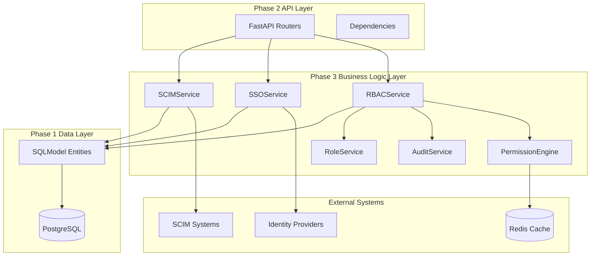
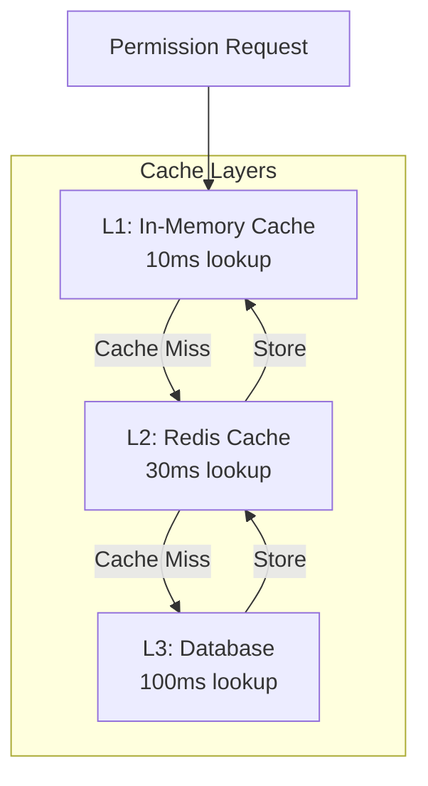

# 🚀 **RBAC Phase 3 Implementation Guide**
## **Business Logic Services & Enterprise Integration**

---

**Version**: 1.0.0  
**Date**: September 17, 2024  
**Target Audience**: Developers, DevOps Engineers, System Administrators  
**Prerequisites**: RBAC Phase 1 (Data Models) and Phase 2 (API Layer) completed

---

## 📋 **TABLE OF CONTENTS**

1. [Overview](#overview)
2. [Architecture](#architecture)
3. [Core Services](#core-services)
4. [Database Schema](#database-schema)
5. [Deployment Guide](#deployment-guide)
6. [Configuration](#configuration)
7. [Monitoring & Operations](#monitoring--operations)
8. [Security Considerations](#security-considerations)
9. [Performance Optimization](#performance-optimization)
10. [Troubleshooting](#troubleshooting)

---

## 🎯 **OVERVIEW**

RBAC Phase 3 introduces the **business logic layer** that powers enterprise-grade access control in LangBuilder. This phase implements sophisticated permission evaluation, SSO integration, automated user provisioning, and comprehensive audit logging.

### **Key Capabilities**
- 🔐 **High-Performance Permission Engine** - Sub-100ms permission evaluation
- 🌐 **Multi-Protocol SSO Integration** - OIDC, OAuth2, SAML2 support
- 👥 **SCIM 2.0 User Provisioning** - Automated user lifecycle management
- 📊 **Comprehensive Audit Logging** - SOC2, GDPR, ISO27001 compliance
- 🏢 **Role Hierarchy Management** - Inheritance and validation
- ⚡ **Break-Glass Emergency Access** - Secure emergency procedures

### **Business Value**
- **Security**: Enterprise-grade access control with deny-by-default security
- **Compliance**: Automated audit trails for regulatory requirements
- **Efficiency**: Automated user provisioning reduces manual overhead
- **Performance**: Optimized permission evaluation for large-scale deployment
- **Integration**: Seamless SSO integration with existing identity providers

---

## 🏗️ **ARCHITECTURE**

### **Service Architecture**



### **Service Dependencies**

| Service | Dependencies | Purpose |
|---------|-------------|---------|
| **RBACService** | PermissionEngine, AuditService, CacheService | Core permission evaluation |
| **SSOService** | HTTP client, JWT libraries | Identity provider integration |
| **SCIMService** | HTTP client, async scheduling | User provisioning automation |
| **AuditService** | Database, compliance frameworks | Immutable audit logging |
| **RoleService** | Database, validation logic | Role hierarchy management |
| **PermissionEngine** | Redis cache, database | High-performance evaluation |

---

## 🔧 **CORE SERVICES**

### **1. RBACService** 
*Primary business logic for access control*

```python
from langflow.services.rbac.service import RBACService

# Initialize service
rbac_service = RBACService(cache_service=cache_service)

# Evaluate permission
result = await rbac_service.evaluate_permission(
    session=session,
    user=current_user,
    resource_type="workspace",
    action="read",
    workspace_id="ws-123"
)

# Batch evaluation for performance
results = await rbac_service.batch_evaluate_permissions(
    session=session,
    user=current_user,
    permission_requests=[
        {"resource_type": "flow", "action": "execute"},
        {"resource_type": "environment", "action": "deploy"}
    ]
)
```

**Key Features:**
- ✅ Hierarchical permission resolution
- ✅ Role-based access control with inheritance
- ✅ Break-glass emergency access
- ✅ Performance metrics tracking
- ✅ Comprehensive audit integration

### **2. SSOService**
*Multi-protocol SSO integration*

```python
from langflow.services.auth.sso_service import SSOService, SSOProtocol

# Initialize SSO flow
sso_service = SSOService()

# OIDC Integration
auth_url, state = await sso_service.initiate_sso_flow(
    session=session,
    provider_id="oidc-provider-123",
    redirect_uri="https://app.langbuilder.com/auth/callback",
    client_ip="192.168.1.100"
)

# Handle callback
result = await sso_service.handle_sso_callback(
    session=session,
    state=state,
    authorization_code="auth-code-from-provider"
)

# Provision user from SSO claims
user = await sso_service.provision_user_from_sso(
    session=session,
    user_claims=result.user_claims,
    provider_id="oidc-provider-123"
)
```

**Supported Protocols:**
- 🔐 **OIDC (OpenID Connect)** - Google, Microsoft, Okta
- 🔐 **OAuth2** - GitHub, GitLab, custom providers  
- 🔐 **SAML2** - Enterprise identity providers (interface ready)

### **3. SCIMService**
*Automated user and group provisioning*

```python
from langflow.services.auth.scim_service import SCIMService

scim_service = SCIMService()

# Provision new user
user = await scim_service.provision_user(
    session=session,
    scim_user_data={
        "userName": "john.doe@company.com",
        "name": {"givenName": "John", "familyName": "Doe"},
        "emails": [{"value": "john.doe@company.com", "primary": True}],
        "groups": ["developers", "qa-team"]
    },
    provider_id="okta-scim"
)

# Provision group
group = await scim_service.provision_group(
    session=session,
    scim_group_data={
        "displayName": "Platform Team",
        "members": ["user-123", "user-456"]
    },
    provider_id="okta-scim"
)

# Sync group memberships
await scim_service.sync_group_memberships(
    session=session,
    group_id="group-789",
    member_user_ids=["user-123", "user-456", "user-789"]
)
```

**Key Features:**
- ✅ **Differential updates** - Only sync changes
- ✅ **Rollback support** - Automatic error recovery
- ✅ **Batch operations** - Efficient bulk provisioning
- ✅ **Reconciliation** - Periodic full synchronization

### **4. AuditService**
*Comprehensive audit logging and compliance*

```python
from langflow.services.rbac.audit_service import AuditService, ComplianceFramework

audit_service = AuditService()

# Log authentication event
await audit_service.log_authentication_event(
    session=session,
    user_id="user-123",
    event_type="sso_login",
    outcome="success",
    ip_address="192.168.1.100",
    user_agent="Mozilla/5.0...",
    additional_data={"provider": "okta", "method": "oidc"}
)

# Log authorization decision
await audit_service.log_authorization_event(
    session=session,
    user_id="user-123",
    resource_type="workspace",
    resource_id="ws-456",
    action="delete",
    outcome="denied",
    reason="Insufficient permissions"
)

# Generate compliance report
report = await audit_service.generate_compliance_report(
    session=session,
    framework=ComplianceFramework.SOC2,
    start_date=datetime(2024, 1, 1),
    end_date=datetime(2024, 12, 31),
    workspace_id="ws-123"
)

# Export audit logs
export_data = await audit_service.export_audit_logs(
    session=session,
    start_date=datetime(2024, 9, 1),
    end_date=datetime(2024, 9, 30),
    format="json",
    filters={"event_category": "authorization"}
)
```

**Compliance Frameworks:**
- 🏢 **SOC 2** - Service organization controls
- 🌍 **ISO 27001** - Information security management
- 🇪🇺 **GDPR** - General Data Protection Regulation
- 🇺🇸 **CCPA** - California Consumer Privacy Act
- 🏥 **HIPAA** - Healthcare data protection

### **5. RoleService**
*Role hierarchy and management*

```python
from langflow.services.rbac.role_service import RoleService

role_service = RoleService()

# Create role with hierarchy
role = await role_service.create_role(
    session=session,
    name="Senior Developer",
    description="Senior development team member",
    permissions=["flow:create", "flow:update", "environment:deploy"],
    parent_role_ids=["developer-role-id"],  # Inherits from Developer
    workspace_id="ws-123",
    created_by=current_user
)

# Get effective permissions (including inherited)
permissions = await role_service.get_effective_permissions(
    session=session,
    role_id="senior-dev-role-id"
)

# Validate role hierarchy (prevent circular dependencies)
is_valid = await role_service.validate_role_hierarchy(
    session=session,
    role_id="senior-dev-role-id",
    parent_role_ids=["architect-role-id"]
)

# Trace permission inheritance path
inheritance_path = await role_service.trace_permission_inheritance(
    session=session,
    role_id="senior-dev-role-id",
    permission="environment:deploy"
)
```

### **6. PermissionEngine**
*High-performance permission evaluation*

```python
from langflow.services.rbac.permission_engine import PermissionEngine

# Initialize with Redis caching
engine = PermissionEngine(redis_client=redis_client, cache_ttl=300)

# Single permission check
result = await engine.check_permission(
    session=session,
    user=current_user,
    resource_type="flow",
    action="execute",
    resource_id="flow-123",
    workspace_id="ws-456"
)

# Batch permission evaluation
results = await engine.batch_check_permissions(
    session=session,
    user=current_user,
    permission_requests=[
        {"resource_type": "flow", "action": "read", "resource_id": "flow-1"},
        {"resource_type": "flow", "action": "read", "resource_id": "flow-2"},
        {"resource_type": "environment", "action": "deploy", "resource_id": "env-1"}
    ]
)

# Cache invalidation
await engine.invalidate_user_cache(user_id="user-123")
await engine.invalidate_resource_cache(resource_type="workspace", resource_id="ws-456")
```

**Performance Characteristics:**
- ⚡ **<100ms P95** - Permission evaluation latency
- ⚡ **<10ms P95** - Cached decision retrieval
- 🔄 **Multi-tier caching** - Memory + Redis
- 📊 **Batch optimization** - Efficient bulk operations

---

## 🗄️ **DATABASE SCHEMA**

### **Phase 3 Database Migration**

The Phase 3 migration (`rbac_phase3_business_logic.py`) creates the following tables:

```sql
-- SSO Configuration
CREATE TABLE sso_configuration (
    id VARCHAR(32) PRIMARY KEY,
    name VARCHAR(255) NOT NULL,
    protocol VARCHAR(50) NOT NULL,  -- OIDC, OAUTH2, SAML2
    provider_url VARCHAR(500) NOT NULL,
    client_id VARCHAR(255) NOT NULL,
    client_secret TEXT,  -- Encrypted
    scopes JSON,
    attribute_mapping JSON,
    is_active BOOLEAN DEFAULT TRUE,
    auto_provision_users BOOLEAN DEFAULT FALSE,
    created_at TIMESTAMP WITH TIME ZONE DEFAULT NOW(),
    updated_at TIMESTAMP WITH TIME ZONE DEFAULT NOW(),
    created_by_id VARCHAR(32) REFERENCES user(id)
);

-- SCIM Configuration  
CREATE TABLE scim_configuration (
    id VARCHAR(32) PRIMARY KEY,
    provider_name VARCHAR(255) NOT NULL,
    base_url VARCHAR(500) NOT NULL,
    bearer_token TEXT NOT NULL,  -- Encrypted
    sync_interval_minutes INTEGER DEFAULT 60,
    last_sync_at TIMESTAMP WITH TIME ZONE,
    sync_status VARCHAR(50) DEFAULT 'pending',
    is_active BOOLEAN DEFAULT TRUE,
    user_attribute_mapping JSON,
    group_attribute_mapping JSON,
    created_at TIMESTAMP WITH TIME ZONE DEFAULT NOW()
);

-- Enhanced Audit Log
CREATE TABLE rbac_audit_log (
    id VARCHAR(32) PRIMARY KEY,
    event_id VARCHAR(64) UNIQUE NOT NULL,
    event_type VARCHAR(100) NOT NULL,
    event_category VARCHAR(50) NOT NULL,  -- authentication, authorization, role_management
    actor_type VARCHAR(50) NOT NULL,      -- user, service_account, system
    actor_id VARCHAR(32),
    actor_email VARCHAR(255),
    subject_type VARCHAR(50),
    subject_id VARCHAR(32),
    resource_type VARCHAR(50),
    resource_id VARCHAR(32),
    action VARCHAR(100) NOT NULL,
    outcome VARCHAR(20) NOT NULL,         -- success, failure, denied
    reason VARCHAR(500),
    session_id VARCHAR(64),
    ip_address VARCHAR(45),               -- IPv6 compatible
    user_agent TEXT,
    before_state JSON,
    after_state JSON,
    additional_data JSON,
    compliance_flags JSON,               -- SOC2, GDPR, etc.
    created_at TIMESTAMP WITH TIME ZONE DEFAULT NOW(),
    workspace_id VARCHAR(32) REFERENCES workspace(id),
    project_id VARCHAR(32) REFERENCES project(id)
);

-- Performance indexes for audit queries
CREATE INDEX idx_audit_timestamp ON rbac_audit_log(created_at);
CREATE INDEX idx_audit_actor_time ON rbac_audit_log(actor_id, created_at);
CREATE INDEX idx_audit_resource_time ON rbac_audit_log(resource_type, resource_id, created_at);
```

### **User Model Enhancements**

```sql
-- SSO integration columns added to existing user table
ALTER TABLE user ADD COLUMN sso_provider_id VARCHAR(32) REFERENCES sso_configuration(id);
ALTER TABLE user ADD COLUMN external_user_id VARCHAR(255);
ALTER TABLE user ADD COLUMN sso_metadata JSON;
ALTER TABLE user ADD COLUMN last_sso_login_at TIMESTAMP WITH TIME ZONE;
ALTER TABLE user ADD COLUMN force_password_change BOOLEAN DEFAULT FALSE;

-- Indexes for SSO user lookup
CREATE INDEX idx_user_sso_provider ON user(sso_provider_id, external_user_id);
CREATE INDEX idx_user_external_id ON user(external_user_id);
```

---

## 🚀 **DEPLOYMENT GUIDE**

### **Step 1: Pre-Deployment Verification**

```bash
# Verify current system state
python scripts/validate_rbac_phase2.py

# Run Phase 3 validation
python scripts/validate_rbac_phase3.py

# Performance benchmark (optional)
python scripts/benchmark_rbac_performance.py
```

### **Step 2: Database Migration**

```bash
# Backup existing database
pg_dump -h localhost -U langflow_user -d langflow_db > rbac_phase2_backup.sql

# Run Phase 3 migration
cd src/backend/base
alembic upgrade rbac_phase3_services

# Verify migration success
alembic current
alembic history
```

### **Step 3: Environment Configuration**

```bash
# Environment variables for Phase 3
export LANGFLOW_RBAC_CACHE_TTL=300
export LANGFLOW_RBAC_REDIS_URL="redis://localhost:6379/1"
export LANGFLOW_SSO_SESSION_TIMEOUT=3600
export LANGFLOW_AUDIT_LOG_RETENTION_DAYS=2555  # 7 years for compliance
export LANGFLOW_BREAK_GLASS_APPROVAL_REQUIRED=true

# Optional: Performance monitoring
export LANGFLOW_RBAC_PERFORMANCE_MONITORING=true
export LANGFLOW_RBAC_METRICS_ENDPOINT="/api/v1/rbac/metrics"
```

### **Step 4: Service Registration**

The services are automatically registered through the LangBuilder service factory pattern:

```python
# src/backend/base/langflow/services/rbac/factory.py
class RBACServiceFactory(ServiceFactory):
    def __init__(self):
        super().__init__(RBACService)
    
    def create(self, cache_service: "CacheService" = None):
        return RBACService(cache_service=cache_service)
```

### **Step 5: Post-Deployment Validation**

```bash
# Verify services are running
curl -X GET "http://localhost:7860/api/v1/rbac/health"

# Test permission evaluation
curl -X POST "http://localhost:7860/api/v1/rbac/permissions/check" \
  -H "Authorization: Bearer YOUR_TOKEN" \
  -H "Content-Type: application/json" \
  -d '{
    "resource_type": "workspace",
    "action": "read",
    "workspace_id": "ws-123"
  }'

# Verify audit logging
curl -X GET "http://localhost:7860/api/v1/rbac/audit/logs?limit=10"
```

---

## ⚙️ **CONFIGURATION**

### **SSO Provider Configuration**

#### **OIDC Provider (e.g., Google, Okta)**

```python
# Via API
POST /api/v1/rbac/sso/configurations
{
    "name": "Company Okta",
    "protocol": "OIDC",
    "provider_url": "https://company.okta.com",
    "client_id": "your-client-id",
    "client_secret": "your-client-secret",
    "scopes": ["openid", "email", "profile", "groups"],
    "attribute_mapping": {
        "groups": "custom_groups",
        "department": "dept"
    },
    "auto_provision_users": true,
    "enforce_sso": false
}
```

#### **OAuth2 Provider (e.g., GitHub)**

```python
POST /api/v1/rbac/sso/configurations
{
    "name": "GitHub Enterprise",
    "protocol": "OAUTH2",
    "provider_url": "https://github.enterprise.com",
    "client_id": "github-client-id",
    "client_secret": "github-client-secret",
    "scopes": ["read:user", "user:email", "read:org"],
    "attribute_mapping": {
        "groups": "organizations"
    },
    "auto_provision_users": true
}
```

### **SCIM Provider Configuration**

```python
POST /api/v1/rbac/scim/configurations
{
    "provider_name": "Okta SCIM",
    "base_url": "https://company.okta.com/api/v1/scim/v2",
    "bearer_token": "your-scim-bearer-token",
    "user_endpoint": "/Users",
    "group_endpoint": "/Groups",
    "sync_interval_minutes": 60,
    "user_attribute_mapping": {
        "email": "emails[0].value",
        "first_name": "name.givenName",
        "last_name": "name.familyName",
        "groups": "groups"
    },
    "group_attribute_mapping": {
        "name": "displayName",
        "members": "members"
    }
}
```

### **Role Hierarchy Configuration**

```python
# Create system roles
POST /api/v1/rbac/roles
{
    "name": "System Administrator",
    "description": "Full system access",
    "permissions": ["*"],
    "is_system_role": true,
    "workspace_id": null  # Global role
}

# Create workspace-scoped roles with hierarchy
POST /api/v1/rbac/roles
{
    "name": "Workspace Owner",
    "description": "Full workspace management",
    "permissions": [
        "workspace:read", "workspace:update", "workspace:delete",
        "project:create", "project:read", "project:update", "project:delete",
        "environment:create", "environment:read", "environment:update", "environment:delete",
        "flow:create", "flow:read", "flow:update", "flow:delete", "flow:execute",
        "invite_users", "manage_roles"
    ],
    "workspace_id": "ws-123"
}

POST /api/v1/rbac/roles
{
    "name": "Developer",
    "description": "Development access",
    "permissions": [
        "project:read", "environment:read",
        "flow:create", "flow:read", "flow:update", "flow:execute"
    ],
    "parent_role_ids": ["workspace-member-role-id"],
    "workspace_id": "ws-123"
}
```

### **Audit Configuration**

```python
# Configure audit retention policies
POST /api/v1/rbac/audit/policies
{
    "retention_days": 2555,  # 7 years
    "compliance_frameworks": ["SOC2", "GDPR", "ISO27001"],
    "export_formats": ["json", "csv"],
    "real_time_alerting": {
        "enabled": true,
        "webhook_url": "https://your-siem.company.com/webhook",
        "alert_on": ["authentication_failure", "privilege_escalation", "break_glass_access"]
    },
    "data_minimization": {
        "redact_pii": true,
        "mask_ip_addresses": true,
        "exclude_sensitive_fields": ["password", "token", "secret"]
    }
}
```

---

## 📊 **MONITORING & OPERATIONS**

### **Performance Monitoring**

#### **Key Metrics to Monitor**

| Metric | Target | Alert Threshold | Description |
|--------|--------|----------------|-------------|
| **Permission Evaluation Latency** | <100ms P95 | >150ms P95 | Time to evaluate permissions |
| **Cache Hit Ratio** | >90% | <80% | Efficiency of permission caching |
| **SSO Flow Success Rate** | >99% | <95% | SSO authentication success |
| **SCIM Sync Success Rate** | >99% | <95% | User provisioning success |
| **Audit Log Write Latency** | <50ms P95 | >100ms P95 | Audit logging performance |
| **Database Connection Pool** | <80% utilized | >90% utilized | Database resource usage |

#### **Monitoring Endpoints**

```bash
# Health check
GET /api/v1/rbac/health
{
    "status": "healthy",
    "services": {
        "rbac_service": "ok",
        "permission_engine": "ok",
        "audit_service": "ok",
        "cache": "ok"
    },
    "timestamp": "2024-09-17T10:30:00Z"
}

# Performance metrics
GET /api/v1/rbac/metrics
{
    "permission_evaluations": {
        "total": 1000000,
        "avg_latency_ms": 15.2,
        "p95_latency_ms": 42.1,
        "cache_hit_ratio": 0.92
    },
    "sso_flows": {
        "total": 5000,
        "success_rate": 0.998,
        "avg_duration_ms": 180.5
    },
    "audit_logs": {
        "total": 2500000,
        "write_latency_p95_ms": 12.3,
        "storage_gb": 15.2
    }
}

# System status
GET /api/v1/rbac/status
{
    "version": "1.0.0",
    "uptime_seconds": 86400,
    "active_sessions": 1250,
    "cache_size_mb": 45.2,
    "database_connections": 12
}
```

### **Alerting Configuration**

#### **Prometheus/Grafana Setup**

```yaml
# prometheus.yml
scrape_configs:
  - job_name: 'langflow-rbac'
    static_configs:
      - targets: ['localhost:7860']
    metrics_path: '/api/v1/rbac/metrics/prometheus'
    scrape_interval: 30s
```

#### **Alert Rules**

```yaml
# rbac_alerts.yml
groups:
  - name: rbac_performance
    rules:
      - alert: HighPermissionLatency
        expr: rbac_permission_evaluation_duration_p95 > 0.1
        for: 5m
        labels:
          severity: warning
        annotations:
          summary: "RBAC permission evaluation latency is high"
          
      - alert: LowCacheHitRatio
        expr: rbac_cache_hit_ratio < 0.8
        for: 10m
        labels:
          severity: warning
        annotations:
          summary: "RBAC cache hit ratio is below threshold"
          
      - alert: SSOFailureRate
        expr: rate(rbac_sso_failures_total[5m]) > 0.05
        for: 2m
        labels:
          severity: critical
        annotations:
          summary: "High SSO failure rate detected"
```

### **Operational Procedures**

#### **Cache Management**

```bash
# Clear all permission caches
curl -X POST "http://localhost:7860/api/v1/rbac/cache/clear" \
  -H "Authorization: Bearer ADMIN_TOKEN"

# Clear cache for specific user
curl -X POST "http://localhost:7860/api/v1/rbac/cache/users/user-123/clear"

# Clear cache for specific resource
curl -X POST "http://localhost:7860/api/v1/rbac/cache/resources/workspace/ws-456/clear"

# View cache statistics
curl -X GET "http://localhost:7860/api/v1/rbac/cache/stats"
```

#### **SCIM Sync Management**

```bash
# Trigger immediate SCIM sync
curl -X POST "http://localhost:7860/api/v1/rbac/scim/sync/trigger" \
  -H "Authorization: Bearer ADMIN_TOKEN" \
  -d '{"provider_id": "okta-scim-provider"}'

# View sync status
curl -X GET "http://localhost:7860/api/v1/rbac/scim/sync/status"

# View sync history
curl -X GET "http://localhost:7860/api/v1/rbac/scim/sync/history?limit=10"
```

#### **Audit Log Management**

```bash
# Export audit logs for compliance
curl -X POST "http://localhost:7860/api/v1/rbac/audit/export" \
  -H "Authorization: Bearer ADMIN_TOKEN" \
  -d '{
    "start_date": "2024-01-01",
    "end_date": "2024-12-31",
    "format": "json",
    "compliance_framework": "SOC2"
  }'

# Search audit logs
curl -X GET "http://localhost:7860/api/v1/rbac/audit/search" \
  -G -d "query=actor_email:john.doe@company.com" \
  -d "start_date=2024-09-01" \
  -d "limit=100"
```

---

## 🛡️ **SECURITY CONSIDERATIONS**

### **Encryption and Key Management**

#### **SSO Configuration Security**
- **Client Secrets**: Encrypted at rest using AES-256
- **Token Storage**: JWT tokens are signed and validated
- **State Management**: Cryptographically secure state generation
- **Session Security**: Secure session handling with expiration

```python
# Example: Secure SSO configuration storage
from cryptography.fernet import Fernet

def encrypt_client_secret(secret: str) -> str:
    key = os.environ.get('LANGFLOW_ENCRYPTION_KEY')
    f = Fernet(key)
    return f.encrypt(secret.encode()).decode()

def decrypt_client_secret(encrypted_secret: str) -> str:
    key = os.environ.get('LANGFLOW_ENCRYPTION_KEY')
    f = Fernet(key)
    return f.decrypt(encrypted_secret.encode()).decode()
```

#### **SCIM Token Security**
- **Bearer Tokens**: Encrypted storage with rotation support
- **Rate Limiting**: Protection against abuse
- **Audit Logging**: All SCIM operations logged
- **IP Restrictions**: Optional IP whitelist for SCIM endpoints

### **Permission Security Model**

#### **Deny-by-Default**
- No implicit permissions granted
- Explicit permission assignment required
- Hierarchical permission inheritance with validation
- Regular permission audits and cleanup

#### **Break-Glass Access Controls**
- Requires detailed justification (minimum 50 characters)
- Automatic approval workflow integration
- Time-limited access with automatic expiration
- Comprehensive audit trail with alerts

```python
# Example: Break-glass access validation
async def validate_break_glass_access(
    self,
    session: AsyncSession,
    user: User,
    justification: str,
    target_resource_type: str,
    target_resource_id: str
) -> bool:
    # Validate justification length
    if len(justification.strip()) < 50:
        raise ValueError("Break-glass access requires detailed justification (minimum 50 characters)")
    
    # Check user's break-glass permissions
    has_permission = await self.evaluate_permission(
        session=session,
        user=user,
        resource_type="system",
        action="break_glass_access"
    )
    
    if not has_permission.allowed:
        raise PermissionError("User does not have break-glass access permissions")
    
    # Log break-glass request
    await self._log_break_glass_access(
        session=session,
        user=user,
        justification=justification,
        target_resource_type=target_resource_type,
        target_resource_id=target_resource_id
    )
    
    return True
```

### **Audit Security**

#### **Immutable Audit Trail**
- Write-Once-Read-Many (WORM) storage pattern
- Cryptographic integrity verification
- Tamper detection and alerting
- Secure export and archival

#### **Data Privacy Compliance**
- PII redaction in audit logs
- GDPR right-to-deletion support
- Data minimization principles
- Consent management integration

---

## ⚡ **PERFORMANCE OPTIMIZATION**

### **Caching Strategy**

#### **Multi-Tier Caching Architecture**



#### **Cache Configuration**

```python
# Permission engine cache configuration
PERMISSION_CACHE_CONFIG = {
    # Memory cache settings
    "memory_cache": {
        "max_size": 10000,  # Maximum cached entries
        "ttl_seconds": 300,  # 5 minutes
        "cleanup_interval": 60  # Cleanup every minute
    },
    
    # Redis cache settings
    "redis_cache": {
        "host": "localhost",
        "port": 6379,
        "db": 1,
        "password": None,
        "ttl_seconds": 900,  # 15 minutes
        "key_prefix": "rbac:perm:"
    },
    
    # Cache invalidation strategy
    "invalidation": {
        "on_role_change": True,
        "on_permission_change": True,
        "on_user_update": True,
        "batch_invalidation": True
    }
}
```

### **Database Optimization**

#### **Index Strategy**

```sql
-- Performance-critical indexes
CREATE INDEX CONCURRENTLY idx_rbac_audit_log_composite 
ON rbac_audit_log(actor_id, created_at, event_category);

CREATE INDEX CONCURRENTLY idx_role_assignment_user_scope 
ON role_assignment(user_id, scope_type, scope_id) 
WHERE is_active = true;

CREATE INDEX CONCURRENTLY idx_permission_resource_action 
ON permission(resource_type, action) 
WHERE is_active = true;

-- Partial indexes for common queries
CREATE INDEX CONCURRENTLY idx_sso_session_active 
ON sso_session(user_id, expires_at) 
WHERE status = 'active';
```

#### **Query Optimization**

```python
# Optimized batch permission query
async def batch_get_user_permissions(
    self, 
    session: AsyncSession, 
    user_id: str, 
    resource_requests: List[Dict]
) -> List[PermissionResult]:
    """Optimized batch permission retrieval with single query."""
    
    # Single query to get all user roles and permissions
    query = select(
        RoleAssignment.scope_type,
        RoleAssignment.scope_id,
        Role.name,
        Permission.resource_type,
        Permission.action,
        RolePermission.is_granted
    ).select_from(
        RoleAssignment
        .join(Role)
        .join(RolePermission)
        .join(Permission)
    ).where(
        RoleAssignment.user_id == user_id,
        RoleAssignment.is_active == True,
        Role.is_active == True,
        RolePermission.is_granted == True
    )
    
    result = await session.exec(query)
    permissions_data = result.all()
    
    # Process results efficiently
    return self._process_batch_permissions(permissions_data, resource_requests)
```

### **Async Processing Optimization**

#### **Batch Operations**

```python
async def batch_evaluate_permissions(
    self,
    session: AsyncSession,
    user: User,
    permission_requests: List[Dict[str, Any]]
) -> List[PermissionResult]:
    """Optimized batch permission evaluation."""
    
    # Group requests by cache availability
    cached_results = []
    uncached_requests = []
    
    for request in permission_requests:
        cache_key = self._generate_cache_key(user.id, request)
        cached_result = await self._get_cached_result(cache_key)
        
        if cached_result:
            cached_results.append(cached_result)
        else:
            uncached_requests.append(request)
    
    # Process uncached requests in parallel
    if uncached_requests:
        tasks = [
            self._evaluate_single_permission(session, user, request)
            for request in uncached_requests
        ]
        uncached_results = await asyncio.gather(*tasks)
        
        # Cache results asynchronously
        asyncio.create_task(self._batch_cache_results(uncached_results))
    else:
        uncached_results = []
    
    return cached_results + uncached_results
```

---

## 🔧 **TROUBLESHOOTING**

### **Common Issues and Solutions**

#### **Permission Evaluation Issues**

**Problem**: Slow permission evaluation (>100ms)
```bash
# Check cache hit ratio
curl -X GET "http://localhost:7860/api/v1/rbac/metrics" | jq '.permission_evaluations.cache_hit_ratio'

# If cache hit ratio is low (<0.8):
# 1. Check Redis connectivity
redis-cli ping

# 2. Review cache configuration
curl -X GET "http://localhost:7860/api/v1/rbac/cache/config"

# 3. Clear and rebuild cache
curl -X POST "http://localhost:7860/api/v1/rbac/cache/rebuild"
```

**Problem**: Permission denied unexpectedly
```bash
# Debug permission evaluation
curl -X POST "http://localhost:7860/api/v1/rbac/permissions/debug" \
  -H "Authorization: Bearer TOKEN" \
  -d '{
    "user_id": "user-123",
    "resource_type": "workspace",
    "action": "read",
    "resource_id": "ws-456"
  }'

# Check user role assignments
curl -X GET "http://localhost:7860/api/v1/rbac/users/user-123/roles"

# Check role permissions
curl -X GET "http://localhost:7860/api/v1/rbac/roles/role-456/permissions"
```

#### **SSO Integration Issues**

**Problem**: SSO flow failures
```bash
# Check SSO configuration
curl -X GET "http://localhost:7860/api/v1/rbac/sso/configurations/provider-123"

# View SSO session logs
curl -X GET "http://localhost:7860/api/v1/rbac/sso/sessions?status=failed&limit=10"

# Test SSO provider connectivity
curl -X POST "http://localhost:7860/api/v1/rbac/sso/test-connection" \
  -d '{"provider_id": "provider-123"}'
```

**Problem**: User provisioning failures
```bash
# Check SCIM sync status
curl -X GET "http://localhost:7860/api/v1/rbac/scim/sync/status"

# View SCIM sync errors
curl -X GET "http://localhost:7860/api/v1/rbac/scim/sync/errors?limit=10"

# Manual user provisioning test
curl -X POST "http://localhost:7860/api/v1/rbac/scim/users/test-provision" \
  -d '{
    "external_user_id": "test-user-123",
    "email": "test@company.com",
    "provider_id": "scim-provider-456"
  }'
```

#### **Database Performance Issues**

**Problem**: Slow audit log queries
```sql
-- Check table sizes
SELECT 
    schemaname,
    tablename,
    pg_size_pretty(pg_total_relation_size(schemaname||'.'||tablename)) as size
FROM pg_tables 
WHERE tablename LIKE '%audit%' 
ORDER BY pg_total_relation_size(schemaname||'.'||tablename) DESC;

-- Check index usage
SELECT 
    schemaname,
    tablename,
    indexname,
    idx_scan,
    idx_tup_read,
    idx_tup_fetch
FROM pg_stat_user_indexes 
WHERE tablename = 'rbac_audit_log'
ORDER BY idx_scan DESC;

-- Optimize slow queries
EXPLAIN ANALYZE 
SELECT * FROM rbac_audit_log 
WHERE actor_id = 'user-123' 
    AND created_at >= '2024-09-01'::timestamp 
ORDER BY created_at DESC 
LIMIT 100;
```

### **Monitoring and Diagnostics**

#### **Health Check Script**

```python
#!/usr/bin/env python3
"""RBAC Phase 3 Health Check Script"""

import asyncio
import httpx
from datetime import datetime

async def check_rbac_health():
    """Comprehensive RBAC health check."""
    
    base_url = "http://localhost:7860"
    results = {}
    
    async with httpx.AsyncClient() as client:
        # 1. Basic health check
        try:
            response = await client.get(f"{base_url}/api/v1/rbac/health")
            results["health"] = response.json() if response.status_code == 200 else "FAILED"
        except Exception as e:
            results["health"] = f"ERROR: {e}"
        
        # 2. Permission evaluation test
        try:
            response = await client.post(
                f"{base_url}/api/v1/rbac/permissions/test",
                json={"resource_type": "system", "action": "health_check"}
            )
            results["permission_evaluation"] = "OK" if response.status_code == 200 else "FAILED"
        except Exception as e:
            results["permission_evaluation"] = f"ERROR: {e}"
        
        # 3. Cache connectivity
        try:
            response = await client.get(f"{base_url}/api/v1/rbac/cache/stats")
            results["cache"] = "OK" if response.status_code == 200 else "FAILED"
        except Exception as e:
            results["cache"] = f"ERROR: {e}"
        
        # 4. Database connectivity
        try:
            response = await client.get(f"{base_url}/api/v1/rbac/database/health")
            results["database"] = "OK" if response.status_code == 200 else "FAILED"
        except Exception as e:
            results["database"] = f"ERROR: {e}"
    
    # Print results
    print(f"RBAC Health Check - {datetime.now()}")
    print("=" * 50)
    for component, status in results.items():
        emoji = "✅" if status == "OK" else "❌"
        print(f"{emoji} {component.upper()}: {status}")
    
    return all(status == "OK" for status in results.values())

if __name__ == "__main__":
    healthy = asyncio.run(check_rbac_health())
    exit(0 if healthy else 1)
```

#### **Log Analysis**

```bash
# View recent RBAC service logs
tail -f /var/log/langflow/rbac_service.log | grep -E "(ERROR|WARN)"

# Analyze permission evaluation performance
grep "permission_evaluation" /var/log/langflow/rbac_service.log | \
  awk '{print $NF}' | \
  sort -n | \
  awk 'BEGIN{sum=0; count=0} {sum+=$1; count++; values[count]=$1} 
       END{
         print "Count:", count
         print "Average:", sum/count "ms"
         print "P50:", values[int(count*0.5)] "ms"
         print "P95:", values[int(count*0.95)] "ms"
       }'

# SSO flow analysis
grep "sso_flow" /var/log/langflow/sso_service.log | \
  grep -c "success\|failure"
```

---

## 🎓 **BEST PRACTICES**

### **Development Guidelines**

1. **Service Design**
   - Follow async/await patterns consistently
   - Implement proper error handling and logging
   - Use dependency injection for testability
   - Cache expensive operations appropriately

2. **Security Principles**
   - Implement deny-by-default security model
   - Validate all inputs and sanitize outputs
   - Use principle of least privilege
   - Audit all security-relevant operations

3. **Performance Optimization**
   - Cache permission decisions with appropriate TTL
   - Use batch operations for bulk processing
   - Implement proper database indexing
   - Monitor and optimize slow queries

4. **Testing Strategy**
   - Write comprehensive unit tests for business logic
   - Include integration tests for SSO flows
   - Test error conditions and edge cases
   - Validate performance under load

### **Operational Excellence**

1. **Monitoring**
   - Set up proactive alerting for performance issues
   - Monitor cache hit ratios and database performance
   - Track SSO success rates and error patterns
   - Monitor audit log growth and storage

2. **Maintenance**
   - Regular cache cleanup and optimization
   - Periodic audit log archival and cleanup
   - SSO provider configuration updates
   - Performance benchmarking and optimization

3. **Security**
   - Regular security audits and penetration testing
   - Compliance reporting and validation
   - Access pattern analysis and anomaly detection
   - Incident response and recovery procedures

---

## 📞 **SUPPORT**

### **Documentation Resources**
- [RBAC Phase 1 Implementation Guide](./RBAC_PHASE1_GUIDE.md)
- [RBAC Phase 2 API Documentation](./RBAC_PHASE2_API.md)
- [LangBuilder Service Architecture](./LANGBUILDER_SERVICES.md)

### **Troubleshooting Resources**
- [Common Issues FAQ](./RBAC_FAQ.md)
- [Performance Tuning Guide](./RBAC_PERFORMANCE.md)
- [Security Best Practices](./RBAC_SECURITY.md)

### **Contact Information**
- **Technical Support**: support@langbuilder.com
- **Security Issues**: security@langbuilder.com
- **Documentation**: docs@langbuilder.com

---

**🎉 Congratulations! You have successfully implemented RBAC Phase 3 in LangBuilder.**

*This comprehensive implementation provides enterprise-grade access control with SSO integration, automated user provisioning, and compliance-ready audit logging.*