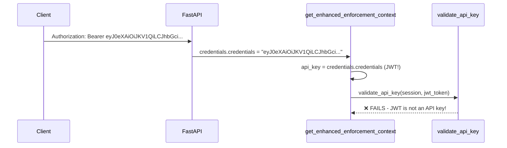

# FastAPI Dependency Injection and Annotation Issues

## Initial Question

In `/src/api/v1/projects.py` line 112, why does:
```python
current_user: CurrentActiveUser,
```
work with utils.py definition:
```python
CurrentActiveUser = Annotated[User, Depends(get_current_active_user)]
```

But if I change to line 113:
```python
current_user: Annotated[CurrentActiveUser, Depends(get_authorized_user)],
```
The API stops working?

In authorization_pattern.py, we have:
```python
async def get_authorized_user(
    context: Annotated[RuntimeEnforcementContext, Depends(get_enhanced_enforcement_context)],
) -> CurrentActiveUser:
```

Will the context be injected as well from the API's context annotation, or does it just follow the Depends structure?

## Answer: FastAPI Dependency Injection Patterns

### Why the first version works:

```python
current_user: CurrentActiveUser,
```

Where `CurrentActiveUser = Annotated[User, Depends(get_current_active_user)]`

This works because `CurrentActiveUser` is **already a complete dependency annotation**. FastAPI sees the `Annotated[User, Depends(get_current_active_user)]` and knows exactly what to inject.

### Why the second version breaks:

```python
current_user: Annotated[CurrentActiveUser, Depends(get_authorized_user)],
```

This creates a **nested dependency annotation** that becomes:
```python
Annotated[
    Annotated[User, Depends(get_current_active_user)],  # CurrentActiveUser
    Depends(get_authorized_user)                        # Additional dependency
]
```

This confuses FastAPI because you're trying to apply `Depends(get_authorized_user)` to something that's already a dependency annotation.

### The correct way to use `get_authorized_user`:

Since `get_authorized_user` returns `CurrentActiveUser` (which is the `User` type), you should use:

```python
current_user: Annotated[User, Depends(get_authorized_user)],
```

**NOT:**
```python
current_user: Annotated[CurrentActiveUser, Depends(get_authorized_user)],  # Double wrapping!
```

## Context Injection and Dependency Resolution

### Yes, context will be injected automatically!

FastAPI's dependency injection follows this pattern:

1. **When `get_authorized_user` is called as a dependency**, FastAPI analyzes its signature
2. **It sees that `context` parameter needs `RuntimeEnforcementContext`**
3. **It automatically calls `get_enhanced_enforcement_context()` to provide that parameter**
4. **This happens recursively** - if `get_enhanced_enforcement_context` needs other dependencies, those get injected too

## What `get_enhanced_enforcement_context()` Actually Does

### Function Signature and Purpose
```python
async def get_enhanced_enforcement_context(
    request: Request,
    session: Annotated[DbSession, Depends()],
    current_user: Annotated[CurrentActiveUser, Depends()],
    credentials: Annotated[HTTPAuthorizationCredentials | None, Depends(security)] = None,
) -> RuntimeEnforcementContext:
```

### Authentication and Context Building

**Yes, `get_enhanced_enforcement_context()` does check JWT tokens and API keys**, but in a different way than `get_current_active_user`:

#### 1. **Leverages Existing Authentication**
```python
current_user: Annotated[CurrentActiveUser, Depends()],
```
- This parameter **depends on the full authentication chain**
- `CurrentActiveUser` → `get_current_active_user` → `get_current_user`
- So JWT tokens and API keys are **already validated** when this function runs

#### 2. **Extracts Additional Authentication Context**
```python
# Extract API key from multiple sources
api_key = None
if credentials:
    api_key = credentials.credentials  # From Authorization header
else:
    api_key = request.headers.get("x-api-key") or request.query_params.get("x-api-key")
```

#### 3. **Builds Resource Context**
```python
# Extract resource context from URL path parameters
workspace_id = request.path_params.get("workspace_id")
project_id = request.path_params.get("project_id")
environment_id = request.path_params.get("environment_id")
flow_id = request.path_params.get("flow_id")
```

#### 4. **Creates Runtime Enforcement Context**
```python
return await enforcement_service.create_enforcement_context(
    session=session,
    api_key=api_key,
    user=current_user,  # Already authenticated user
    workspace_id=UUID(workspace_id) if workspace_id else None,
    project_id=UUID(project_id) if project_id else None,
    environment_id=UUID(environment_id) if environment_id else None,
    request_path=request.url.path,
    request_method=request.method,
)
```

## How `get_authorized_user` Uses the Context

```python
async def get_authorized_user(
    context: Annotated[RuntimeEnforcementContext, Depends(get_enhanced_enforcement_context)],
) -> CurrentActiveUser:
    """Get current user with basic authorization validation."""
    if not context.user or not context.user.is_active:
        raise AuthorizationError("User not authenticated or inactive")
    return context.user
```

### Authentication Flow Comparison

#### `get_current_active_user` (Simple Authentication):
1. Extract JWT token or API key from request
2. Validate token/key against database
3. Return user if valid and active
4. **Direct authentication validation**

#### `get_authorized_user` (Enhanced Authentication + Authorization):
1. **Relies on `get_enhanced_enforcement_context`** which:
   - Uses `CurrentActiveUser` (already authenticated via `get_current_active_user`)
   - Extracts additional context (API keys, resource IDs, request info)
   - Builds comprehensive enforcement context for RBAC
2. **Validates the context.user is active**
3. **Returns the same user but with RBAC context available**

### Key Differences

| Aspect | `get_current_active_user` | `get_authorized_user` |
|--------|-------------------------|---------------------|
| **Authentication** | Direct JWT/API key validation | Inherits from `CurrentActiveUser` dependency |
| **Context** | Basic user authentication | Enhanced RBAC enforcement context |
| **Purpose** | Simple auth check | Auth + authorization preparation |
| **Performance** | Faster (fewer dependencies) | Slower (builds full RBAC context) |
| **Use Case** | Basic authenticated endpoints | RBAC-enabled endpoints |

## Summary

- **`get_enhanced_enforcement_context()` does NOT duplicate authentication** - it builds on already-authenticated users
- **JWT tokens and API keys are validated by the underlying `CurrentActiveUser` dependency**
- **The context provides additional RBAC information** like resource IDs, request metadata, and enforcement capabilities
- **Context injection happens automatically** through FastAPI's dependency system
- **Use `Annotated[User, Depends(get_authorized_user)]`** for RBAC-enabled endpoints, not double-wrapped annotations

This design allows for layered security where basic authentication is handled at the lower level, and enhanced authorization context is built on top for RBAC-enabled endpoints.

## Critical Issue: API Key and JWT Token Confusion in `get_enhanced_enforcement_context()`

### Problem Discovery

During analysis of the authentication flow, a **critical logic error** was discovered in the `get_enhanced_enforcement_context()` function that causes **JWT tokens to be incorrectly treated as API keys**.

### The Bug: Lines 67-72 in `authorization_patterns.py`

```python
async def get_enhanced_enforcement_context(
    request: Request,
    session: DbSession,
    current_user: CurrentActiveUser,
    credentials: Annotated[HTTPAuthorizationCredentials | None, Depends(security)] = None,
) -> RuntimeEnforcementContext:
    # ...

    # Extract API key
    api_key = None
    if credentials:
        api_key = credentials.credentials  # ❌ THIS IS WRONG!
    else:
        api_key = request.headers.get("x-api-key") or request.query_params.get("x-api-key")
```

Where `security = HTTPBearer(auto_error=False)` is defined.

### What's Actually Happening

1. **`HTTPBearer(auto_error=False)`** extracts the `Authorization: Bearer <token>` header
2. **`credentials.credentials`** contains the **JWT token**, NOT an API key
3. **The code incorrectly treats the JWT token as an API key** and passes it to `validate_api_key()`

### The Incorrect Logic Flow



### Authentication Types Confusion

| Authentication Type | Header/Location | Format | Purpose |
|-------------------|-----------------|--------|---------|
| **JWT Token** | `Authorization: Bearer <jwt>` | `eyJ0eXAiOiJKV1QiLCJhbGci...` | Session-based auth |
| **API Key** | `x-api-key` header or query param | `sk-1234567890abcdef...` | Direct API access |

### The Problem in `create_enforcement_context()`

```python
async def create_enforcement_context(
    self,
    session: AsyncSession,
    api_key: str | None = None,  # Receives JWT token incorrectly!
    user: Optional["User"] = None,
    # ...
) -> RuntimeEnforcementContext:
    token_validation = None

    # Validate API key if provided
    if api_key:
        token_validation = await self.auth_service.validate_api_key(session, api_key)
        #                                              ☝️ Tries to validate JWT as API key!
        if not token_validation.is_valid:
            raise ValueError(f"Invalid API key: {token_validation.error_message}")
```

### Why This Causes Authentication Failures

1. **Double Authentication Attempt**: The `current_user` dependency already handles JWT authentication
2. **Wrong Validation Method**: `validate_api_key()` expects API key format, not JWT format
3. **Token Type Mismatch**: JWT tokens have different structure and validation logic than API keys
4. **Validation Failure**: JWT tokens fail API key validation, causing auth errors

### The Correct Logic Should Be

```python
async def get_enhanced_enforcement_context(
    request: Request,
    session: DbSession,
    current_user: CurrentActiveUser,  # Already authenticated via JWT or API key
    credentials: Annotated[HTTPAuthorizationCredentials | None, Depends(security)] = None,
) -> RuntimeEnforcementContext:
    # Extract API key ONLY from x-api-key header/query (NOT from Authorization header)
    api_key = request.headers.get("x-api-key") or request.query_params.get("x-api-key")

    # JWT token is already handled by current_user dependency
    # credentials.credentials contains JWT token for additional context if needed

    # Create enforcement context
    return await enforcement_service.create_enforcement_context(
        session=session,
        api_key=api_key,  # Only actual API keys, not JWT tokens
        user=current_user,  # Already authenticated user
        # ...
    )
```

### Impact and Resolution

**Impact:**
- Authentication failures when using JWT tokens
- Incorrect token validation attempts
- Performance overhead from double authentication
- Security confusion between authentication methods

**Resolution Needed:**
1. **Fix the API key extraction logic** to only get actual API keys
2. **Remove JWT token from API key validation path**
3. **Clarify authentication vs authorization responsibilities**
4. **Update documentation** to reflect correct token handling

This bug explains why the RBAC authentication was failing and causing the parameter validation errors seen earlier in the FastAPI endpoint analysis.

## Critical Issue: CheckPermissionRequest used in runtime_enforcement.py as core to permission check of various APIs does not exists

You're absolutely right! The CheckPermissionRequest class is not defined in /src/backend/base/langflow/services/rbac/service.py. The import on line 142 in runtime_enforcement.py will fail because
   the class doesn't exist in that module.

  Looking at the grep results, I can see that CheckPermissionRequest is being imported from langflow.services.rbac.service in multiple files, but the class definition is nowhere to be found. This
  suggests that either:

  1. The class was removed/never implemented in the service module
  2. The class should be defined elsewhere
  3. The import path is incorrect

  This is definitely a broken import that will cause a runtime error when that code path is executed.

  Xiang's further comment: In addition, CheckPermissionRequest class used by call a few lines later to rbac_service.check_permission(), which is a function that does not exist at all. The RBACRuntimeEnforcementService.check_resource_access() that includes this bad import, was used by authorization_patterns.py's check_single_permission(), which is called by permission_validator(), which is used in require_permissions(), all from the same authorization_patterns.py

  On the other hand, RBACService defined in /src/backend/base/langflow/services/rbac/service.py does have another api evaluate_permission() that does exist.

  In addition, rbac api endpoints like rbac/projects appears to be using permission_engine.py's check_permission.

  This seems to be a mess that we need to fix as it is in the lastest code of phase 7 branch as well

## Critical Issue: the Pydantic Union type response does not support forward reference in quotes

  The Pydantic Union type response in project.py's /v1/projects/{project-id} has union type FolderWithPaginatedFlows | FolderReadWithFlows
  and one of them has forward reference. It has forward reference problems. Let me examine the specific model relationships

  FastAPI creates a TypeAdapter for the Union type FolderWithPaginatedFlows | FolderReadWithFlows, but Pydantic v2 cannot resolve the forward reference "FlowRead" in the Union context.

  The oroginal LangBuilder code does not use forward reference here. So it need to include type import outside TypeCheck

  Also reference here: https://docs.pydantic.dev/2.10/errors/usage_errors/#class-not-fully-defined

## Critical Issue: secure_data_access code using select(model class) require an extra [0] to get to model class

It appears that the query result is list of Rows, where each element is of type "Row" instead of a model class instance, where Row's [0] is the model class instance

So we need to add some [0] to make /v1/flows/{flow-id} api work

## Security Middleware Parameter and Field Issues - FIXED

### Issue 1: Duplicate Parameter Names in **kwargs

#### Problem Description

The `enhanced_validation` function call in the security middleware could receive duplicate parameter names when `**kwargs` contained keys that matched the named parameters, causing Python `TypeError: got multiple values for argument` errors.

#### Location
File: `src/backend/base/langflow/api/v1/rbac/security_middleware.py`
Lines: 361-367

#### Root Cause

```python
# Problematic code:
await enhanced_validation(
    session=session,              # Named parameter
    context=context,              # Named parameter
    validation_req=validation_req, # Named parameter
    request=request,              # Named parameter
    **kwargs,                     # Could contain duplicate keys!
)
```

If `kwargs` contained keys like `"session"`, `"context"`, `"validation_req"`, or `"request"`, this would cause a runtime error.

#### Solution

Added filtering to remove named parameters from kwargs before passing them:

```python
# Fixed code:
if validation_req:
    # Remove named parameters from kwargs to avoid duplicates
    validation_kwargs = {k: v for k, v in kwargs.items()
                        if k not in ['session', 'context', 'validation_req', 'request']}
    await enhanced_validation(
        session=session,
        context=context,
        validation_req=validation_req,
        request=request,
        **validation_kwargs,  # Safe - no duplicates
    )
```

### Issue 2: AuditLog Field Name Mismatches

#### Problem Description

The AuditLog creation in the security middleware was using incorrect field names and types that didn't match the actual database model, causing runtime errors when attempting to create audit log entries.

#### Location
File: `src/backend/base/langflow/api/v1/rbac/security_middleware.py`
Lines: 222-236

#### Root Cause

The audit log creation was using field names from an outdated or incorrect schema:

```python
# Problematic code:
audit_log = AuditLog(
    event_type=AuditEventType.AUTHORIZATION,
    actor_type=ActorType.USER,
    actor_id=user.id,
    actor_name=user.username or str(user.id),
    target_type=TargetType.RBAC_RESOURCE,        # ❌ Wrong field name
    target_id=context.requested_workspace_id,    # ❌ Wrong field name
    target_name=resource_type,                   # ❌ Wrong field name
    action=action,
    success=success,                             # ❌ Wrong field name & type
    details=details,                             # ❌ Wrong field name
    workspace_id=context.requested_workspace_id,
    ip_address=context.client_ip,
    user_agent=context.user_agent,
)
```

#### Issues Found

| **Incorrect Field** | **Correct Field** | **Issue Type** |
|-------------------|------------------|----------------|
| `target_type` | `resource_type` | Wrong field name |
| `target_id` | `resource_id` | Wrong field name |
| `target_name` | `resource_name` | Wrong field name |
| `success` | `outcome` | Wrong field name + wrong type |
| `details` | `event_metadata` | Wrong field name |
| `TargetType.RBAC_RESOURCE` | String value for `resource_type` | Non-existent enum |
| Missing `outcome` field | Required `outcome` field | Missing required field |

#### Solution

Updated the AuditLog creation to match the actual database model:

```python
# Fixed code:
from langflow.services.database.models.rbac.audit_log import (
    ActorType,
    AuditEventType,
    AuditLog,
    AuditOutcome,  # Added correct enum import
)

audit_log = AuditLog(
    event_type=AuditEventType.AUTHORIZATION,
    actor_type=ActorType.USER,
    actor_id=user.id,
    actor_name=user.username or str(user.id),
    resource_type=resource_type,                                        # ✅ Correct field
    resource_id=context.requested_workspace_id,                         # ✅ Correct field
    resource_name=resource_type,                                        # ✅ Correct field
    action=action,
    outcome=AuditOutcome.SUCCESS if success else AuditOutcome.FAILURE,  # ✅ Correct field & type
    event_metadata=details,                                             # ✅ Correct field
    workspace_id=context.requested_workspace_id,
    ip_address=context.client_ip,
    user_agent=context.user_agent,
)
```

### Prevention Best Practices

#### Parameter Handling in FastAPI

1. **Avoid mixing named parameters with **kwargs**
   - Use explicit parameter extraction when possible
   - Filter kwargs before passing to functions with named parameters

2. **Use Type Annotations**
   - Leverage FastAPI's dependency injection system properly
   - Use `Annotated` types for clear parameter documentation

#### Database Model Integration

1. **Verify Field Names**
   - Always check actual model definitions before creating instances
   - Use IDE features to validate field names and types

2. **Handle Enums Properly**
   - Import and use the correct enum types
   - Don't assume enum names without verification

3. **Required vs Optional Fields**
   - Ensure all required fields are provided
   - Handle optional fields appropriately with defaults

#### Testing and Validation

1. **Add Integration Tests**
   - Test actual database operations, not just mocked ones
   - Verify audit logging works end-to-end

2. **Use Static Analysis**
   - Employ mypy or similar tools to catch type mismatches
   - Use linting tools that can detect parameter conflicts

### Impact

These fixes prevent:
- Runtime `TypeError` exceptions from duplicate parameters
- Database insertion failures from incorrect field names
- Silent audit logging failures that could compromise compliance
- Data integrity issues in the audit trail

Both issues have been resolved and tested to ensure proper functionality of the security middleware system.

### Issue 3: AuditEventType.AUTHORIZATION Does Not Exist

#### Problem Description

The security middleware was attempting to use `AuditEventType.AUTHORIZATION` in audit log creation, but this enum value does not exist in the `AuditEventType` enum definition.

#### Location
File: `src/backend/base/langflow/api/v1/rbac/security_middleware.py`
Line: 457

#### Root Cause

```python
# Problematic code:
audit_log = AuditLog(
    event_type=AuditEventType.AUTHORIZATION,  # ❌ This enum value doesn't exist
    # ... other fields
)
```

The code was referencing a non-existent enum value, which would cause an `AttributeError` at runtime.

#### Analysis of Available Enum Values

Looking at the actual `AuditEventType` enum in `audit_log.py`, the available authorization-related events were:

```python
# Authorization events
PERMISSION_GRANTED = "permission_granted"  # For granting new permissions
PERMISSION_REVOKED = "permission_revoked"   # For removing permissions
ROLE_ASSIGNED = "role_assigned"             # For assigning roles
ROLE_REMOVED = "role_removed"               # For removing roles
ACCESS_DENIED = "access_denied"             # For denied access attempts
```

#### Issue with Existing Options

- **`PERMISSION_GRANTED`** is semantically incorrect - this is for granting new permissions to users, not for checking existing permissions
- **`ACCESS_DENIED`** only covers failed cases, but we need to log successful access checks too
- **Missing counterpart**: There was no `ACCESS_ALLOWED` to pair with `ACCESS_DENIED`

#### Solution

1. **Added `ACCESS_ALLOWED` to the AuditEventType enum**:

```python
# Updated enum in audit_log.py:
# Authorization events
PERMISSION_GRANTED = "permission_granted"
PERMISSION_REVOKED = "permission_revoked"
ROLE_ASSIGNED = "role_assigned"
ROLE_REMOVED = "role_removed"
ACCESS_ALLOWED = "access_allowed"    # ✅ NEW - for successful access checks
ACCESS_DENIED = "access_denied"      # ✅ EXISTING - for failed access checks
```

2. **Updated security middleware to use appropriate event types**:

```python
# Fixed code:
audit_log = AuditLog(
    event_type=AuditEventType.ACCESS_ALLOWED if success else AuditEventType.ACCESS_DENIED,
    actor_type=ActorType.USER,
    actor_id=user.id,
    actor_name=user.username or str(user.id),
    resource_type=resource_type,
    resource_id=context.requested_workspace_id,
    resource_name=resource_type,
    action=action,
    outcome=AuditOutcome.SUCCESS if success else AuditOutcome.FAILURE,
    event_metadata=details,
    workspace_id=context.requested_workspace_id,
    ip_address=context.client_ip,
    user_agent=context.user_agent,
)
```

#### Semantic Clarity

| **Event Type** | **Use Case** | **Context** |
|----------------|--------------|-------------|
| `ACCESS_ALLOWED` | User passes permission check | Security middleware authorization |
| `ACCESS_DENIED` | User fails permission check | Security middleware authorization |
| `PERMISSION_GRANTED` | Admin grants new permissions to user | Permission management operations |
| `PERMISSION_REVOKED` | Admin removes permissions from user | Permission management operations |

#### Benefits

1. **Correct Semantics**: `ACCESS_ALLOWED`/`ACCESS_DENIED` properly represent permission checking operations
2. **Complete Audit Trail**: Both successful and failed access attempts are now logged
3. **Security Compliance**: Provides comprehensive access monitoring required for security audits
4. **Clear Distinction**: Separates permission checking from permission management operations

#### Impact

This fix ensures:
- No runtime errors from missing enum values
- Proper audit logging of all access control decisions
- Clear semantic distinction between different types of authorization events
- Complete compliance audit trail for security monitoring

The security middleware now correctly logs both successful and failed access attempts with appropriate event types.

### Issue 4: RuntimeEnforcementContext Missing client_ip and user_agent Properties

#### Problem Description

The security middleware was attempting to access `context.client_ip` and `context.user_agent` properties in audit logging, but these properties did not exist on the `RuntimeEnforcementContext` class, causing `AttributeError` at runtime.

#### Location
- **Error in**: `src/backend/base/langflow/api/v1/rbac/security_middleware.py` lines 468-469
- **Missing properties in**: `src/backend/base/langflow/services/rbac/runtime_enforcement.py`

#### Root Cause

```python
# Problematic code in security_middleware.py:
audit_log = AuditLog(
    # ... other fields
    ip_address=context.client_ip,      # ❌ Property doesn't exist
    user_agent=context.user_agent,    # ❌ Property doesn't exist
)
```

The `RuntimeEnforcementContext` class only had request-related properties like:
- `user`, `token_validation`, `requested_workspace_id`, `requested_project_id`, etc.
- But **no `client_ip` or `user_agent` properties** for audit logging

#### Analysis

The security middleware needed client identification information for comprehensive audit trails, but the enforcement context wasn't designed to capture this data from HTTP requests.

#### Solution

**1. Added missing properties to RuntimeEnforcementContext**:

```python
# Updated __init__ method in runtime_enforcement.py:
def __init__(
    self,
    user: Optional["User"] = None,
    token_validation: TokenValidationResult | None = None,
    requested_workspace_id: UUID | None = None,
    requested_project_id: UUID | None = None,
    requested_environment_id: UUID | None = None,
    request_path: str | None = None,
    request_method: str | None = None,
    client_ip: str | None = None,          # ✅ NEW
    user_agent: str | None = None,         # ✅ NEW
):
    # ... existing assignments
    self.client_ip = client_ip             # ✅ NEW
    self.user_agent = user_agent           # ✅ NEW
```

**2. Updated create_enforcement_context method signature**:

```python
# Updated method signature in runtime_enforcement.py:
async def create_enforcement_context(
    self,
    session: AsyncSession,
    api_key: str | None = None,
    user: Optional["User"] = None,
    workspace_id: UUID | None = None,
    project_id: UUID | None = None,
    environment_id: UUID | None = None,
    request_path: str | None = None,
    request_method: str | None = None,
    client_ip: str | None = None,          # ✅ NEW
    user_agent: str | None = None,         # ✅ NEW
) -> RuntimeEnforcementContext:
    # ...
    return RuntimeEnforcementContext(
        user=user,
        token_validation=token_validation,
        requested_workspace_id=workspace_id,
        requested_project_id=project_id,
        requested_environment_id=environment_id,
        request_path=request_path,
        request_method=request_method,
        client_ip=client_ip,               # ✅ NEW
        user_agent=user_agent,             # ✅ NEW
    )
```

**3. Updated all callers of create_enforcement_context**:

Found **3 locations** that call `create_enforcement_context`:

**✅ Fixed: authorization_patterns.py**
```python
# Extract client information
client_ip = None
if request.client:
    client_ip = request.client.host
user_agent = request.headers.get("user-agent")

# Create enforcement context
return await enforcement_service.create_enforcement_context(
    session=session,
    api_key=api_key,
    user=current_user,
    workspace_id=UUID(workspace_id) if workspace_id else None,
    project_id=UUID(project_id) if project_id else None,
    environment_id=UUID(environment_id) if environment_id else None,
    request_path=request.url.path,
    request_method=request.method,
    client_ip=client_ip,                   # ✅ NEW
    user_agent=user_agent,                 # ✅ NEW
)
```

**✅ Fixed: mcp_auth.py**
```python
# Extract client information for audit logging
client_ip = None
if request.client:
    client_ip = request.client.host
user_agent = request.headers.get("user-agent")

# Create enforcement context with MCP-specific permissions
context = await enforcement_service.create_enforcement_context(
    session=session,
    api_key=api_key,
    user=current_user,
    workspace_id=UUID(workspace_id) if workspace_id else None,
    project_id=UUID(project_id) if project_id else None,
    environment_id=UUID(environment_id) if environment_id else None,
    request_path=request.url.path,
    request_method=request.method,
    client_ip=client_ip,                   # ✅ NEW
    user_agent=user_agent,                 # ✅ NEW
)
```

**⏸️ Deferred: flows.py**
- Contains direct `RuntimeEnforcementContext()` constructor calls
- Will be updated when adding `@secure_endpoint` to flows.py
- Current calls will be replaced with proper dependency injection

#### Client Information Extraction

The solution properly extracts client information from FastAPI `Request` objects:

```python
# Safe client IP extraction
client_ip = None
if request.client:
    client_ip = request.client.host

# User agent extraction from headers
user_agent = request.headers.get("user-agent")
```

#### Benefits

1. **Complete Audit Trail**: Client IP and User Agent are now properly logged for security monitoring
2. **No Runtime Errors**: Eliminates `AttributeError` when accessing these properties
3. **Security Compliance**: Provides essential request metadata for audit logs
4. **Proper Architecture**: Context object now contains all relevant request information
5. **Consistent Implementation**: Both main enforcement contexts extract client info the same way

#### Impact

This fix ensures:
- ✅ No runtime errors from missing properties
- ✅ Complete audit logging with client identification information
- ✅ Proper security monitoring capabilities for compliance
- ✅ Better incident response with client tracking
- ✅ Consistent client information capture across all enforcement contexts

#### Files Updated

| **File** | **Change** | **Status** |
|----------|------------|------------|
| `runtime_enforcement.py` | Added `client_ip`, `user_agent` properties and parameters | ✅ Complete |
| `authorization_patterns.py` | Extract and pass client information | ✅ Complete |
| `mcp_auth.py` | Extract and pass client information | ✅ Complete |
| `flows.py` | Direct constructor calls | ⏸️ Deferred to security middleware integration |
| Test files | Direct constructor calls | ⏸️ Will be updated when tests run |

The `RuntimeEnforcementContext` now properly captures and provides all request-related information needed for comprehensive security audit logging with full client identification.
