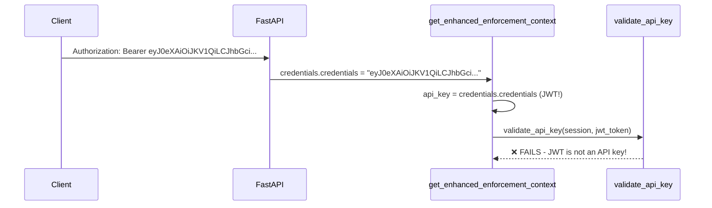

# FastAPI Dependency Injection and Annotation Issues

## Initial Question

In `/src/api/v1/projects.py` line 112, why does:
```python
current_user: CurrentActiveUser,
```
work with utils.py definition:
```python
CurrentActiveUser = Annotated[User, Depends(get_current_active_user)]
```

But if I change to line 113:
```python
current_user: Annotated[CurrentActiveUser, Depends(get_authorized_user)],
```
The API stops working?

In authorization_pattern.py, we have:
```python
async def get_authorized_user(
    context: Annotated[RuntimeEnforcementContext, Depends(get_enhanced_enforcement_context)],
) -> CurrentActiveUser:
```

Will the context be injected as well from the API's context annotation, or does it just follow the Depends structure?

## Answer: FastAPI Dependency Injection Patterns

### Why the first version works:

```python
current_user: CurrentActiveUser,
```

Where `CurrentActiveUser = Annotated[User, Depends(get_current_active_user)]`

This works because `CurrentActiveUser` is **already a complete dependency annotation**. FastAPI sees the `Annotated[User, Depends(get_current_active_user)]` and knows exactly what to inject.

### Why the second version breaks:

```python
current_user: Annotated[CurrentActiveUser, Depends(get_authorized_user)],
```

This creates a **nested dependency annotation** that becomes:
```python
Annotated[
    Annotated[User, Depends(get_current_active_user)],  # CurrentActiveUser
    Depends(get_authorized_user)                        # Additional dependency
]
```

This confuses FastAPI because you're trying to apply `Depends(get_authorized_user)` to something that's already a dependency annotation.

### The correct way to use `get_authorized_user`:

Since `get_authorized_user` returns `CurrentActiveUser` (which is the `User` type), you should use:

```python
current_user: Annotated[User, Depends(get_authorized_user)],
```

**NOT:**
```python
current_user: Annotated[CurrentActiveUser, Depends(get_authorized_user)],  # Double wrapping!
```

## Context Injection and Dependency Resolution

### Yes, context will be injected automatically!

FastAPI's dependency injection follows this pattern:

1. **When `get_authorized_user` is called as a dependency**, FastAPI analyzes its signature
2. **It sees that `context` parameter needs `RuntimeEnforcementContext`**
3. **It automatically calls `get_enhanced_enforcement_context()` to provide that parameter**
4. **This happens recursively** - if `get_enhanced_enforcement_context` needs other dependencies, those get injected too

## What `get_enhanced_enforcement_context()` Actually Does

### Function Signature and Purpose
```python
async def get_enhanced_enforcement_context(
    request: Request,
    session: Annotated[DbSession, Depends()],
    current_user: Annotated[CurrentActiveUser, Depends()],
    credentials: Annotated[HTTPAuthorizationCredentials | None, Depends(security)] = None,
) -> RuntimeEnforcementContext:
```

### Authentication and Context Building

**Yes, `get_enhanced_enforcement_context()` does check JWT tokens and API keys**, but in a different way than `get_current_active_user`:

#### 1. **Leverages Existing Authentication**
```python
current_user: Annotated[CurrentActiveUser, Depends()],
```
- This parameter **depends on the full authentication chain**
- `CurrentActiveUser` → `get_current_active_user` → `get_current_user`
- So JWT tokens and API keys are **already validated** when this function runs

#### 2. **Extracts Additional Authentication Context**
```python
# Extract API key from multiple sources
api_key = None
if credentials:
    api_key = credentials.credentials  # From Authorization header
else:
    api_key = request.headers.get("x-api-key") or request.query_params.get("x-api-key")
```

#### 3. **Builds Resource Context**
```python
# Extract resource context from URL path parameters
workspace_id = request.path_params.get("workspace_id")
project_id = request.path_params.get("project_id")
environment_id = request.path_params.get("environment_id")
flow_id = request.path_params.get("flow_id")
```

#### 4. **Creates Runtime Enforcement Context**
```python
return await enforcement_service.create_enforcement_context(
    session=session,
    api_key=api_key,
    user=current_user,  # Already authenticated user
    workspace_id=UUID(workspace_id) if workspace_id else None,
    project_id=UUID(project_id) if project_id else None,
    environment_id=UUID(environment_id) if environment_id else None,
    request_path=request.url.path,
    request_method=request.method,
)
```

## How `get_authorized_user` Uses the Context

```python
async def get_authorized_user(
    context: Annotated[RuntimeEnforcementContext, Depends(get_enhanced_enforcement_context)],
) -> CurrentActiveUser:
    """Get current user with basic authorization validation."""
    if not context.user or not context.user.is_active:
        raise AuthorizationError("User not authenticated or inactive")
    return context.user
```

### Authentication Flow Comparison

#### `get_current_active_user` (Simple Authentication):
1. Extract JWT token or API key from request
2. Validate token/key against database
3. Return user if valid and active
4. **Direct authentication validation**

#### `get_authorized_user` (Enhanced Authentication + Authorization):
1. **Relies on `get_enhanced_enforcement_context`** which:
   - Uses `CurrentActiveUser` (already authenticated via `get_current_active_user`)
   - Extracts additional context (API keys, resource IDs, request info)
   - Builds comprehensive enforcement context for RBAC
2. **Validates the context.user is active**
3. **Returns the same user but with RBAC context available**

### Key Differences

| Aspect | `get_current_active_user` | `get_authorized_user` |
|--------|-------------------------|---------------------|
| **Authentication** | Direct JWT/API key validation | Inherits from `CurrentActiveUser` dependency |
| **Context** | Basic user authentication | Enhanced RBAC enforcement context |
| **Purpose** | Simple auth check | Auth + authorization preparation |
| **Performance** | Faster (fewer dependencies) | Slower (builds full RBAC context) |
| **Use Case** | Basic authenticated endpoints | RBAC-enabled endpoints |

## Summary

- **`get_enhanced_enforcement_context()` does NOT duplicate authentication** - it builds on already-authenticated users
- **JWT tokens and API keys are validated by the underlying `CurrentActiveUser` dependency**
- **The context provides additional RBAC information** like resource IDs, request metadata, and enforcement capabilities
- **Context injection happens automatically** through FastAPI's dependency system
- **Use `Annotated[User, Depends(get_authorized_user)]`** for RBAC-enabled endpoints, not double-wrapped annotations

This design allows for layered security where basic authentication is handled at the lower level, and enhanced authorization context is built on top for RBAC-enabled endpoints.

## Critical Issue: API Key and JWT Token Confusion in `get_enhanced_enforcement_context()`

### Problem Discovery

During analysis of the authentication flow, a **critical logic error** was discovered in the `get_enhanced_enforcement_context()` function that causes **JWT tokens to be incorrectly treated as API keys**.

### The Bug: Lines 67-72 in `authorization_patterns.py`

```python
async def get_enhanced_enforcement_context(
    request: Request,
    session: DbSession,
    current_user: CurrentActiveUser,
    credentials: Annotated[HTTPAuthorizationCredentials | None, Depends(security)] = None,
) -> RuntimeEnforcementContext:
    # ...

    # Extract API key
    api_key = None
    if credentials:
        api_key = credentials.credentials  # ❌ THIS IS WRONG!
    else:
        api_key = request.headers.get("x-api-key") or request.query_params.get("x-api-key")
```

Where `security = HTTPBearer(auto_error=False)` is defined.

### What's Actually Happening

1. **`HTTPBearer(auto_error=False)`** extracts the `Authorization: Bearer <token>` header
2. **`credentials.credentials`** contains the **JWT token**, NOT an API key
3. **The code incorrectly treats the JWT token as an API key** and passes it to `validate_api_key()`

### The Incorrect Logic Flow



### Authentication Types Confusion

| Authentication Type | Header/Location | Format | Purpose |
|-------------------|-----------------|--------|---------|
| **JWT Token** | `Authorization: Bearer <jwt>` | `eyJ0eXAiOiJKV1QiLCJhbGci...` | Session-based auth |
| **API Key** | `x-api-key` header or query param | `sk-1234567890abcdef...` | Direct API access |

### The Problem in `create_enforcement_context()`

```python
async def create_enforcement_context(
    self,
    session: AsyncSession,
    api_key: str | None = None,  # Receives JWT token incorrectly!
    user: Optional["User"] = None,
    # ...
) -> RuntimeEnforcementContext:
    token_validation = None

    # Validate API key if provided
    if api_key:
        token_validation = await self.auth_service.validate_api_key(session, api_key)
        #                                              ☝️ Tries to validate JWT as API key!
        if not token_validation.is_valid:
            raise ValueError(f"Invalid API key: {token_validation.error_message}")
```

### Why This Causes Authentication Failures

1. **Double Authentication Attempt**: The `current_user` dependency already handles JWT authentication
2. **Wrong Validation Method**: `validate_api_key()` expects API key format, not JWT format
3. **Token Type Mismatch**: JWT tokens have different structure and validation logic than API keys
4. **Validation Failure**: JWT tokens fail API key validation, causing auth errors

### The Correct Logic Should Be

```python
async def get_enhanced_enforcement_context(
    request: Request,
    session: DbSession,
    current_user: CurrentActiveUser,  # Already authenticated via JWT or API key
    credentials: Annotated[HTTPAuthorizationCredentials | None, Depends(security)] = None,
) -> RuntimeEnforcementContext:
    # Extract API key ONLY from x-api-key header/query (NOT from Authorization header)
    api_key = request.headers.get("x-api-key") or request.query_params.get("x-api-key")

    # JWT token is already handled by current_user dependency
    # credentials.credentials contains JWT token for additional context if needed

    # Create enforcement context
    return await enforcement_service.create_enforcement_context(
        session=session,
        api_key=api_key,  # Only actual API keys, not JWT tokens
        user=current_user,  # Already authenticated user
        # ...
    )
```

### Impact and Resolution

**Impact:**
- Authentication failures when using JWT tokens
- Incorrect token validation attempts
- Performance overhead from double authentication
- Security confusion between authentication methods

**Resolution Needed:**
1. **Fix the API key extraction logic** to only get actual API keys
2. **Remove JWT token from API key validation path**
3. **Clarify authentication vs authorization responsibilities**
4. **Update documentation** to reflect correct token handling

This bug explains why the RBAC authentication was failing and causing the parameter validation errors seen earlier in the FastAPI endpoint analysis.

## Critical Issue: CheckPermissionRequest used in runtime_enforcement.py as core to permission check of various APIs does not exists

You're absolutely right! The CheckPermissionRequest class is not defined in /src/backend/base/langflow/services/rbac/service.py. The import on line 142 in runtime_enforcement.py will fail because
   the class doesn't exist in that module.

  Looking at the grep results, I can see that CheckPermissionRequest is being imported from langflow.services.rbac.service in multiple files, but the class definition is nowhere to be found. This
  suggests that either:

  1. The class was removed/never implemented in the service module
  2. The class should be defined elsewhere
  3. The import path is incorrect

  This is definitely a broken import that will cause a runtime error when that code path is executed.

  Xiang's further comment: In addition, CheckPermissionRequest class used by call a few lines later to rbac_service.check_permission(), which is a function that does not exist at all. The RBACRuntimeEnforcementService.check_resource_access() that includes this bad import, was used by authorization_patterns.py's check_single_permission(), which is called by permission_validator(), which is used in require_permissions(), all from the same authorization_patterns.py

  On the other hand, RBACService defined in /src/backend/base/langflow/services/rbac/service.py does have another api evaluate_permission() that does exist.

  In addition, rbac api endpoints like rbac/projects appears to be using permission_engine.py's check_permission.

  This seems to be a mess that we need to fix as it is in the lastest code of phase 7 branch as well

  ## Critical Issue: the Pydantic Union type response does not support forward reference in quotes

  The Pydantic Union type response in project.py's /v1/projects/{project-id} has union type FolderWithPaginatedFlows | FolderReadWithFlows
  and one of them has forward reference. It has forward reference problems. Let me examine the specific model relationships

  FastAPI creates a TypeAdapter for the Union type FolderWithPaginatedFlows | FolderReadWithFlows, but Pydantic v2 cannot resolve the forward reference "FlowRead" in the Union context.

  The oroginal LangBuilder code does not use forward reference here. So it need to include type import outside TypeCheck

  Also reference here: https://docs.pydantic.dev/2.10/errors/usage_errors/#class-not-fully-defined
