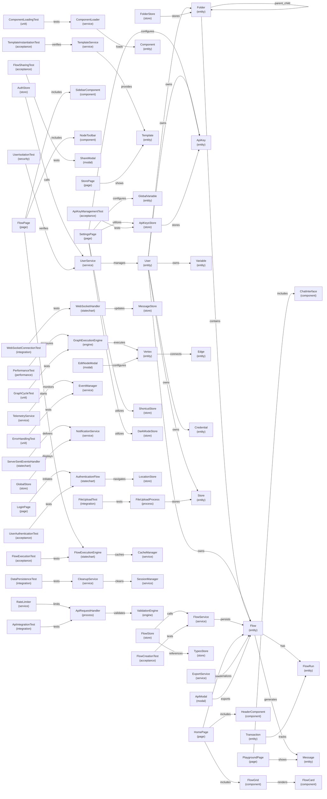

```mermaid
%% LangBuilder AppGraph v1.1.0
graph LR
    schema_user["User\n(entity)"]
    schema_flow["Flow\n(entity)"]
    schema_folder["Folder\n(entity)"]
    schema_apikey["ApiKey\n(entity)"]
    schema_flowrun["FlowRun\n(entity)"]
    schema_variable["Variable\n(entity)"]
    schema_message["Message\n(entity)"]
    schema_vertex["Vertex\n(entity)"]
    schema_edge["Edge\n(entity)"]
    schema_component["Component\n(entity)"]
    schema_template["Template\n(entity)"]
    schema_credential["Credential\n(entity)"]
    schema_transaction["Transaction\n(entity)"]
    schema_store["Store\n(entity)"]
    schema_global_variable["GlobalVariable\n(entity)"]
    ui_login_page["LoginPage\n(page)"]
    ui_flow_page["FlowPage\n(page)"]
    ui_home_page["HomePage\n(page)"]
    ui_settings_page["SettingsPage\n(page)"]
    ui_playground_page["PlaygroundPage\n(page)"]
    ui_store_page["StorePage\n(page)"]
    ui_header_component["HeaderComponent\n(component)"]
    ui_sidebar_component["SidebarComponent\n(component)"]
    ui_chat_interface["ChatInterface\n(component)"]
    ui_flow_grid["FlowGrid\n(component)"]
    ui_flow_card["FlowCard\n(component)"]
    ui_node_toolbar["NodeToolbar\n(component)"]
    ui_api_modal["ApiModal\n(modal)"]
    ui_share_modal["ShareModal\n(modal)"]
    ui_edit_node_modal["EditNodeModal\n(modal)"]
    ui_auth_store["AuthStore\n(store)"]
    ui_flow_store["FlowStore\n(store)"]
    ui_types_store["TypesStore\n(store)"]
    ui_global_store["GlobalStore\n(store)"]
    ui_folder_store["FolderStore\n(store)"]
    ui_message_store["MessageStore\n(store)"]
    ui_api_keys_store["ApiKeysStore\n(store)"]
    ui_shortcut_store["ShortcutStore\n(store)"]
    ui_dark_mode_store["DarkModeStore\n(store)"]
    ui_location_store["LocationStore\n(store)"]
    logic_auth_flow["AuthenticationFlow\n(statechart)"]
    logic_flow_execution["FlowExecutionEngine\n(statechart)"]
    logic_websocket_handler["WebSocketHandler\n(statechart)"]
    logic_file_upload["FileUploadProcess\n(process)"]
    logic_api_handler["ApiRequestHandler\n(process)"]
    logic_flow_service["FlowService\n(service)"]
    logic_user_service["UserService\n(service)"]
    logic_graph_engine["GraphExecutionEngine\n(engine)"]
    logic_cache_manager["CacheManager\n(service)"]
    logic_event_manager["EventManager\n(service)"]
    logic_session_manager["SessionManager\n(service)"]
    logic_validation_engine["ValidationEngine\n(engine)"]
    logic_notification_service["NotificationService\n(service)"]
    logic_component_loader["ComponentLoader\n(service)"]
    logic_sse_handler["ServerSentEventsHandler\n(statechart)"]
    logic_template_service["TemplateService\n(service)"]
    logic_export_service["ExportService\n(service)"]
    logic_rate_limiter["RateLimiter\n(service)"]
    logic_telemetry_service["TelemetryService\n(service)"]
    logic_cleanup_service["CleanupService\n(service)"]
    test_flow_creation["FlowCreationTest\n(acceptance)"]
    test_user_authentication["UserAuthenticationTest\n(acceptance)"]
    test_flow_execution["FlowExecutionTest\n(acceptance)"]
    test_api_integration["ApiIntegrationTest\n(integration)"]
    test_component_loading["ComponentLoadingTest\n(unit)"]
    test_graph_cycles["GraphCycleTest\n(unit)"]
    test_user_isolation["UserIsolationTest\n(security)"]
    test_websocket_connection["WebSocketConnectionTest\n(integration)"]
    test_file_upload["FileUploadTest\n(integration)"]
    test_template_instantiation["TemplateInstantiationTest\n(acceptance)"]
    test_api_key_management["ApiKeyManagementTest\n(acceptance)"]
    test_flow_sharing["FlowSharingTest\n(acceptance)"]
    test_error_handling["ErrorHandlingTest\n(unit)"]
    test_data_persistence["DataPersistenceTest\n(integration)"]
    test_performance["PerformanceTest\n(performance)"]
    schema_user -->|owns| schema_flow
    schema_user -->|owns| schema_folder
    schema_folder -->|contains| schema_flow
    schema_flow -->|has| schema_flowrun
    schema_user -->|owns| schema_apikey
    schema_flow -->|generates| schema_message
    schema_vertex -->|connects| schema_edge
    ui_login_page -->|initiates| logic_auth_flow
    ui_auth_store -->|calls| logic_user_service
    ui_flow_page -->|starts| logic_flow_execution
    ui_flow_store -->|calls| logic_flow_service
    logic_websocket_handler -->|updates| ui_message_store
    logic_flow_service -->|persists| schema_flow
    logic_user_service -->|manages| schema_user
    logic_graph_engine -->|executes| schema_vertex
    test_flow_creation -->|tests| logic_flow_service
    test_user_authentication -->|tests| logic_auth_flow
    test_flow_execution -->|tests| logic_flow_execution
    ui_home_page -->|shows| schema_flow
    ui_settings_page -->|configures| schema_apikey
    ui_playground_page -->|shows| schema_message
    logic_api_handler -->|validates| logic_validation_engine
    logic_flow_execution -->|caches| logic_cache_manager
    logic_component_loader -->|loads| schema_component
    logic_template_service -->|provides| schema_template
    logic_sse_handler -->|delivers| logic_notification_service
    test_user_isolation -->|verifies| logic_user_service
    test_websocket_connection -->|tests| logic_websocket_handler
    ui_flow_page -->|includes| ui_sidebar_component
    ui_home_page -->|includes| ui_header_component
    ui_flow_store -->|references| ui_types_store
    logic_auth_flow -->|navigates| ui_location_store
    logic_export_service -->|serializes| schema_flow
    logic_rate_limiter -->|limits| logic_api_handler
    logic_telemetry_service -->|monitors| logic_event_manager
    logic_cleanup_service -->|cleans| logic_session_manager
    test_template_instantiation -->|verifies| logic_template_service
    test_flow_sharing -->|tests| ui_share_modal
    schema_folder -->|parent_child| schema_folder
    ui_global_store -->|displays| logic_notification_service
    ui_api_modal -->|exports| schema_flow
    ui_edit_node_modal -->|configures| schema_vertex
    test_performance -->|measures| logic_graph_engine
    schema_user -->|owns| schema_variable
    schema_user -->|owns| schema_credential
    schema_user -->|owns| schema_store
    schema_transaction -->|tracks| schema_flowrun
    ui_settings_page -->|configures| schema_global_variable
    ui_home_page -->|includes| ui_flow_grid
    ui_flow_grid -->|renders| ui_flow_card
    ui_flow_page -->|includes| ui_node_toolbar
    ui_playground_page -->|includes| ui_chat_interface
    ui_api_keys_store -->|stores| schema_apikey
    ui_folder_store -->|stores| schema_folder
    ui_settings_page -->|utilizes| ui_api_keys_store
    ui_settings_page -->|utilizes| ui_shortcut_store
    ui_settings_page -->|utilizes| ui_dark_mode_store
    ui_store_page -->|shows| schema_template
    test_api_integration -->|tests| logic_api_handler
    test_api_key_management -->|tests| ui_api_keys_store
    test_component_loading -->|tests| logic_component_loader
    test_data_persistence -->|tests| logic_cleanup_service
    test_error_handling -->|tests| logic_event_manager
    test_file_upload -->|tests| logic_file_upload
    test_graph_cycles -->|tests| logic_graph_engine
    logic_file_upload -->|stores| schema_store
```
