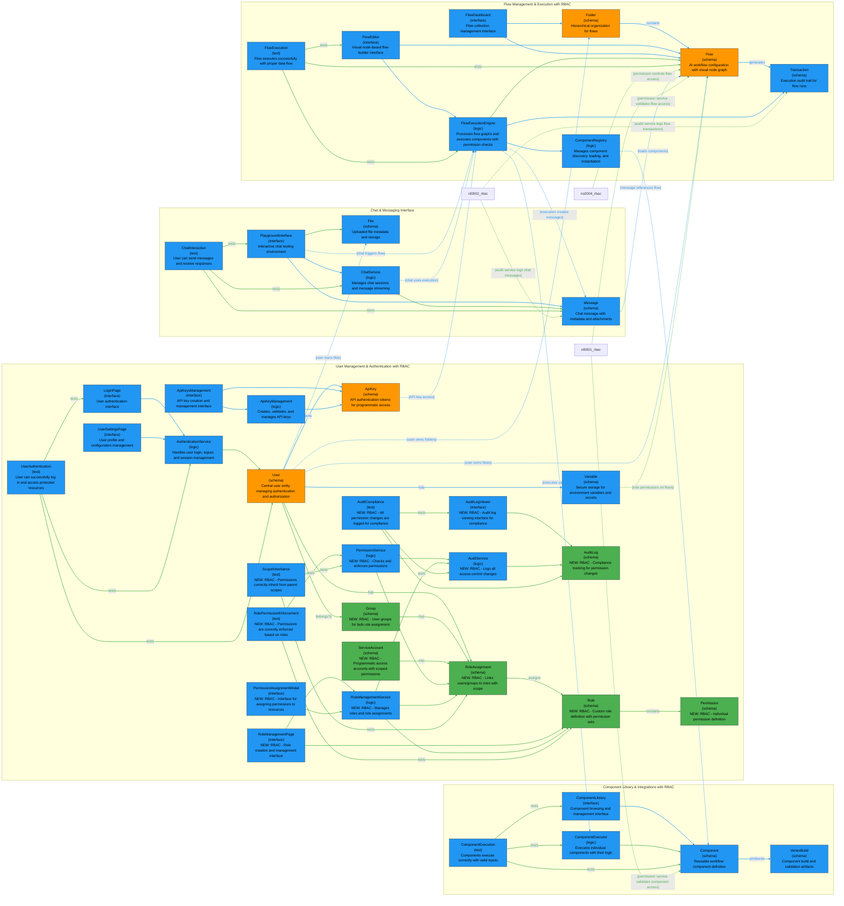

%% Partitioned (with RBAC)

```mermaid
graph LR
    subgraph ss001["User Management & Authentication with RBAC"]
        ns0001["User
(schema)
Central user entity managing authentication and authorization"]
        ns0002["ApiKey
(schema)
API authentication tokens for programmatic access"]
        ns0003["Variable
(schema)
Secure storage for environment variables and secrets"]
        ns0011["Role
(schema)
NEW: RBAC - Custom role definition with permission sets"]
        ns0012["Permission
(schema)
NEW: RBAC - Individual permission definition"]
        ns0013["RoleAssignment
(schema)
NEW: RBAC - Links users/groups to roles with scope"]
        ns0014["Group
(schema)
NEW: RBAC - User groups for bulk role assignment"]
        ns0015["ServiceAccount
(schema)
NEW: RBAC - Programmatic access accounts with scoped permissions"]
        ns0016["AuditLog
(schema)
NEW: RBAC - Compliance tracking for permission changes"]
        ni0001["LoginPage
(interface)
User authentication interface"]
        ni0002["UserSettingsPage
(interface)
User profile and configuration management"]
        ni0003["ApiKeysManagement
(interface)
API key creation and management interface"]
        ni0008["RoleManagementPage
(interface)
NEW: RBAC - Role creation and management interface"]
        ni0009["PermissionAssignmentModal
(interface)
NEW: RBAC - Interface for assigning permissions to resources"]
        ni0010["AuditLogViewer
(interface)
NEW: RBAC - Audit log viewing interface for compliance"]
        nl0001["AuthenticationService
(logic)
Handles user login, logout, and session management"]
        nl0002["ApiKeyManagement
(logic)
Creates, validates, and manages API keys"]
        nl0007["PermissionService
(logic)
NEW: RBAC - Checks and enforces permissions"]
        nl0008["RoleManagementService
(logic)
NEW: RBAC - Manages roles and role assignments"]
        nl0009["AuditService
(logic)
NEW: RBAC - Logs all access control changes"]
        nt0001["UserAuthentication
(test)
User can successfully log in and access protected resources"]
        nt0005["RolePermissionEnforcement
(test)
NEW: RBAC - Permissions are correctly enforced based on roles"]
        nt0006["AuditCompliance
(test)
NEW: RBAC - All permission changes are logged for compliance"]
        nt0007["ScopeInheritance
(test)
NEW: RBAC - Permissions correctly inherit from parent scopes"]
        ns0001 -->|owns| ns0002
        ns0001 -->|has| ns0003
        ns0001 -->|has| ns0013
        ns0001 -->|belongsTo| ns0014
        ns0011 -->|contains| ns0012
        ns0013 -->|assigns| ns0011
        ns0014 -->|has| ns0013
        ns0015 -->|has| ns0013
        ni0001 --> nl0001
        ni0002 --> nl0001
        ni0003 --> ns0002
        ni0003 --> nl0002
        ni0008 --> ns0011
        ni0008 --> nl0008
        ni0009 --> nl0008
        ni0010 --> ns0016
        nl0007 --> nl0009
        nl0008 --> nl0009
        nl0002 --> ns0002
        nl0001 --> ns0001
        nl0007 --> ns0013
        nl0008 --> ns0011
        nl0008 --> ns0013
        nl0009 --> ns0016
        nt0001 -->|tests| ni0001
        nt0001 -->|tests| nl0001
        nt0001 -->|tests| ns0001
        nt0005 -->|tests| nl0007
        nt0005 -->|tests| ns0011
        nt0006 -->|tests| nl0009
        nt0006 --> ns0016
        nt0006 -->|tests| ni0010
        nt0007 -->|tests| nl0007
        nt0007 -->|tests| ns0013
    end
    style ns0001 fill:#FF9800,stroke:#333,stroke-width:1px,color:#000
    style ns0002 fill:#FF9800,stroke:#333,stroke-width:1px,color:#000
    style ns0003 fill:#2196F3,stroke:#333,stroke-width:1px,color:#000
    style ns0011 fill:#4CAF50,stroke:#333,stroke-width:1px,color:#000
    style ns0012 fill:#4CAF50,stroke:#333,stroke-width:1px,color:#000
    style ns0013 fill:#4CAF50,stroke:#333,stroke-width:1px,color:#000
    style ns0014 fill:#4CAF50,stroke:#333,stroke-width:1px,color:#000
    style ns0015 fill:#4CAF50,stroke:#333,stroke-width:1px,color:#000
    style ns0016 fill:#4CAF50,stroke:#333,stroke-width:1px,color:#000
    style ni0001 fill:#2196F3,stroke:#333,stroke-width:1px,color:#000
    style ni0002 fill:#2196F3,stroke:#333,stroke-width:1px,color:#000
    style ni0003 fill:#2196F3,stroke:#333,stroke-width:1px,color:#000
    style ni0008 fill:#2196F3,stroke:#333,stroke-width:1px,color:#000
    style ni0009 fill:#2196F3,stroke:#333,stroke-width:1px,color:#000
    style ni0010 fill:#2196F3,stroke:#333,stroke-width:1px,color:#000
    style nl0001 fill:#2196F3,stroke:#333,stroke-width:1px,color:#000
    style nl0002 fill:#2196F3,stroke:#333,stroke-width:1px,color:#000
    style nl0007 fill:#2196F3,stroke:#333,stroke-width:1px,color:#000
    style nl0008 fill:#2196F3,stroke:#333,stroke-width:1px,color:#000
    style nl0009 fill:#2196F3,stroke:#333,stroke-width:1px,color:#000
    style nt0001 fill:#2196F3,stroke:#333,stroke-width:1px,color:#000
    style nt0005 fill:#2196F3,stroke:#333,stroke-width:1px,color:#000
    style nt0006 fill:#2196F3,stroke:#333,stroke-width:1px,color:#000
    style nt0007 fill:#2196F3,stroke:#333,stroke-width:1px,color:#000
    subgraph ss002["Flow Management & Execution with RBAC"]
        ns0004["Flow
(schema)
AI workflow configuration with visual node graph"]
        ns0005["Folder
(schema)
Hierarchical organization for flows"]
        ns0006["Transaction
(schema)
Execution audit trail for flow runs"]
        ni0004["FlowEditor
(interface)
Visual node-based flow builder interface"]
        ni0005["FlowDashboard
(interface)
Flow collection management interface"]
        nl0003["FlowExecutionEngine
(logic)
Processes flow graphs and executes components with permission checks"]
        nl0004["ComponentRegistry
(logic)
Manages component discovery, loading, and instantiation"]
        nt0002["FlowExecution
(test)
Flow executes successfully with proper data flow"]
        ns0005 -->|contains| ns0004
        ns0004 -->|generates| ns0006
        ni0004 --> ns0004
        ni0004 --> nl0003
        ni0005 --> ns0004
        ni0005 --> ns0005
        nl0003 --> nl0004
        nl0003 --> ns0006
        nl0003 --> ns0004
        nt0002 -->|tests| nl0003
        nt0002 -->|tests| ni0004
        nt0002 -->|tests| ns0004
    end
    style ns0004 fill:#FF9800,stroke:#333,stroke-width:1px,color:#000
    style ns0005 fill:#FF9800,stroke:#333,stroke-width:1px,color:#000
    style ns0006 fill:#2196F3,stroke:#333,stroke-width:1px,color:#000
    style ni0004 fill:#2196F3,stroke:#333,stroke-width:1px,color:#000
    style ni0005 fill:#2196F3,stroke:#333,stroke-width:1px,color:#000
    style nl0003 fill:#2196F3,stroke:#333,stroke-width:1px,color:#000
    style nl0004 fill:#2196F3,stroke:#333,stroke-width:1px,color:#000
    style nt0002 fill:#2196F3,stroke:#333,stroke-width:1px,color:#000
    subgraph ss003["Chat & Messaging Interface"]
        ns0007["Message
(schema)
Chat message with metadata and attachments"]
        ns0008["File
(schema)
Uploaded file metadata and storage"]
        ni0006["PlaygroundInterface
(interface)
Interactive chat testing environment"]
        nl0005["ChatService
(logic)
Manages chat sessions and message streaming"]
        nt0003["ChatInteraction
(test)
User can send messages and receive responses"]
        ni0006 --> ns0007
        ni0006 --> ns0008
        ni0006 --> nl0005
        nl0005 --> ns0007
        nt0003 -->|tests| nl0005
        nt0003 -->|tests| ni0006
        nt0003 -->|tests| ns0007
    end
    style ns0007 fill:#2196F3,stroke:#333,stroke-width:1px,color:#000
    style ns0008 fill:#2196F3,stroke:#333,stroke-width:1px,color:#000
    style ni0006 fill:#2196F3,stroke:#333,stroke-width:1px,color:#000
    style nl0005 fill:#2196F3,stroke:#333,stroke-width:1px,color:#000
    style nt0003 fill:#2196F3,stroke:#333,stroke-width:1px,color:#000
    subgraph ss004["Component Library & Integrations with RBAC"]
        ns0009["Component
(schema)
Reusable workflow component definition"]
        ns0010["VertexBuild
(schema)
Component build and validation artifacts"]
        ni0007["ComponentLibrary
(interface)
Component browsing and management interface"]
        nl0006["ComponentExecutor
(logic)
Executes individual components with their logic"]
        nt0004["ComponentExecution
(test)
Components execute correctly with valid inputs"]
        ns0009 -->|produces| ns0010
        ni0007 --> ns0009
        nl0006 --> ns0009
        nt0004 -->|tests| nl0006
        nt0004 -->|tests| ni0007
        nt0004 -->|tests| ns0009
    end
    style ns0009 fill:#2196F3,stroke:#333,stroke-width:1px,color:#000
    style ns0010 fill:#2196F3,stroke:#333,stroke-width:1px,color:#000
    style ni0007 fill:#2196F3,stroke:#333,stroke-width:1px,color:#000
    style nl0006 fill:#2196F3,stroke:#333,stroke-width:1px,color:#000
    style nt0004 fill:#2196F3,stroke:#333,stroke-width:1px,color:#000
    ns0001 -. |user owns flows| .-> ns0004
    ns0001 -. |user owns folders| .-> ns0005
    ns0002 -. |API key access| .-> nl0003
    ns0003 -. |role permissions on flows| .-> ns0004
    ns0004_rbac -. |permission controls flow access| .-> ns0004
    ni0006 -. |chat triggers flow| .-> nl0003
    nl0003 -. |executes components| .-> nl0006
    nl0004 -. |loads components| .-> ns0009
    nl0003 -. |execution creates messages| .-> ns0007
    ns0001 -. |user owns files| .-> ns0008
    nl0005 -. |chat uses execution| .-> nl0003
    ns0007 -. |message references flow| .-> ns0004
    nl0001_rbac -. |permission service validates flow access| .-> ns0004
    nl0001_rbac -. |permission service validates component access| .-> ns0009
    nl0002_rbac -. |audit service logs flow transactions| .-> ns0006
    nl0002_rbac -. |audit service logs chat messages| .-> ns0007
    linkStyle 0 stroke:#2196F3,stroke-width:2px,color:#2196F3
    linkStyle 1 stroke:#2196F3,stroke-width:2px,color:#2196F3
    linkStyle 2 stroke:#4CAF50,stroke-width:2px,color:#4CAF50
    linkStyle 3 stroke:#4CAF50,stroke-width:2px,color:#4CAF50
    linkStyle 4 stroke:#4CAF50,stroke-width:2px,color:#4CAF50
    linkStyle 5 stroke:#4CAF50,stroke-width:2px,color:#4CAF50
    linkStyle 6 stroke:#4CAF50,stroke-width:2px,color:#4CAF50
    linkStyle 7 stroke:#4CAF50,stroke-width:2px,color:#4CAF50
    linkStyle 8 stroke:#2196F3,stroke-width:2px,color:#2196F3
    linkStyle 9 stroke:#2196F3,stroke-width:2px,color:#2196F3
    linkStyle 10 stroke:#2196F3,stroke-width:2px,color:#2196F3
    linkStyle 11 stroke:#2196F3,stroke-width:2px,color:#2196F3
    linkStyle 12 stroke:#4CAF50,stroke-width:2px,color:#4CAF50
    linkStyle 13 stroke:#4CAF50,stroke-width:2px,color:#4CAF50
    linkStyle 14 stroke:#4CAF50,stroke-width:2px,color:#4CAF50
    linkStyle 15 stroke:#4CAF50,stroke-width:2px,color:#4CAF50
    linkStyle 16 stroke:#4CAF50,stroke-width:2px,color:#4CAF50
    linkStyle 17 stroke:#4CAF50,stroke-width:2px,color:#4CAF50
    linkStyle 18 stroke:#2196F3,stroke-width:2px,color:#2196F3
    linkStyle 19 stroke:#4CAF50,stroke-width:2px,color:#4CAF50
    linkStyle 20 stroke:#4CAF50,stroke-width:2px,color:#4CAF50
    linkStyle 21 stroke:#4CAF50,stroke-width:2px,color:#4CAF50
    linkStyle 22 stroke:#4CAF50,stroke-width:2px,color:#4CAF50
    linkStyle 23 stroke:#4CAF50,stroke-width:2px,color:#4CAF50
    linkStyle 24 stroke:#4CAF50,stroke-width:2px,color:#4CAF50
    linkStyle 25 stroke:#4CAF50,stroke-width:2px,color:#4CAF50
    linkStyle 26 stroke:#4CAF50,stroke-width:2px,color:#4CAF50
    linkStyle 27 stroke:#4CAF50,stroke-width:2px,color:#4CAF50
    linkStyle 28 stroke:#4CAF50,stroke-width:2px,color:#4CAF50
    linkStyle 29 stroke:#4CAF50,stroke-width:2px,color:#4CAF50
    linkStyle 30 stroke:#4CAF50,stroke-width:2px,color:#4CAF50
    linkStyle 31 stroke:#4CAF50,stroke-width:2px,color:#4CAF50
    linkStyle 32 stroke:#4CAF50,stroke-width:2px,color:#4CAF50
    linkStyle 33 stroke:#4CAF50,stroke-width:2px,color:#4CAF50
    linkStyle 34 stroke:#2196F3,stroke-width:2px,color:#2196F3
    linkStyle 35 stroke:#2196F3,stroke-width:2px,color:#2196F3
    linkStyle 36 stroke:#2196F3,stroke-width:2px,color:#2196F3
    linkStyle 37 stroke:#2196F3,stroke-width:2px,color:#2196F3
    linkStyle 38 stroke:#2196F3,stroke-width:2px,color:#2196F3
    linkStyle 39 stroke:#2196F3,stroke-width:2px,color:#2196F3
    linkStyle 40 stroke:#2196F3,stroke-width:2px,color:#2196F3
    linkStyle 41 stroke:#2196F3,stroke-width:2px,color:#2196F3
    linkStyle 42 stroke:#4CAF50,stroke-width:2px,color:#4CAF50
    linkStyle 43 stroke:#4CAF50,stroke-width:2px,color:#4CAF50
    linkStyle 44 stroke:#4CAF50,stroke-width:2px,color:#4CAF50
    linkStyle 45 stroke:#4CAF50,stroke-width:2px,color:#4CAF50
    linkStyle 46 stroke:#2196F3,stroke-width:2px,color:#2196F3
    linkStyle 47 stroke:#4CAF50,stroke-width:2px,color:#4CAF50
    linkStyle 48 stroke:#2196F3,stroke-width:2px,color:#2196F3
    linkStyle 49 stroke:#4CAF50,stroke-width:2px,color:#4CAF50
    linkStyle 50 stroke:#4CAF50,stroke-width:2px,color:#4CAF50
    linkStyle 51 stroke:#4CAF50,stroke-width:2px,color:#4CAF50
    linkStyle 52 stroke:#4CAF50,stroke-width:2px,color:#4CAF50
    linkStyle 53 stroke:#2196F3,stroke-width:2px,color:#2196F3
    linkStyle 54 stroke:#2196F3,stroke-width:2px,color:#2196F3
    linkStyle 55 stroke:#4CAF50,stroke-width:2px,color:#4CAF50
    linkStyle 56 stroke:#4CAF50,stroke-width:2px,color:#4CAF50
    linkStyle 57 stroke:#4CAF50,stroke-width:2px,color:#4CAF50
    linkStyle 58 stroke:#4CAF50,stroke-width:2px,color:#4CAF50
    linkStyle 59 stroke:#2196F3,stroke-width:2px,color:#2196F3
    linkStyle 60 stroke:#2196F3,stroke-width:2px,color:#2196F3
    linkStyle 61 stroke:#2196F3,stroke-width:2px,color:#2196F3
    linkStyle 62 stroke:#4CAF50,stroke-width:2px,color:#4CAF50
    linkStyle 63 stroke:#4CAF50,stroke-width:2px,color:#4CAF50
    linkStyle 64 stroke:#2196F3,stroke-width:2px,color:#2196F3
    linkStyle 65 stroke:#2196F3,stroke-width:2px,color:#2196F3
    linkStyle 66 stroke:#2196F3,stroke-width:2px,color:#2196F3
    linkStyle 67 stroke:#2196F3,stroke-width:2px,color:#2196F3
    linkStyle 68 stroke:#2196F3,stroke-width:2px,color:#2196F3
    linkStyle 69 stroke:#2196F3,stroke-width:2px,color:#2196F3
    linkStyle 70 stroke:#2196F3,stroke-width:2px,color:#2196F3
    linkStyle 71 stroke:#4CAF50,stroke-width:2px,color:#4CAF50
    linkStyle 72 stroke:#4CAF50,stroke-width:2px,color:#4CAF50
    linkStyle 73 stroke:#4CAF50,stroke-width:2px,color:#4CAF50
    linkStyle 74 stroke:#4CAF50,stroke-width:2px,color:#4CAF50
%% Legend (visualization_legend)
%% new: NEW: RBAC additions and enhancements (#4CAF50)
%% modified: MODIFIED: Existing elements enhanced for RBAC (#FF9800)
%% original: ORIGINAL: Unchanged from base system (#2196F3)
```
